# Entity Relationship Diagram (Sơ đồ Quan hệ Thực thể)

Hệ thống Quản trị Nhà Việt Group

| | |
| --- | --- |
| **Phiên bản** | 1.0 |
| **Ngày soạn** | 28/09/2026 |
| **Trạng thái** | Bản nháp — chờ Haan duyệt |
| **Người soạn** | Đội triển khai — vai trò Kiến trúc sư phần mềm |
| **Phạm vi** | Mô hình dữ liệu toàn hệ thống, chia theo phân hệ |

> Tài liệu này mô tả **dữ liệu được tổ chức thế nào**: có những thực thể nào, quan hệ ra sao, ràng
> buộc bắt buộc là gì. Đây là nguồn tham chiếu chính cho người làm phía dữ liệu. Sơ đồ vẽ **quan hệ
> nghiệp vụ**, không vẽ cột — cột và kiểu dữ liệu đọc ở lược đồ trong mã nguồn. Tài liệu Thiết kế
> chi tiết nói cách truy cập dữ liệu; tài liệu Kiến trúc nói vì sao chọn mô hình này.

---

## 0. Chú giải và cách đọc sơ đồ

| Ký hiệu | Nghĩa |
| --- | --- |
| Hộp chữ nhật | Một thực thể (một bảng dữ liệu) |
| `A \|\|--o{ B` | Một bản ghi A có **nhiều** bản ghi B; mỗi B thuộc **đúng một** A |
| Chữ trên đường nối | Ý nghĩa nghiệp vụ của quan hệ |

| Thuật ngữ | Nghĩa |
| --- | --- |
| Thực thể | Một loại đối tượng dữ liệu, tương ứng một bảng |
| Khoá chính | Cột định danh duy nhất một bản ghi |
| Khoá ngoại | Cột trỏ sang bản ghi của bảng khác |
| Bảng giao dịch | Bảng ghi nghiệp vụ phát sinh, luôn thuộc một pháp nhân |
| Bảng dùng chung | Bảng tra cứu dùng cho mọi pháp nhân |
| Bảng lịch sử | Bảng ghi lại thay đổi, chỉ thêm, không sửa đè |
| Xoá mềm | Đánh dấu đã xoá thay vì xoá hẳn khỏi cơ sở dữ liệu |
| Phân quyền theo hàng | Quy tắc trong cơ sở dữ liệu quyết định ai thấy dòng nào |

**Hai quan hệ không vẽ lại trong sơ đồ phân hệ.** Gần như mọi bảng đều trỏ tới `companies` (pháp
nhân) và `users` (người tạo, người sửa). Vẽ lại ở từng sơ đồ sẽ che mất quan hệ nghiệp vụ, nên chúng
chỉ xuất hiện ở sơ đồ tổng và được nêu một lần trong quy ước dưới đây.

---

## 1. Quy ước áp cho mọi bảng

Các cột dưới đây định nghĩa tập trung trong helper dùng chung, không khai lại ở từng bảng.

| Nhóm cột | Quy tắc |
| --- | --- |
| Khoá chính | Mã định danh duy nhất sinh ngẫu nhiên; **không dùng số tự tăng** |
| Vết kiểm | Ngày tạo, ngày sửa, người tạo, người sửa — trigger tự cập nhật |
| Phạm vi pháp nhân | Bảng giao dịch có cột pháp nhân; **bảng dùng chung thì không** |
| Phạm vi khách thuê | Cột khách thuê có ở `companies` và các bảng của phân hệ Thiết kế AI |
| Xoá mềm | Bảng quan trọng đánh dấu ngày xoá; truy vấn luôn lọc bỏ dòng đã xoá. Bảng nhật ký **không** dùng xoá mềm |
| Phiên bản | Số phiên bản và cờ «bản đang hiệu lực» — tại một thời điểm chỉ một bản hiệu lực trong nhóm |
| Tiền | Số nguyên đơn vị đồng, **không thập phân** |
| Số lượng vật lý | Số thực, đơn vị lấy từ bảng danh mục |
| Mã hiển thị | Chuỗi theo khuôn pháp nhân – phân hệ – năm – số thứ tự, sinh bằng hàm trong cơ sở dữ liệu |
| Bản ghi hiện trường | Mốc nghiệp vụ do máy khách đặt, mốc đồng bộ do máy chủ đặt, mã khử trùng khi đồng bộ lại |

**Ba bảng dùng chung cố ý không có cột pháp nhân:** khách hàng, nhà cung cấp, người dùng. Quan hệ
với pháp nhân suy ra gián tiếp qua bảng giao dịch — một khách hàng có thể giao dịch với nhiều pháp
nhân trong nhóm.

**Thay đổi quan trọng ghi sang bảng lịch sử riêng**, không ghi đè bản ghi gốc: lịch sử bước của cơ
hội, lịch sử tham số hệ thống, bước duyệt của đề nghị thanh toán, sự kiện của tài sản giàn giáo.

---

## 2. Hồ sơ 360° — các thực thể trung tâm

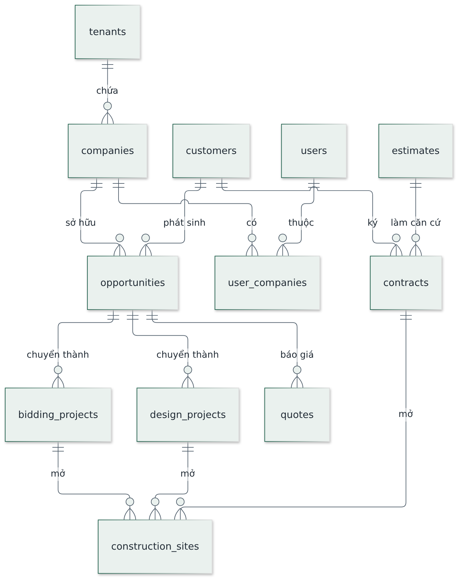

**Hình 1.** Chuỗi thực thể xuyên suốt: từ khách hàng tới công trình.

Đây là xương sống dữ liệu. Mọi phân hệ khác **liên kết** tới các thực thể này chứ không sao chép.

| Thực thể | Vai trò |
| --- | --- |
| `tenants` | Khách thuê phần mềm — mức cách ly cao nhất, chuẩn bị cho việc bán lại |
| `companies` | Pháp nhân giao dịch; mã tổng hợp toàn nhóm chỉ dùng cho báo cáo |
| `users` | Người dùng; liên kết danh tính đăng nhập |
| `customers` | Khách hàng, dùng chung cho cả ba pháp nhân |
| `opportunities` | Cơ hội kinh doanh — điểm khởi đầu của mọi hồ sơ |
| `bidding_projects` · `design_projects` | Gói thầu và dự án thiết kế, hai nhánh sau cơ hội |
| `contracts` | Hợp đồng đã ký |
| `construction_sites` | Công trình — **trục nối liên phân hệ**, và là neo cho phân quyền theo phạm vi hiện trường |

---

## 3. NEN — Nền tảng dùng chung

### 3.1 Danh tính, vai trò, phạm vi

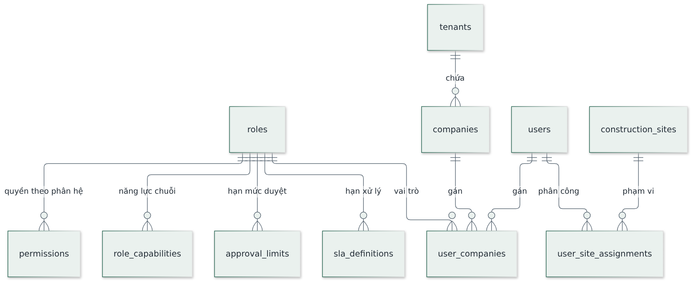

**Hình 2.** Người dùng, vai trò và phạm vi dữ liệu.

| Thực thể | Vai trò |
| --- | --- |
| `tenants` · `companies` | Khách thuê và pháp nhân |
| `users` | Người dùng hệ thống |
| `roles` | 14 vai trò; có cờ đánh dấu vai trò giới hạn theo công trình |
| `permissions` | Ma trận vai trò × phân hệ × hành động |
| `role_capabilities` | Năng lực chuỗi ngoài ma trận trên, ví dụ quyền theo bộ môn thiết kế |
| `user_companies` | Gán người dùng vào pháp nhân kèm vai trò — một người có thể nhiều vai trò |
| `approval_limits` | Hạn mức phê duyệt theo vai trò, loại nghiệp vụ, pháp nhân |
| `sla_definitions` | Thời hạn cam kết xử lý của từng vai trò hoặc phòng ban |
| `user_site_assignments` | Phân công người dùng vào công trình — căn cứ của phân quyền phạm vi hiện trường |

### 3.2 Phê duyệt, hồ sơ, nhật ký

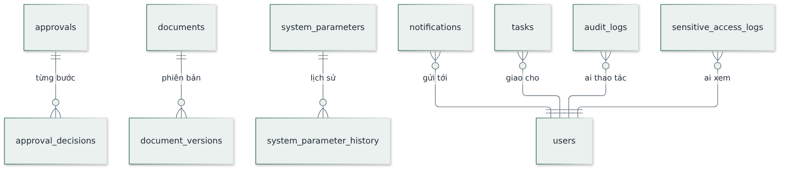

**Hình 3.** Các thực thể dùng chung cho mọi phân hệ.

| Thực thể | Vai trò |
| --- | --- |
| `approvals` · `approval_decisions` | Một hồ sơ chờ duyệt và từng quyết định của mỗi bước |
| `documents` · `document_versions` | Kho hồ sơ tập trung và các phiên bản tệp |
| `system_parameters` · `system_parameter_history` | Tham số cấu hình được và lịch sử thay đổi — **đổi tham số không hồi tố** |
| `notifications` · `tasks` | Thông báo và việc cần làm |
| `audit_logs` | Nhật ký thao tác |
| `sensitive_access_logs` | Nhật ký truy cập dữ liệu nhạy cảm — ghi mọi lượt xem giá vốn, lợi nhuận, lương |

---

## 4. CRM và HD — Khách hàng, cơ hội, hợp đồng

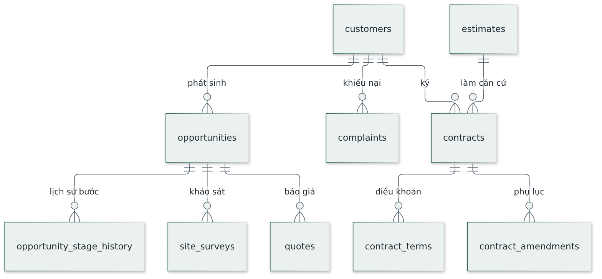

**Hình 4.** Từ khách hàng tới hợp đồng.

| Thực thể | Vai trò |
| --- | --- |
| `customers` | Hồ sơ khách hàng tập trung |
| `opportunities` | Cơ hội kinh doanh theo các bước của phễu bán hàng |
| `opportunity_stage_history` | Lịch sử chuyển bước — không ghi đè |
| `site_surveys` | Biên bản khảo sát khách hàng |
| `quotes` | Báo giá có phiên bản, phải duyệt trước khi gửi |
| `complaints` | Khiếu nại và phản ánh, có hạn xử lý |
| `contracts` | Hợp đồng; căn cứ giá lấy từ dự toán đã duyệt |
| `contract_terms` | Điều khoản chính: thanh toán, tạm ứng, bảo lãnh, bảo hành |
| `contract_amendments` | Phụ lục và phát sinh ngoài hợp đồng |

---

## 5. DA — Dự án và đấu thầu

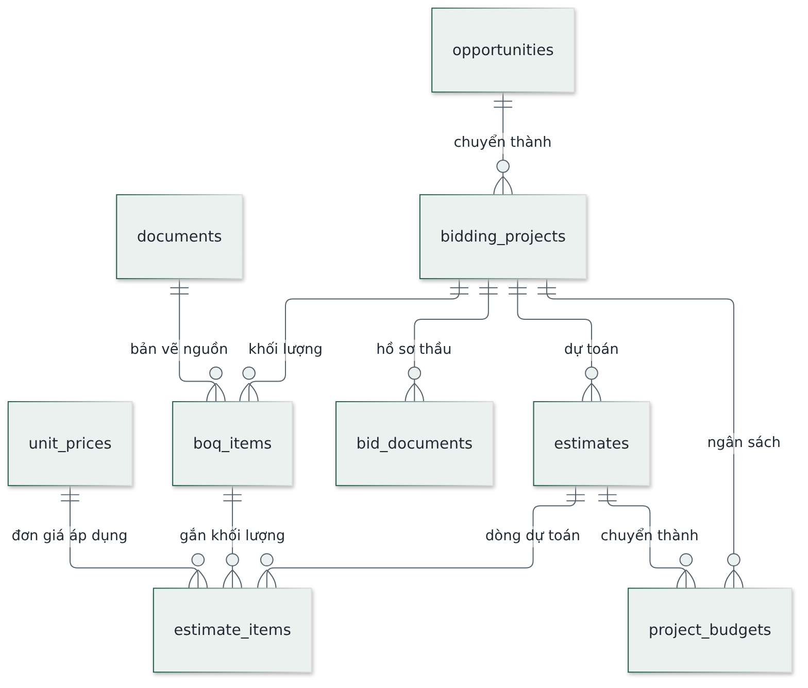

**Hình 5.** Gói thầu, khối lượng, dự toán, ngân sách.

| Thực thể | Vai trò |
| --- | --- |
| `bidding_projects` | Gói thầu hoặc dự án của pháp nhân xây dựng công nghiệp |
| `boq_items` | Bảng khối lượng, gắn với bản vẽ nguồn và phiên bản hồ sơ |
| `unit_prices` | Cơ sở dữ liệu đơn giá và định mức dùng chung, có lịch sử |
| `estimates` · `estimate_items` | Dự toán và các dòng dự toán |
| `bid_documents` | Hồ sơ dự thầu và danh mục kiểm |
| `project_budgets` | Ngân sách thi công chuyển từ dự toán sau khi ký hợp đồng |

Ràng buộc đáng chú ý: dòng dự toán trỏ về **đúng dòng khối lượng** và **đúng đơn giá đã áp dụng**,
nên đổi đơn giá về sau không làm đổi chứng từ đã lập.

---

## 6. TK — Thiết kế

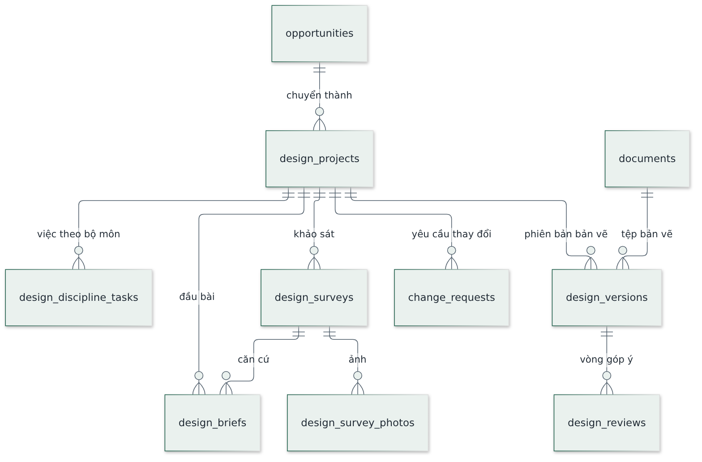

**Hình 6.** Dự án thiết kế và phiên bản bản vẽ.

| Thực thể | Vai trò |
| --- | --- |
| `design_projects` | Dự án thiết kế nhà ở |
| `design_surveys` · `design_survey_photos` | Khảo sát hiện trạng và ảnh kèm |
| `design_briefs` | Đầu bài thiết kế — tại một thời điểm chỉ một bản hiệu lực |
| `design_versions` | Phiên bản bản vẽ, trỏ tới tệp trong kho hồ sơ |
| `design_reviews` | Vòng góp ý và xác nhận duyệt của khách hàng |
| `design_discipline_tasks` | Việc theo bộ môn: kiến trúc, kết cấu, điện nước |
| `change_requests` | Yêu cầu thay đổi kèm đánh giá ảnh hưởng tiến độ và chi phí |

---

## 7. TC — Thi công và hiện trường

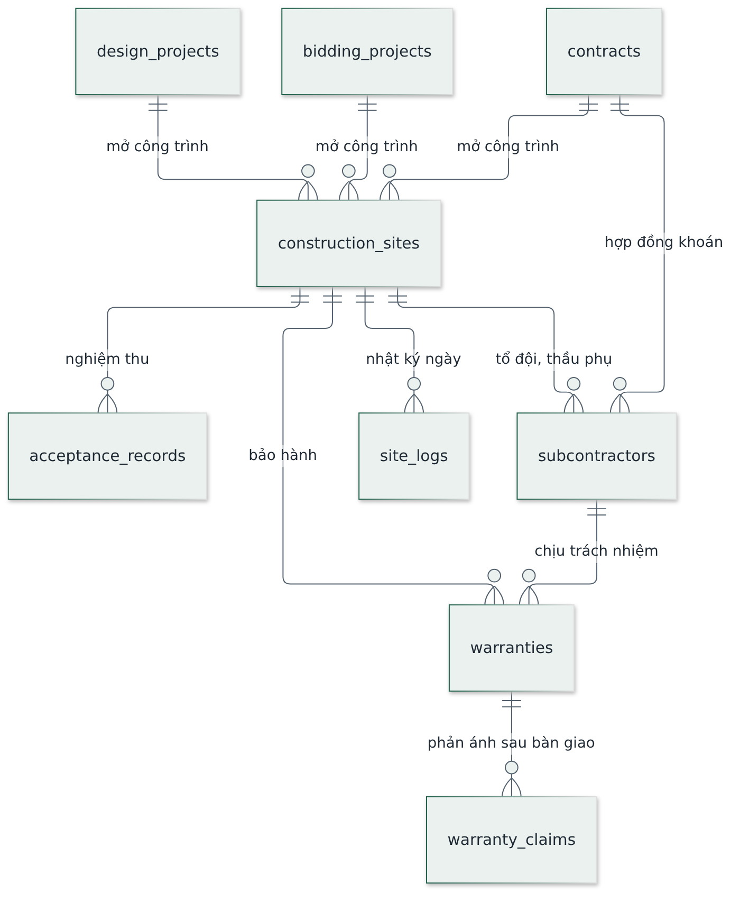

**Hình 7.** Công trình là trục nối liên phân hệ.

| Thực thể | Vai trò |
| --- | --- |
| `construction_sites` | Công trình, mở từ hợp đồng, gói thầu hoặc dự án thiết kế |
| `site_logs` | Nhật ký thi công theo ngày, nhập từ hiện trường |
| `acceptance_records` | Biên bản nghiệm thu theo danh mục kiểm |
| `subcontractors` | Tổ đội và nhà thầu phụ, kèm phạm vi khoán |
| `warranties` · `warranty_claims` | Bảo hành theo hạng mục và phản ánh sau bàn giao |

`construction_sites` được tham chiếu từ hầu hết phân hệ khác (kho, kế toán, nhân sự, mua hàng, sản
xuất), nên nó cũng là **điểm neo của phân quyền theo phạm vi hiện trường**.

---

## 8. MH — Mua hàng và vật tư

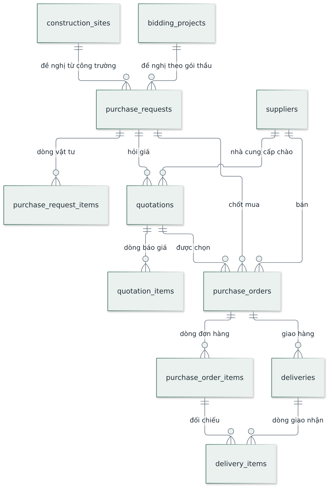

**Hình 8.** Chuỗi chứng từ mua hàng.

| Thực thể | Vai trò |
| --- | --- |
| `suppliers` | Nhà cung cấp, dùng chung các pháp nhân |
| `purchase_requests` · `purchase_request_items` | Đề nghị mua, nhận từ công trường, gói thầu hoặc xưởng |
| `quotations` · `quotation_items` | Báo giá của nhà cung cấp để so sánh |
| `purchase_orders` · `purchase_order_items` | Đơn đặt hàng sau khi chọn nhà cung cấp |
| `deliveries` · `delivery_items` | Giao nhận thực tế, đối chiếu với dòng đơn hàng |

Chuỗi chứng từ giữ liên kết suốt từ đề nghị tới giao nhận, nên truy được **một dòng vật tư đã đi qua
những bước nào**, và kế toán nhận chứng từ mà không nhập lại.

---

## 9. KHO — Kho và tài sản giàn giáo

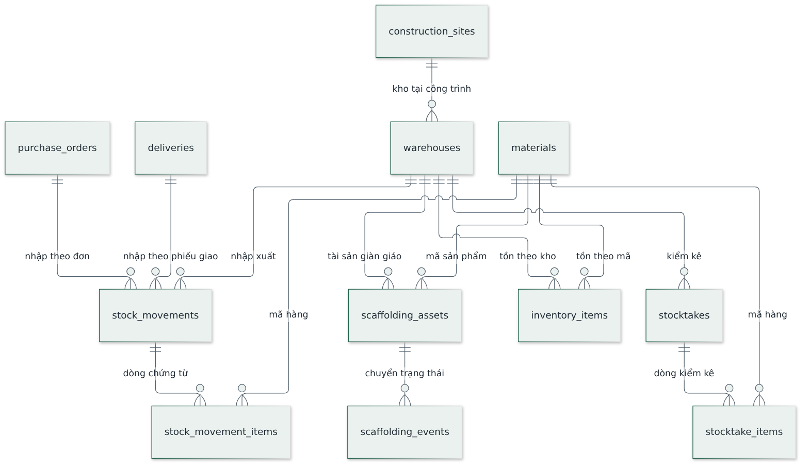

**Hình 9.** Tồn kho, chứng từ kho và tài sản luân chuyển.

| Thực thể | Vai trò |
| --- | --- |
| `materials` | Danh mục vật tư và sản phẩm, mã thống nhất toàn hệ thống |
| `warehouses` | Kho đa địa điểm, gồm kho tại công trình |
| `inventory_items` | Tồn theo kho và theo mã |
| `stock_movements` · `stock_movement_items` | Chứng từ nhập, xuất, điều chuyển |
| `stocktakes` · `stocktake_items` | Kiểm kê và chênh lệch |
| `scaffolding_assets` | Giàn giáo quản lý như **tài sản luân chuyển**, không phải vật tư tiêu hao |
| `scaffolding_events` | Mọi lần chuyển trạng thái của tài sản, đều phải có chứng từ |

Ràng buộc nghiệp vụ quan trọng: tổng số lượng theo mã sản phẩm phải **luôn cân** giữa các trạng thái
(ở kho, đang cho thuê, đang sửa, thiếu chưa thu hồi); lệch thì phải cảnh báo ngay trên dòng.

---

## 10. KT — Kế toán và tài chính

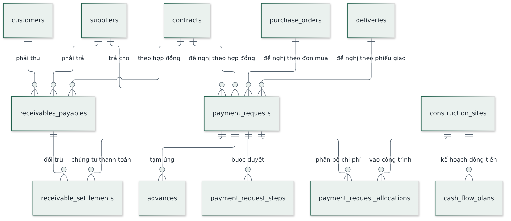

**Hình 10.** Đề nghị chi, công nợ và đối trừ.

| Thực thể | Vai trò |
| --- | --- |
| `payment_requests` | Đề nghị thanh toán hoặc tạm ứng, gắn hợp đồng, đơn mua hoặc phiếu giao |
| `payment_request_steps` | Từng bước duyệt — biết hồ sơ đang chờ ai và bao lâu |
| `payment_request_allocations` | Phân bổ chi phí vào đúng công trình và hạng mục |
| `advances` | Tạm ứng và theo dõi hoàn ứng |
| `receivables_payables` | Công nợ phải thu và phải trả |
| `receivable_settlements` | Đối trừ công nợ với chứng từ thanh toán |
| `cash_flow_plans` | Kế hoạch dòng tiền theo kỳ và theo công trình |
| `aging_buckets` | Nhóm tuổi nợ, cấu hình được |
| `accounting_periods` | Kỳ kế toán; **kỳ đã khoá chỉ sửa bằng chứng từ điều chỉnh** |

---

## 11. NS — Nhân sự và hành chính

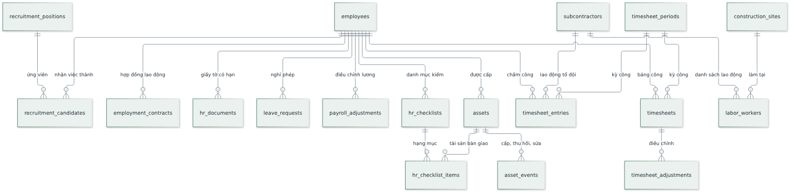

**Hình 11.** Hồ sơ nhân sự, chấm công, tài sản cấp phát.

| Thực thể | Vai trò |
| --- | --- |
| `employees` | Hồ sơ nhân sự — một người một hồ sơ duy nhất |
| `employment_contracts` · `hr_documents` | Hợp đồng lao động và giấy tờ có thời hạn |
| `timesheet_periods` · `timesheet_entries` · `timesheets` | Kỳ công, dữ liệu chấm công và bảng công đã chốt |
| `timesheet_adjustments` | Điều chỉnh sau khi chốt, ghi rõ lý do và người duyệt |
| `leave_requests` · `payroll_adjustments` | Nghỉ phép và điều chỉnh lương thưởng |
| `recruitment_positions` · `recruitment_candidates` | Tuyển dụng; ứng viên nhận việc trở thành nhân sự |
| `assets` · `asset_events` | Tài sản cấp phát và lịch sử cấp, thu hồi, sửa chữa |
| `hr_checklists` · `hr_checklist_items` | Danh mục kiểm khi nhận việc và khi nghỉ việc |
| `labor_workers` | Lao động thuộc tổ đội và thầu phụ tại công trường |

Cột lương và dữ liệu nhạy cảm khác thuộc nhóm **hạn chế theo cột**: chỉ vai trò được phép nhận giá
trị thật, và mọi lượt xem đều ghi nhật ký.

---

## 12. SX — Sản xuất và cho thuê giàn giáo

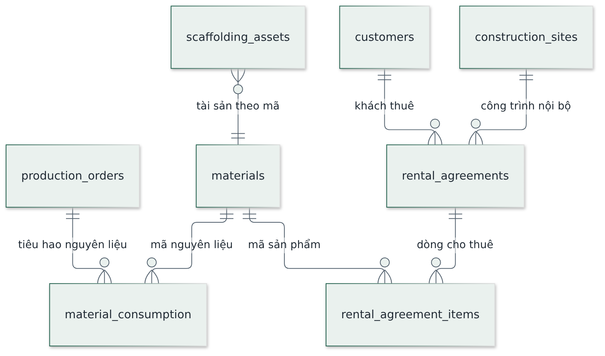

**Hình 12.** Lệnh sản xuất và hợp đồng cho thuê.

| Thực thể | Vai trò |
| --- | --- |
| `production_orders` | Lệnh sản xuất — chứng từ gốc của mọi hoạt động gia công |
| `material_consumption` | Tiêu hao nguyên liệu thực tế, để đối chiếu với định mức |
| `rental_agreements` | Hợp đồng cho thuê; có cờ đánh dấu **giao dịch nội bộ** để loại khi hợp nhất báo cáo |
| `rental_agreement_items` | Dòng cho thuê theo mã sản phẩm |

Tài sản giàn giáo thực tế nằm ở phân hệ Kho; phân hệ này quản lý **giao dịch** trên tài sản đó.
Giàn giáo cấp cho công trình nội bộ vẫn phải lập chứng từ đầy đủ như khách hàng bên ngoài.

---

## 13. Thiết kế AI

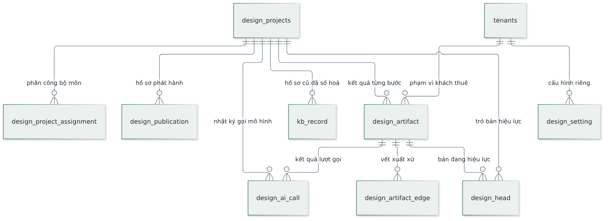

**Hình 13.** Kết quả bất biến và vết xuất xứ.

| Thực thể | Vai trò |
| --- | --- |
| `design_artifact` | Kết quả một bước, **khoá chính là mã băm nội dung**; không có lệnh sửa hay xoá |
| `design_artifact_edge` | Vết xuất xứ: kết quả này sinh ra từ những kết quả nào |
| `design_head` | Con trỏ tới bản đang hiệu lực của mỗi loại kết quả |
| `design_publication` | Hồ sơ đã phát hành, mỗi lần đúng một bộ môn |
| `design_project_assignment` | Phân công bộ môn cho từng người |
| `design_setting` | Cấu hình riêng theo khách thuê, ví dụ lớp phủ biểu mẫu đầu bài |
| `kb_record` | Hồ sơ công trình cũ đã số hoá, dùng làm tham chiếu |
| `design_ai_call` | Nhật ký mỗi lượt gọi mô hình: ai gọi, mô hình nào, chi phí |

Khác biệt lớn nhất so với các phân hệ khác: **kết quả là bất biến**. Sửa nghĩa là tạo kết quả mới và
chuyển con trỏ, nên luôn dựng lại được phương án cũ và truy được nó sinh ra từ đâu.

---

## 14. BC — Báo cáo: không có bảng riêng

Phân hệ Báo cáo **cố ý không có thực thể nào**. Mọi báo cáo và bảng điều khiển đọc trực tiếp từ nơi
dữ liệu phát sinh, qua các khung nhìn và hàm tổng hợp trong cơ sở dữ liệu.

Lý do: một nguồn dữ liệu duy nhất. Nếu báo cáo có bảng riêng thì sẽ tồn tại hai con số cho cùng một
sự việc, và câu hỏi «số nào đúng» không có lời đáp. Đổi lại, báo cáo nặng phải giải quyết bằng chỉ
mục và truy vấn, không bằng bảng tổng hợp sẵn.

---

## 15. Phân quyền theo hàng áp cho nhóm bảng nào

Mỗi bảng áp **đúng một** trong năm mẫu. Chi tiết logic xem tài liệu Kiến trúc.

| Mẫu | Áp cho |
| --- | --- |
| A — theo pháp nhân | Phần lớn bảng giao dịch |
| B — theo người chịu trách nhiệm | Cơ hội, báo giá, hợp đồng, hồ sơ thiết kế |
| C — theo hạn mức phê duyệt | Hồ sơ chờ duyệt, đề nghị mua, đề nghị thanh toán |
| D — hạn chế theo cột | Đơn giá, dòng dự toán, ngân sách, lương, lợi nhuận |
| E — theo phạm vi hiện trường | Công trình, nhật ký thi công, nghiệm thu, dữ liệu gắn công trình |

Ba cơ chế cưỡng chế ở tầng cơ sở dữ liệu, không ở giao diện:

1. **Bật phân quyền tự động** cho bảng mới bằng trigger sự kiện — quên viết chính sách thì bảng bị chặn hết, tức là hỏng theo hướng an toàn.
2. **Khoá danh tính bản ghi**: các cột định danh và cột thuộc quy trình không nhận lệnh sửa đến từ trình duyệt.
3. **Ghi nhật ký truy cập** tự động cho mọi lượt đọc dữ liệu thuộc nhóm hạn chế theo cột.
