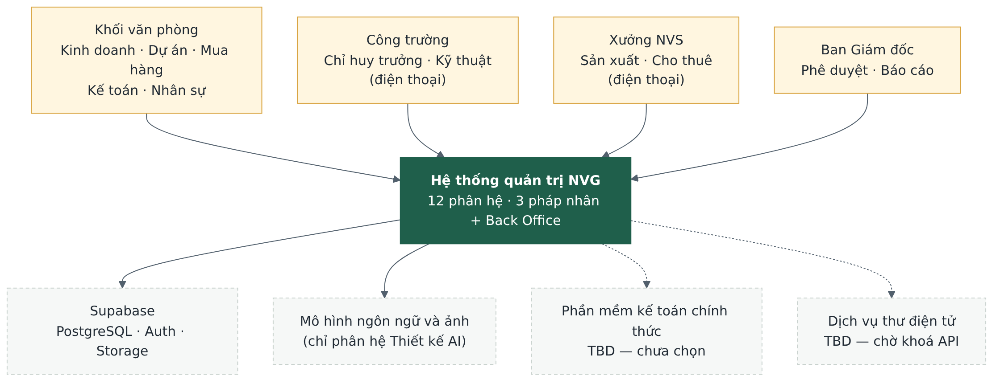
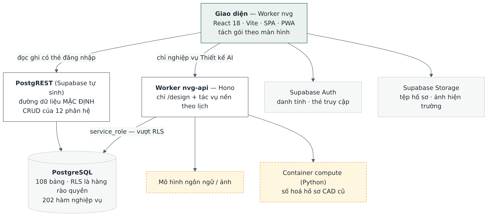
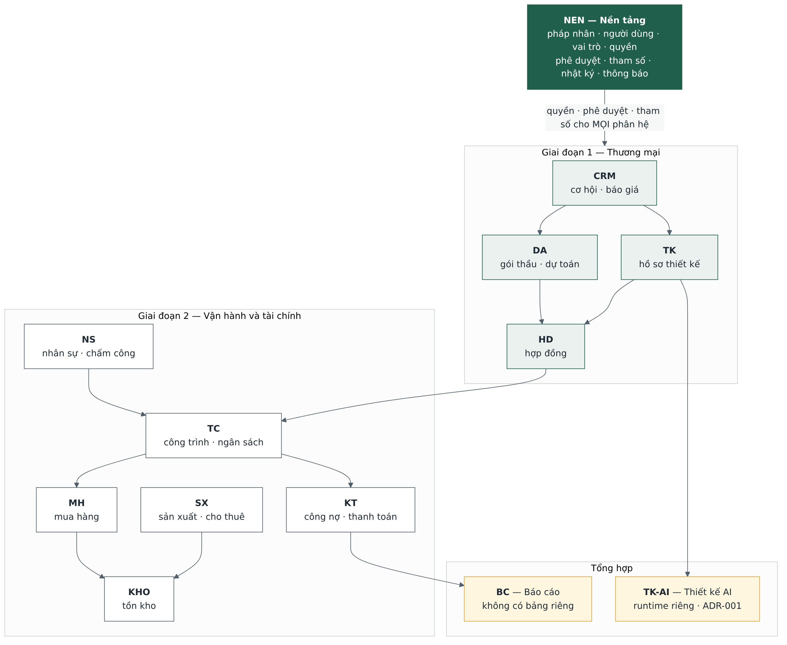
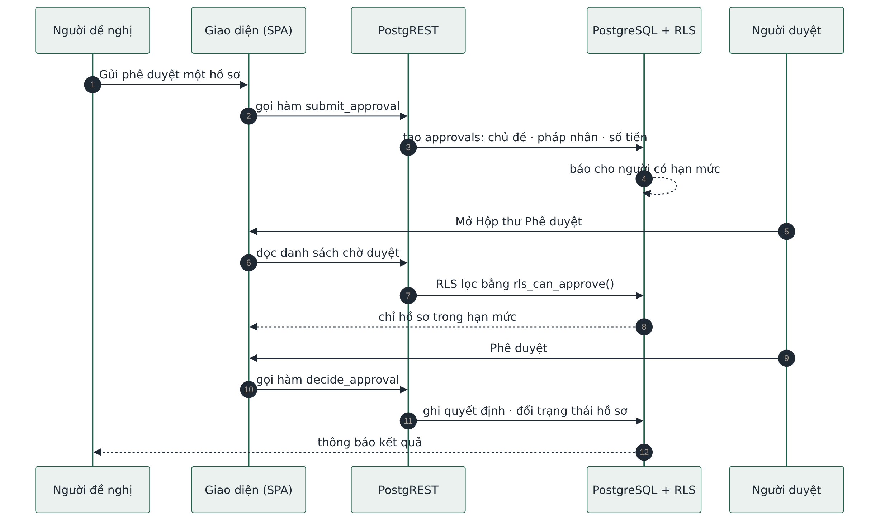
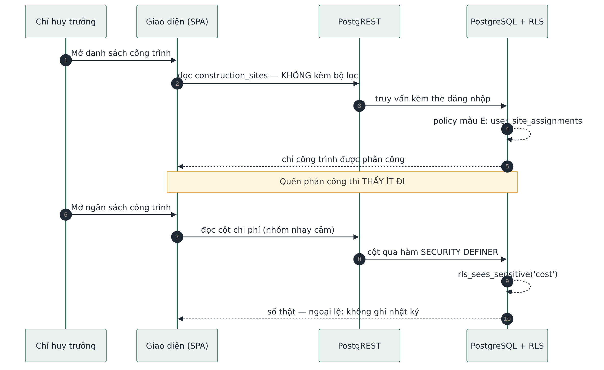
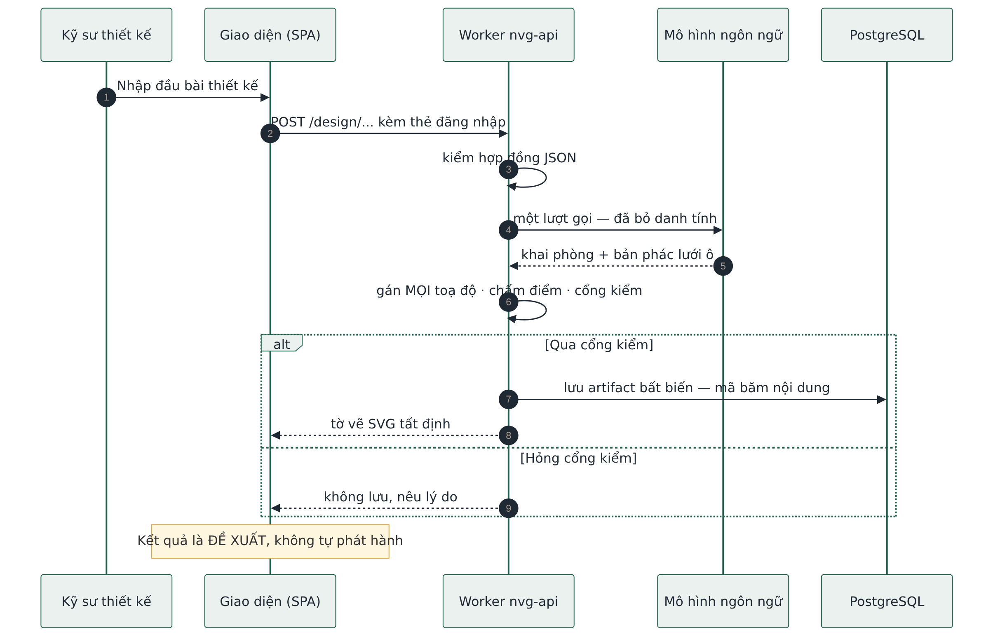
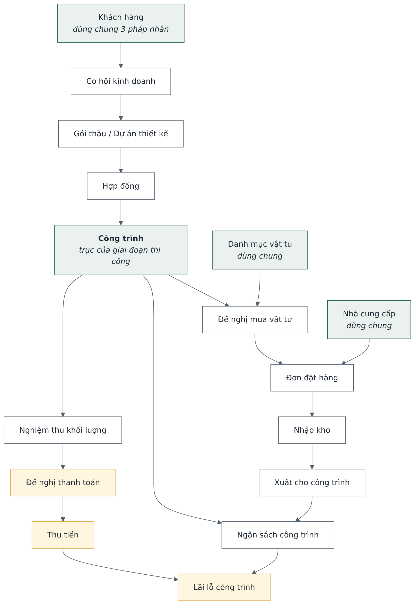
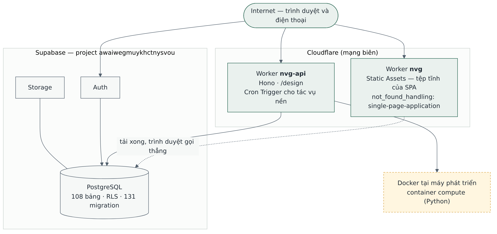

# SAD — Hệ thống Quản trị Nhà Việt Group

| | |
| --- | --- |
| **Phiên bản** | 1.0 |
| **Ngày** | 20/09/2026 |
| **Trạng thái** | Chờ Haan duyệt |
| **Người soạn** | Đội triển khai — vai trò Kiến trúc sư phần mềm |
| **Phạm vi** | Toàn hệ thống, 12 phân hệ |

> Mọi con số trong tài liệu **đo trên hệ thống thật ngày 20/09/2026**. Phần chưa quyết được đánh
> dấu `TBD`. Phần suy luận chưa ai xác nhận đánh dấu **Giả định**.

---

## 1. Executive Summary

- Hệ thống quản trị nội bộ cho **ba pháp nhân** (NVC xây dựng công nghiệp, NVO nhà ở dân dụng,
  NVS giàn giáo) dùng chung một khối Back Office. Thay cho Excel, Word, Zalo và Google Drive.
- **12 phân hệ** trên **một cơ sở dữ liệu duy nhất**. Nền tảng là phân hệ NEN: pháp nhân, người
  dùng, quyền, phê duyệt, tham số, nhật ký.
- **Phân quyền nằm trong cơ sở dữ liệu** (RLS của PostgreSQL), không nằm ở giao diện hay API.
  Đây là quyết định kiến trúc quan trọng nhất — xem ADR-002.
- **Không có tầng API tự viết cho nghiệp vụ thường**: giao diện gọi thẳng PostgREST. Chỉ phân hệ
  Thiết kế AI có endpoint riêng trên Cloudflare Workers — xem ADR-001.
- Chạy trên **mạng biên Cloudflare + Supabase**, không có máy chủ ứng dụng thường trực.

| Số đo | Giá trị |
| --- | --- |
| Phân hệ | 12 (cộng phân hệ Thiết kế AI đang làm) |
| Bảng dữ liệu | 108 |
| Migration | 131 |
| Hàm nghiệp vụ trong CSDL | 202, trong đó 55 hàm phân quyền |
| Vai trò | 14 |
| Màn hình | khoảng 110 |
| Endpoint API tự viết | chỉ `/design` |
| Phép thử tự động | 446 giao diện · 142 phân quyền · 1.606 chạy trên mỗi thay đổi |

---

## 2. Purpose & Scope

**Mục đích.** Cho người mới đọc trong mười phút để biết: hệ thống gồm gì, các phần nối nhau ra
sao, dữ liệu đi đường nào, quyết định nào đã chốt và vì sao.

| Trong phạm vi | Ngoài phạm vi |
| --- | --- |
| Cấu trúc hệ thống, ranh giới, phụ thuộc | Thiết kế chi tiết từng lớp, từng hàm |
| Luồng nghiệp vụ trọng yếu | Đặc tả nghiệp vụ đầy đủ (xem PRD) |
| Quyết định kiến trúc và lý do | Lược đồ bảng đầy đủ (xem `db/src/schema/`) |
| Bảo mật, triển khai, khả mở rộng | Hướng dẫn sử dụng |

**Người đọc:** chủ dự án, người viết mã ở phiên sau, người kiểm thử, Ban Giám đốc NVG.

---

## 3. Architecture Drivers / NFR

| Yếu tố dẫn dắt | Yêu cầu đo được | Ảnh hưởng tới kiến trúc |
| --- | --- | --- |
| Dữ liệu nhạy cảm nhiều tầng | Giá vốn, lợi nhuận, lương chỉ tới đúng nhóm vai trò | RLS là hàng rào duy nhất; cột nhạy cảm đi qua hàm có ghi nhật ký |
| Ba pháp nhân, báo cáo hợp nhất | Tách bạch dữ liệu, vẫn cộng được toàn nhóm | `company_id` trên mọi bảng giao dịch; loại trừ giao dịch nội bộ khi hợp nhất |
| Người dùng ở công trường | Cập nhật hằng ngày **dưới 10–20 phút**, mục tiêu 5–10 phút | Bố cục di động thật, tách gói theo màn hình, không nhập hai lần |
| Quy chế NVG chưa ban hành | Hạn mức, ngưỡng, thời hạn phải sửa được khi đang chạy | Cấu hình là dữ liệu, không phải mã — ADR-005 |
| Một người triển khai | Sửa một quy tắc chỉ động vào một chỗ | Điều kiện phân quyền gói trong hàm dùng chung |
| Sai quyền phải bắt được bằng máy | Phép thử đăng nhập thật bằng từng vai trò | 142 phép thử phân quyền chạy trên CSDL thật |
| Giao diện tiếng Việt 100% | Kể cả chữ do trình duyệt tự sinh | Cấm dùng điều khiển gốc tự sinh chữ; có phép thử canh |

---

## 4. System Context

- Bốn nhóm người dùng, một hệ thống, bốn hệ thống ngoài. Hai trong bốn hệ thống ngoài còn là `TBD`.
- **Supabase** là nền dữ liệu, không phải "một dịch vụ ngoài tuỳ chọn": mất Supabase là mất hệ thống.
- **Mô hình ngôn ngữ** chỉ phục vụ phân hệ Thiết kế AI. Mười hai phân hệ nghiệp vụ không gọi AI.
- Dữ liệu gửi ra ngoài đã bỏ danh tính; khung tên mang mã hồ sơ không gửi.

---

## 5. High-Level Architecture

| Tầng | Thành phần | Trách nhiệm |
| --- | --- | --- |
| Giao diện | Worker `nvg` (Static Assets) | Ứng dụng một trang, PWA, tách gói theo màn hình |
| Dữ liệu | **PostgREST** | Đường mặc định: đọc, lọc, ghi cho 12 phân hệ |
| Nghiệp vụ đặc thù | Worker `nvg-api` (Hono) | Chỉ `/design`; cổng vào tác vụ nền theo lịch |
| Lưu trữ | PostgreSQL · Auth · Storage | Dữ liệu, danh tính, tệp — kèm RLS |

**Không có API Gateway, không có hàng đợi, không có bộ nhớ đệm riêng.** Quy mô hiện tại không đòi
hỏi, và mỗi tầng thêm vào là một tầng nữa có thể hỏng. Khi cần gửi thư điện tử hàng loạt thì thêm
Cloudflare Queues — hiện `TBD`, chờ khoá dịch vụ thư.

---

## 6. Logical / Component Architecture

| Phân hệ | Trách nhiệm | Bảng | Hiện trạng |
| --- | --- | --- | --- |
| **NEN** | Pháp nhân, người dùng, vai trò, quyền, phê duyệt, tham số, nhật ký, thông báo | 20 | Xong, 6 màn hình quản trị |
| CRM | Khách hàng, cơ hội, báo giá có phiên bản | 6 | Xong |
| DA | Gói thầu, dự toán | 7 | Xong phần lõi |
| TK | Hồ sơ thiết kế | 8 | Xong phần lõi |
| HD | Hợp đồng, phát sinh | 3 | Xong |
| TC | Công trình, ngân sách, nhật ký thi công | 6 | Xong lõi phạm vi cũ |
| MH | Đề nghị mua, so sánh báo giá, đơn hàng | 9 | Xong |
| KHO | Tồn kho, nhập xuất, kiểm kê | 9 | Xong |
| KT | Công nợ, thanh toán, lãi lỗ | 9 | Xong |
| NS | Nhân sự, chấm công, tuyển dụng | 16 | Xong |
| SX | Sản xuất, cho thuê giàn giáo | 4 | Mới có khung |
| BC | Báo cáo | 0 — đọc từ nguồn | Xong phần lớn |
| TK-AI | Thiết kế sơ bộ bằng AI | 8 | Đang làm |

Hai ranh giới cứng: **BC không có bảng riêng** (một nguồn dữ liệu duy nhất, báo cáo đọc từ nơi
phát sinh), và **TK-AI không ghi vào hồ sơ phát hành** (kết quả AI là đề xuất, người có thẩm
quyền mới phát hành).

---

## 7. Runtime / Critical Flows

### 7.1 Phê duyệt theo hạn mức

Một Hộp thư Phê duyệt cho mọi loại hồ sơ. Hạn mức đọc từ bảng `approval_limits`, nên đổi quy chế
là đổi dữ liệu. Hồ sơ vượt hạn mức tự chuyển bước cao hơn.

### 7.2 Đọc dữ liệu có phạm vi và có cột nhạy cảm

Giao diện **không gửi điều kiện lọc người dùng**; cơ sở dữ liệu tự lọc. Quên phân công dẫn tới
thấy ít đi — hướng sai an toàn.

### 7.3 Thiết kế sơ bộ bằng AI

Luồng duy nhất đi qua Worker và ra dịch vụ ngoài. Mô hình đề xuất bố cục; **chương trình gán mọi
toạ độ**. Hỏng cổng kiểm thì không lưu.

### 7.4 Tác vụ nền (không có sơ đồ riêng)

Cron Trigger gọi Worker, Worker gọi ba hàm SQL quét cảnh báo rồi ghi log. Điều kiện nghiệp vụ nằm
trong SQL để không có hai bản. Cảnh báo vượt ngân sách không chờ quét — trigger báo ngay khi ghi.

---

## 8. Data Architecture

**Quy ước áp cho mọi bảng**

| Chủ đề | Quy tắc |
| --- | --- |
| Định danh | Khoá chính UUID; tên bảng số nhiều, tiếng Anh, `snake_case` |
| Phạm vi | Bảng giao dịch có `company_id`; bảng dùng chung thì không |
| Tiền | Số nguyên đồng, **không thập phân**. Số lượng vật lý là số thực có đơn vị |
| Trạng thái | Quy về sáu nhóm chung cho toàn hệ thống |
| Lịch sử | Thay đổi quan trọng ghi sang **bảng lịch sử riêng**, không ghi đè |
| Xoá | Xoá mềm cho bảng quan trọng; phân công thì kết thúc bằng ngày, không xoá dòng |
| Chứng từ đã ký | Bất biến; sửa bằng chứng từ điều chỉnh có người duyệt, cưỡng chế ở CSDL |
| Hiện trường | `client_created_at`, `synced_at`, `client_generated_id` để khử ghi trùng |

**Hồ sơ 360°:** bảy thực thể tham chiếu xuyên phân hệ (pháp nhân, người dùng, khách hàng, cơ hội,
gói thầu/dự án thiết kế, hợp đồng, công trình) được **liên kết, không sao chép**.

---

## 9. Security Architecture

**Năm mẫu phân quyền — mỗi bảng áp đúng một mẫu**

| Mẫu | Logic | Ví dụ |
| --- | --- | --- |
| A | Theo pháp nhân; Ban Giám đốc và quản trị viên thấy tất cả | Hầu hết bảng giao dịch |
| B | A cộng điều kiện người chịu trách nhiệm mới sửa được | Cơ hội, hợp đồng |
| C | Hiện trong Hộp thư Phê duyệt và cho duyệt nếu trong hạn mức | Đề nghị mua, thanh toán |
| D | Hạn chế theo **cột**, trả số thật qua hàm có ghi nhật ký | Giá vốn, lợi nhuận, lương |
| E | Chỉ dữ liệu công trình được phân công | Công trình, nhật ký thi công |

**Nguyên tắc vận hành**

- Trình duyệt chỉ giữ khoá ẩn danh. Khoá `service_role` **chỉ tồn tại trong Worker**.
- Mọi lượt xem hoặc sửa dữ liệu nhóm nhạy cảm ghi một dòng `sensitive_access_logs` (hiện 2.434 dòng).
- Bảng mới tự động bật RLS bằng trigger sự kiện: quên viết policy thì bảng **bị chặn hết**, tức là
  hỏng theo hướng an toàn.
- Ba lớp chặn: menu ẩn theo quyền → chặn đường dẫn gõ tay → RLS. Chỉ lớp cuối là hàng rào.
- Không lưu: mật khẩu thô, mã xác thực một lần, tài khoản ngân hàng cá nhân.
- Không commit bí mật; dùng Cloudflare Workers Secrets.

---

## 10. Deployment Architecture

| Môi trường | Giao diện | API | Cơ sở dữ liệu |
| --- | --- | --- | --- |
| Máy phát triển | Vite cổng 5173 | `wrangler dev` | Dùng **chung** project Supabase |
| Bản chạy thử | Worker `nvg` | Worker `nvg-api` | Cùng project đó |
| Production | Chưa dựng | Chưa dựng | **Chưa tách** — xem R-1 |

**Hai cái bẫy đã gặp thật**

1. Kèm `--env production` khi triển khai Worker `nvg` sinh ra một Worker thứ hai; bản thật giữ
   nguyên bản cũ mà không báo lỗi.
2. Biến môi trường `VITE_` rỗng làm **trắng màn hình** trong khi bản dựng vẫn báo thành công.
   Phải kiểm bằng cách tìm địa chỉ máy chủ trong gói đã dựng.

---

## 11. Scalability & Reliability

| Khía cạnh | Hiện trạng | Đánh giá |
| --- | --- | --- |
| Quy mô người dùng | Khoảng 40 nhân sự văn phòng và ban công trường | Xa ngưỡng cần chia tải |
| Khối lượng giao dịch | Khoảng 800 dự án và đơn hàng mỗi năm | Một instance PostgreSQL dư sức |
| Giao diện | Tệp tĩnh trên mạng biên | Không có điểm nghẽn máy chủ ứng dụng |
| Tác vụ nền | Cron Trigger, không hàng đợi | Đủ cho ba loại quét hiện có |
| Ngoại tuyến | Chỉ khử ghi trùng, **chưa làm ngoại tuyến thật** | `TBD` — KHO-09 |
| Sao lưu | Theo cơ chế của Supabase | Chưa có quy trình phục hồi được diễn tập |
| Điểm hỏng đơn lẻ | Supabase | Chấp nhận ở giai đoạn demo; cần soát lại trước vận hành thật |

Hướng mở rộng khi cần, theo thứ tự: chỉ mục và truy vấn trước, rồi bộ nhớ đệm cho báo cáo nặng,
sau cùng mới tách dịch vụ. **Chưa có nhu cầu nào trong ba mức này.**

---

## 12. Technology Stack

| Lớp | Công nghệ | Ghi chú |
| --- | --- | --- |
| Giao diện | React 18, TypeScript, Vite, Tailwind, shadcn/ui | SPA, không kết xuất phía máy chủ |
| Trạng thái | TanStack Query, Zustand | Bộ đệm truy vấn 30 giây |
| Biểu mẫu | React Hook Form, Zod | Zod dùng chung giao diện và máy chủ |
| API | Supabase PostgREST; Cloudflare Workers + Hono | Workers chỉ cho Thiết kế AI |
| Dữ liệu | PostgreSQL trên Supabase, Drizzle ORM | Migration là nguồn duy nhất của lược đồ |
| Xác thực | Supabase Auth | |
| Tệp | Supabase Storage | |
| Nền tảng chạy | Cloudflare Workers, Static Assets, Cron Triggers | |
| Kiểm thử | Vitest, React Testing Library, Playwright | |
| AI | Mô hình ngôn ngữ và ảnh cho Thiết kế AI | Không dùng cho nghiệp vụ khác |

---

## 13. Architecture Decisions

| Mã | Quyết định | Đánh đổi chính |
| --- | --- | --- |
| [ADR-001](adr/ADR-001.md) | PostgREST là đường dữ liệu mặc định; Workers chỉ cho ngoại lệ | Mọi truy vấn phải diễn đạt được bằng PostgREST |
| [ADR-002](adr/ADR-002.md) | Phân quyền bằng RLS trong CSDL | Logic quyền viết bằng SQL, khó đọc hơn TypeScript |
| [ADR-003](adr/ADR-003.md) | Năm mẫu RLS, mỗi bảng đúng một mẫu | Trường hợp lạ phải uốn về một trong năm mẫu |
| [ADR-004](adr/ADR-004.md) | Đa pháp nhân bằng cột `company_id` | Lọc sai một chỗ là lộ dữ liệu chéo pháp nhân |
| [ADR-005](adr/ADR-005.md) | Cấu hình là dữ liệu, không phải mã | Chưa cấu hình thì màn hình phải xử lý giá trị rỗng |
| — | Giao diện là SPA trên Workers Static Assets | Không có kết xuất phía máy chủ, không SEO |
| — | Chứng từ đã ký bất biến, cưỡng chế ở CSDL | Mọi sửa đổi thành luồng điều chỉnh |
| — | Tác vụ nền: Cron gọi hàm SQL | Khó gỡ lỗi hơn mã TypeScript |
| — | Ba lớp chặn quyền, chỉ lớp cuối là hàng rào | Quyền khai ở hai nơi, phải giữ đồng bộ |
| — | Kết quả AI luôn là đề xuất | Không tự động hoá được khâu phát hành hồ sơ |

---

## 14. Risks & Trade-offs

| Mã | Rủi ro | Ảnh hưởng | Hướng xử lý |
| --- | --- | --- | --- |
| R-1 | Một project Supabase dùng chung cho máy phát triển và bản chạy thử | Chạy migration ở máy đổi luôn CSDL bản công khai; phép thử CSDL **xoá cứng** dữ liệu thử | Bắt buộc tách **trước dòng dữ liệu thật đầu tiên** |
| R-2 | Bảng `audit_logs` chưa có nguồn ghi nào | Không trả lời được "hôm qua ai sửa gì" theo chiều ngang | Chờ quyết định nghiệp vụ nào ghi vào đây |
| R-3 | Bảng `tasks` có nhưng chưa dùng | Việc không gắn phê duyệt chỉ có thông báo một chiều | Quyết định: bỏ hẳn hay dùng thật |
| R-4 | Ma trận quyền không có chiều pháp nhân | Nhân viên kinh doanh NVS dùng chung vai trò với khối Xưởng | Ghi nhận, chưa sửa |
| R-5 | Bảng thời hạn cam kết cố ý để rỗng | Cảnh báo quá hạn **chưa có căn cứ để chạy** | Chờ Ban Giám đốc ban hành, không nạp số tạm |
| R-6 | Hệ thống không chặn người tự duyệt hồ sơ của mình | Kiểm soát yếu ở chủ đề mà người lập và người duyệt cùng vai trò | Thêm một bước duyệt — bằng dữ liệu |
| R-7 | Phụ thuộc một nhà cung cấp nền dữ liệu | Supabase hỏng là hệ thống dừng | Chấp nhận ở giai đoạn demo |
| R-8 | Thư viện Supabase **không coi mã 300 là lỗi** | Truy vấn nhúng mơ hồ trả rỗng, màn hình đọc như "chưa có dữ liệu" | Đã thêm phép thử đọc mã nguồn canh thường trực |

---

## 15. Open Issues / TBD

| Mã | Câu hỏi còn mở | Chặn việc gì |
| --- | --- | --- |
| TBD-1 | Thời hạn cam kết phản hồi của từng phòng ban | Cảnh báo quá hạn của công trường |
| TBD-2 | Phương thức ghi nhận công tại công trường | Chấm công khối công trường |
| TBD-3 | Bộ mã vật tư, công trình, nhà cung cấp | Nhập liệu thật — đã có bản đề xuất chờ duyệt |
| TBD-4 | Phần mềm kế toán chính thức để tích hợp | Xuất dữ liệu sang kế toán |
| TBD-5 | Công thức lương | Tính lương từ bảng công |
| TBD-6 | Ngoại tuyến thật cho Kho hay chỉ trực tuyến | Thiết kế đồng bộ dữ liệu |
| TBD-7 | Tên miền chính thức, đầu mối hỗ trợ kỹ thuật | Nội dung thông báo lỗi, cấu hình nguồn cho phép |

Danh sách đầy đủ kèm hiện trạng: `doc/VAN_DE_CON_MO.md`.

---

## 16. Related Documents

| Tài liệu | Trả lời câu hỏi | Đường dẫn |
| --- | --- | --- |
| PRD | Làm gì, ranh giới không làm | `doc/PRD_He_thong_Quan_tri_NVG_v1_4.docx` |
| BSD | Bảng, quan hệ, mẫu RLS, API đã đặc tả | `doc/BackendSchema_Document_NVG_v1_1.docx` |
| AFD | Màn hình, điều hướng, hành trình | `doc/Webapp_Flow_Document_NVG_v1_1.docx` |
| TSD | Thư viện, hạ tầng, CI/CD | `doc/TechStack_Document_NVG_v1_2.docx` |
| CGD | Nội dung hiển thị, màu, khoảng cách | `doc/ContentGuidelines_Document_NVG_v1_2.docx` |
| ADR | Vì sao chọn kiến trúc đó | `doc/architecture/adr/` |
| Kế hoạch triển khai | Thứ tự làm, hiện trạng từng phân hệ | `BUILD_PLAN.md` |
| Câu hỏi nghiệp vụ còn treo | Cái gì đang chặn cái gì | `doc/VAN_DE_CON_MO.md` |
| Đặc tả Thiết kế AI | Ràng buộc riêng của phân hệ TK-AI | `doc/design/` |
| Hàng rào cho người viết mã | Cái gì không được vượt | `CLAUDE.md` |
