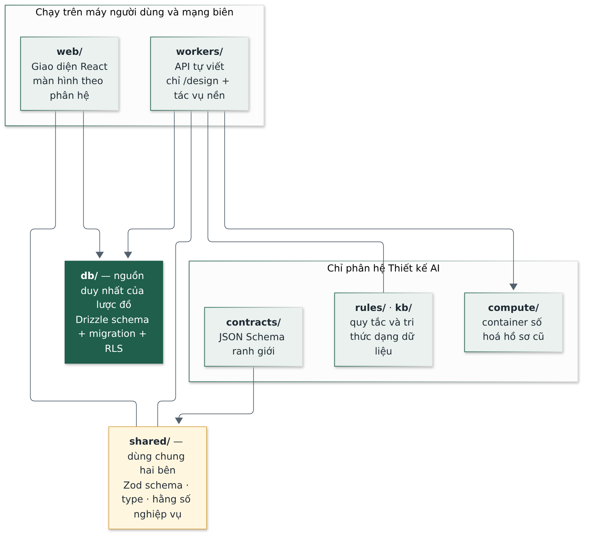
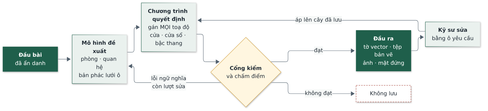

# Software Design Document (Tài liệu Thiết kế Chi tiết)

Hệ thống Quản trị Nhà Việt Group

| | |
| --- | --- |
| **Phiên bản** | 1.0 |
| **Ngày soạn** | 28/09/2026 |
| **Trạng thái** | Bản nháp — chờ Haan duyệt |
| **Người soạn** | Đội triển khai — vai trò Kiến trúc sư phần mềm |
| **Phạm vi** | Thiết kế chi tiết: cấu trúc mã, quy ước, luồng trọng yếu, phân hệ Thiết kế AI |

> Tài liệu Kiến trúc trả lời «kiến trúc gì»; tài liệu này trả lời **«thiết kế chi tiết thế nào»**:
> mã nguồn tổ chức ra sao, một nghiệp vụ đi qua những lớp nào, quy ước bắt buộc là gì. Viết cho
> **người mới vào dự án**: đọc xong biết thêm một màn hình hoặc một endpoint thì đi đường nào.
> Đây là tài liệu thiết kế, không phải báo cáo tiến độ. Thuật ngữ giải nghĩa ở Mục 0; thuật ngữ
> kiến trúc chung xem phụ lục của tài liệu Kiến trúc.

---

## 0. Chú giải thuật ngữ

| Thuật ngữ | Nghĩa |
| --- | --- |
| Hook (React) | Hàm dùng lại được trong giao diện, tên bắt đầu bằng `use…`; nơi đặt lô-gic lấy dữ liệu và quyền |
| TanStack Query | Thư viện quản lý dữ liệu lấy từ máy chủ: tự đệm, tự tải lại, tự báo trạng thái đang tải và lỗi |
| Query key (khoá truy vấn) | Mảng định danh một truy vấn trong bộ đệm; ghi xong phải «làm cũ» đúng khoá để màn hình tải lại |
| Mutation | Thao tác ghi (thêm, sửa, xoá) trong TanStack Query |
| RPC (Remote Procedure Call) | Gọi một hàm viết sẵn trong cơ sở dữ liệu thay vì ghi thẳng vào bảng |
| Embed (PostgREST) | Lấy kèm dữ liệu bảng liên quan trong cùng một truy vấn |
| Skeleton | Khung xám hình dạng nội dung, hiện trong lúc tải thay cho vòng xoay |
| Lazy-load | Chỉ tải mã của một màn hình khi người dùng mở màn hình đó |
| Guard (chặn tuyến) | Thành phần bọc một tuyến đường, chặn người không đủ quyền trước khi vào |
| Idempotent | Chạy lại nhiều lần cho cùng kết quả, không nhân đôi dữ liệu |
| Workflow | Bộ điều phối nhiều bước nền, dừng được giữa các bước để người duyệt |
| Artifact | Kết quả bất biến của một bước Thiết kế AI, khoá bằng mã băm nội dung |
| Đột biến (mutation testing) | Cố ý cài lỗi vào mã để kiểm chứng bộ kiểm thử có bắt được không |

---

## 1. Giới thiệu

**Người đọc:** người viết mã mới vào dự án, người kiểm thử, kiến trúc sư.

**Quan hệ với các tài liệu khác**

| Tài liệu | Trả lời | Quan hệ với tài liệu này |
| --- | --- | --- |
| Kiến trúc phần mềm | Kiến trúc gì, vì sao | Tài liệu này hiện thực các quyết định ở đó |
| Sơ đồ quan hệ thực thể | Bảng, quan hệ, ràng buộc dữ liệu | Tài liệu này không lặp lại lược đồ |
| Đặc tả API | Hợp đồng gọi dữ liệu và endpoint | Tài liệu này mô tả phía gọi và phía nhận |
| Yêu cầu sản phẩm | Làm gì, ranh giới không làm | Nguồn của mọi màn hình và nghiệp vụ |

---

## 2. Cấu trúc mã nguồn

**Hình 1.** Các gói mã và quan hệ phụ thuộc.

Một kho mã duy nhất (monorepo) gồm bốn gói chính cộng các thư mục riêng của phân hệ Thiết kế AI.

| Thư mục | Vai trò | Ràng buộc |
| --- | --- | --- |
| `web/` | Giao diện React, màn hình chia theo phân hệ | Chỉ dùng khoá ẩn danh; không chứa bí mật |
| `workers/` | API tự viết (chỉ `/design`) và tác vụ nền theo lịch | Nơi duy nhất giữ khoá đặc quyền và khoá mô hình AI |
| `shared/` | Kiểu dữ liệu, hằng số nghiệp vụ, định dạng, câu chữ dùng chung | **Không** truy vấn cơ sở dữ liệu, không gọi API, không phụ thuộc môi trường chạy |
| `db/` | Lược đồ Drizzle, migration, phân quyền, dữ liệu mẫu | Nguồn duy nhất của cấu trúc bảng |
| `contracts/` | JSON Schema cho mọi ranh giới của Thiết kế AI | Viết tay; sinh ra Zod cho `shared/` |
| `rules/` · `kb/` | Quy tắc và tri thức nghề dạng dữ liệu | Không viết ngưỡng vào mã |
| `compute/` | Container Python số hoá hồ sơ cũ | Không giữ trạng thái, không gọi ngược Worker |

### 2.1 Bên trong `web/src/`

| Thư mục | Nội dung |
| --- | --- |
| `pages/<phân hệ>/` | Màn hình, chia theo mã phân hệ (`crm`, `tk`, `kho`…), cộng `phe-duyet/` dùng chung |
| `components/ui/` | Nguyên thuỷ dùng chung: `button`, `input`, `date-input`, `money-input`, `field`, `states`, `status-lozenge`, `confirm-dialog` |
| `components/layout/` | Khung ứng dụng: `app-shell`, `sidebar`, `bottom-nav`, `module-nav`, `module-guard`, `protected-route` |
| `components/entity/` | Thành phần theo mẫu bố cục: `entity-table` (Danh sách), `entity-detail` (Chi tiết 360°), `kanban-board`, `approval-inbox` |
| `hooks/` | Một tệp `use-<chủ đề>.ts` cho mỗi nhóm nghiệp vụ, cộng `use-entity.ts` (CRUD phẳng dùng chung) |
| `lib/` | Hạ tầng không phải giao diện: `supabase.ts`, `auth.tsx`, `company-scope.ts`, `design-api.ts`, `validation-message.ts`, `build-env.ts` |
| `test/` | Hạ tầng kiểm thử: `render.tsx` (`renderWithApp`), stub, kiểm thử canh quy ước |

### 2.2 Quy ước đặt tên

| Đối tượng | Quy ước | Ví dụ |
| --- | --- | --- |
| Tệp và thư mục | chữ thường nối gạch ngang | `customer-create.tsx` |
| Thư mục theo phân hệ | mã phân hệ viết thường | `pages/tk/` |
| Màn hình theo vai trò | `<thực-thể>-list` · `-detail` · `-create` · `-edit` · `-form` · `-panel` | `contract-detail.tsx` |
| Thành phần React | xuất theo tên (không xuất mặc định), viết hoa đầu từ, hậu tố `Page` | `CustomerListPage` |
| Đường dẫn URL | **tiếng Việt không dấu** | `/crm/co-hoi`, `/hd/hop-dong` |
| Import nội bộ | bí danh `@/` cho `web/src`; gói dùng chung là `@nvg/shared` | `@/lib/supabase` |
| Kiểm thử | đặt cạnh mã, trong `__tests__/`, đuôi `.test.ts(x)` | |

Mọi màn hình **lazy-load** một gói riêng, trừ màn hình đăng nhập — công trường dùng mạng yếu, không
tải cả ứng dụng chỉ để mở một trang.

---

## 3. Thiết kế tầng dữ liệu phía giao diện

### 3.1 Chọn lớp: gọi thẳng cơ sở dữ liệu hay viết endpoint

Đây là quyết định đầu tiên khi thêm bất kỳ nghiệp vụ nào.

| Tình huống | Cách làm |
| --- | --- |
| Đọc, ghi một hoặc vài bảng, quyền diễn đạt được bằng phân quyền cơ sở dữ liệu | **Gọi thẳng Supabase**, không viết API |
| Ghi nhiều bảng phải toàn vẹn cùng lúc, hoặc quy tắc phức tạp hơn phân quyền | Viết **hàm trong cơ sở dữ liệu** (migration) rồi gọi qua RPC |
| Gọi dịch vụ ngoài, cần giữ khoá, tác vụ chạy lâu | Viết **endpoint trên Worker** |

### 3.2 Truy cập dữ liệu

| Hạng mục | Thiết kế |
| --- | --- |
| Client | Một thực thể Supabase duy nhất ở `lib/supabase.ts`, chỉ khoá ẩn danh; thiếu biến cấu hình thì báo lỗi ngay khi khởi động |
| Nơi đặt truy vấn | Trong hook `hooks/use-<chủ đề>.ts`, không rải truy vấn trong trang |
| Danh sách cột | Khai thành hằng ở đầu tệp hook (`const CONTRACT_SELECT = …`) |
| Lấy kèm bảng liên quan | **Bắt buộc chỉ đích danh khoá ngoại** khi lấy kèm bảng người dùng. Không chỉ đích danh thì máy chủ trả mã «nhiều lựa chọn», thư viện không coi là lỗi, và màn hình hiện «chưa có dữ liệu» — sai câm |
| Khoá truy vấn | Mảng, phần tử đầu là tên bảng: `['contracts', companyId]`; chi tiết `['contracts','detail',id]` |
| Ghi xong | Làm cũ (`invalidate`) **mọi khoá của bảng bị ảnh hưởng**, không chỉ bảng vừa ghi |
| Điều kiện chạy | Luôn chờ phạm vi pháp nhân sẵn sàng trước khi truy vấn |

### 3.3 Lọc theo pháp nhân

`lib/company-scope.ts` cung cấp `useCompanyScope()` và `withCompanyScope(query, scope)`.

- Chế độ một pháp nhân: thêm điều kiện lọc theo cột pháp nhân.
- Chế độ **«Toàn NVG»**: **bỏ hẳn điều kiện lọc**, để phân quyền cơ sở dữ liệu quyết định. Lý do: «NVG» là mã tổng hợp cho báo cáo, **không phải pháp nhân giao dịch** — lọc bằng mã đó cho danh sách rỗng ở mọi màn hình.
- Bảng dùng chung (khách hàng, nhà cung cấp, người dùng) không có cột pháp nhân nên không áp bộ lọc này.

> Đây là **bộ lọc hiển thị**, không phải hàng rào bảo mật. Hàng rào là phân quyền trong cơ sở dữ liệu.

### 3.4 Ghi có kiểm soát

Thay đổi trạng thái, phiên bản, hoặc số hiệu chứng từ **không ghi thẳng vào cột**, mà gọi hàm trong
cơ sở dữ liệu. Các cột nhạy cảm về quy trình được trigger từ chối nếu lệnh ghi đến từ trình duyệt.
Nhờ vậy quy tắc nghiệp vụ chỉ tồn tại một bản, ở cơ sở dữ liệu.

---

## 4. Thiết kế biểu mẫu

### 4.1 Khuôn biểu mẫu

1. Thẻ `<form>` cộng trạng thái cục bộ giữ giá trị các trường; một hàm cập nhật chung đồng thời đánh dấu «có thay đổi chưa lưu».
2. Các trường dùng chung giữa màn hình thêm mới và sửa tách ra tệp `*-form.tsx`, xuất kèm giá trị rỗng mặc định và hàm dựng dữ liệu gửi đi.
3. Kiểm tra dữ liệu bằng mã tường minh; câu chữ lỗi lấy từ thư viện nội dung dùng chung, **không viết chuỗi tại chỗ**.
4. Chặn mọi lối ra khi còn dữ liệu chưa lưu.
5. Lưu xong chuyển **thẳng vào trang Chi tiết** của bản ghi vừa tạo.

> **Ghi chú thiết kế.** Giao diện **không dùng thư viện quản lý biểu mẫu và không dùng Zod**. Kiểm
> tra viết tay giữ mã đơn giản và không thêm phụ thuộc; Zod chỉ dùng ở ranh giới dữ liệu của phân hệ
> Thiết kế AI, nơi hợp đồng sinh tự động từ JSON Schema.

### 4.2 Vì sao phải bọc sẵn các ô nhập

Ràng buộc «giao diện tiếng Việt 100%» gồm **cả chữ do trình duyệt tự sinh** — thứ không tìm thấy
bằng cách đọc mã. Vì vậy mỗi ô nhập gốc dễ sinh chữ ngoại ngữ đều có bản bọc sẵn.

| Thành phần | Vấn đề của ô gốc | Cách giải |
| --- | --- | --- |
| `input` | Trình duyệt tự hiện câu nhắc bằng ngôn ngữ của trình duyệt | Đặt lại câu nhắc tiếng Việt, gom ở `lib/validation-message.ts` |
| `date-input` | Ô ngày gốc hiển thị theo ngôn ngữ trình duyệt; máy đặt tiếng Anh sẽ hiểu `03/04` là ngày 4 tháng 3 | Ô chữ theo khuôn `dd/mm/yyyy`, tự chèn dấu gạch; vào và ra luôn theo chuẩn ISO |
| `money-input` | Số tiền dài 9–12 chữ số, không nhóm nghìn thì đọc sai | Tự nhóm nghìn khi gõ; vào và ra là chuỗi chữ số thô để khớp kiểu số nguyên của cột tiền |
| `field` | Nhãn rời khỏi ô gây khó cho trợ năng | Nhãn bọc ô; nhóm nhiều ô thì dùng nhóm trường có tiêu đề |
| `confirm-dialog` | Hộp thoại gốc của trình duyệt không đổi được ngôn ngữ và kiểu dáng | Hộp thoại riêng cho việc quan trọng |

---

## 5. Xử lý lỗi và thông báo

### 5.1 Nguyên tắc

- **Lỗi hiện tại chỗ (inline)**, không dùng thông báo nổi. Người dùng công trường thao tác một tay, thông báo nổi trôi mất trước khi kịp đọc.
- **Không bao giờ hiện mã lỗi kỹ thuật hay vết gọi hàm.** Chi tiết kỹ thuật chỉ để ghi nhật ký.
- Lỗi vượt quyền phải nói rõ **ai xử lý được**.
- Đang tải là **skeleton**, không phải vòng xoay toàn màn hình.

### 5.2 Thành phần và cách dịch lỗi

| Thành phần | Dùng khi |
| --- | --- |
| `EmptyState` | Không có dữ liệu — kèm hành động gợi ý |
| `ErrorState` | Lấy dữ liệu hỏng — kèm nút thử lại |
| `BlockedNotice` | Vượt quyền |
| `Skeleton` | Đang tải |

`hooks/use-error-message.ts` dịch lỗi kỹ thuật sang ngôn ngữ nghiệp vụ theo **ngữ cảnh hành động**
(xem, tạo, sửa, xoá, duyệt). Trường hợp quan trọng nhất: khi truy vấn một bản ghi mà không có dòng
nào trả về, nguyên nhân thường là **phân quyền đã lọc mất** chứ không phải bản ghi không tồn tại —
thông điệp phải phản ánh đúng điều đó.

### 5.3 Một nguồn câu chữ

Mọi câu chữ giao diện lấy từ `shared/src/content.ts` (nút bấm, lỗi, trạng thái rỗng, xác nhận,
thông báo) và `shared/src/terminology.ts` (thuật ngữ chuẩn). Trong đó có trạng thái rỗng đặc biệt
**«Chưa đủ dữ liệu»** — dùng cho chỉ số chưa có dữ liệu thật, thay vì hiện số 0 gây hiểu nhầm.

---

## 6. Phân quyền ở giao diện

| Lớp | Công cụ | Mục đích |
| --- | --- | --- |
| Nguồn quyền | `lib/auth.tsx` nạp hồ sơ người dùng: danh sách quyền, phân công công trình, phạm vi pháp nhân | Một nơi duy nhất biết người dùng được gì |
| Ẩn nút | `useCan(mã phân hệ, hành động)` với hành động thuộc xem, tạo, sửa, xoá, duyệt | Không hiện thứ bấm vào sẽ báo lỗi |
| Quyền theo người chịu trách nhiệm | `useIsResponsible(...)` | Quyền sửa chung không đủ: còn phải đúng người phụ trách hồ sơ |
| Ẩn menu | `components/layout/module-nav.ts` | Dùng chung cho thanh bên, thanh dưới, bảng tất cả phân hệ |
| Chặn tuyến | `protected-route` (đăng nhập) và `module-guard` (quyền phân hệ) | Chặn cả khi gõ thẳng đường dẫn |

**Quan hệ với phân quyền cơ sở dữ liệu.** Giao diện chỉ ẩn cho đúng trải nghiệm; **hàng rào thật là
phân quyền trong cơ sở dữ liệu**. Vẫn phải làm ở giao diện vì phân quyền trả về **danh sách rỗng**,
mà «kho trống» và «kho không được phép xem» trông giống hệt nhau trên màn hình nhưng dẫn tới hai
quyết định trái ngược.

Quy tắc quyết định quyền tách thành **hàm thuần** để kiểm thử được độc lập với giao diện.

---

## 7. Thiết kế luồng trọng yếu

### 7.1 Phê duyệt theo hạn mức

**Hình 2.** Một hồ sơ đi qua Hộp thư Phê duyệt.

| Bước | Thiết kế |
| --- | --- |
| Gửi duyệt | Giao diện gọi hàm trong cơ sở dữ liệu, không tự đổi cột trạng thái |
| Xác định người duyệt | Hàm đọc hạn mức từ bảng tham số, so với giá trị hồ sơ; vượt hạn mức thì chuyển bước cao hơn |
| Hiển thị hộp thư | Phân quyền Mẫu C: hồ sơ chỉ hiện với người đề nghị và người có hạn mức đủ |
| Quyết định | Gọi hàm quyết định; hàm ghi lịch sử và đổi trạng thái trong cùng một giao dịch |
| Sau khi duyệt | Tự chuyển sang hồ sơ tiếp theo trong hộp thư |
| Lỗi thường gặp | Vượt hạn mức → dùng câu chữ chuẩn nói rõ cấp nào duyệt được |

### 7.2 Đọc dữ liệu có phạm vi và cột nhạy cảm

**Hình 3.** Cơ sở dữ liệu tự lọc theo phạm vi người dùng.

- Giao diện **không gửi điều kiện lọc người dùng**; nó chỉ hỏi bảng và cột.
- Với vai trò giới hạn theo công trình, cơ sở dữ liệu lọc theo bảng phân công. **Quên phân công dẫn tới thấy ít đi**, không phải nhiều hơn — hỏng theo hướng an toàn.
- Cột nhạy cảm (giá vốn, lợi nhuận, lương) trả về qua hàm có ghi nhật ký truy cập; vai trò không đủ quyền nhận giá trị rỗng chứ không nhận lỗi.

### 7.3 Tác vụ nền theo lịch

| Hạng mục | Thiết kế |
| --- | --- |
| Kích hoạt | Bộ hẹn giờ của nền tảng gọi Worker theo lịch khai trong cấu hình |
| Vai trò của Worker | Chỉ gọi lần lượt các hàm quét trong cơ sở dữ liệu — **không chứa lô-gic nghiệp vụ** |
| Nội dung quét | Nhắc hạn giấy tờ, nhắc công nợ, nhắc hồ sơ chờ duyệt quá hạn |
| Ngoại lệ | Cảnh báo vượt ngân sách **không chờ quét**: trigger phát ngay khi ghi dữ liệu |
| Thêm tác vụ mới | Viết hàm trong migration, khai tên hàm vào danh sách quét, khai lịch trong cấu hình Worker |

---

## 8. Thiết kế chi tiết phân hệ Thiết kế AI

Đây là phần duy nhất có API tự viết và gọi dịch vụ ngoài, nên thiết kế chặt hơn phần còn lại.

**Hình 4.** Nguyên lý: mô hình đề xuất, chương trình quyết định.

### 8.1 Nguyên tắc bất biến

1. **Mô hình đề xuất, chương trình quyết định.** Mô hình khai phòng, quan hệ và bản phác thô; **chương trình gán mọi toạ độ**, cửa, cửa sổ, số bậc thang. Không có con số nào trên bản vẽ do mô hình tự đặt.
2. **Cổng kiểm hỏng thì không lưu.** Chỉ gọi lại mô hình với lỗi ngữ nghĩa và trong giới hạn số lượt; lỗi hình học thì chương trình tự thử rồi dừng.
3. **Mọi ranh giới có hợp đồng dữ liệu.** Không có hợp đồng thì không được truyền dữ liệu qua ranh giới đó.
4. **Kết quả là đề xuất.** Không tự phát hành hồ sơ; kỹ sư có chứng chỉ ký, mỗi lần phát hành đúng một bộ môn.
5. **Ẩn danh trước khi gửi ra ngoài.** Bỏ tên khách hàng, mã hồ sơ, khung tên bản vẽ.

### 8.2 Các bước xử lý

| # | Bước | Ai quyết định | Kết quả |
| --- | --- | --- | --- |
| 1 | Chốt đầu bài | Kỹ sư điền, hệ thống kiểm đủ | Đầu bài bất biến |
| 2 | Ẩn danh | Chương trình | Bản tóm tắt gửi được ra ngoài |
| 3 | Chương trình không gian | Mô hình đề xuất, chương trình bác nếu thiếu so với đầu bài | Danh sách phòng, diện tích, quan hệ |
| 4 | Ý định cả nhà | Mô hình, **một lượt gọi cho cả nhà** | Khai phòng từng tầng và bản phác lưới ô |
| 5 | Xếp phòng từng tầng | Chương trình nắn bản phác | Bố cục hợp lệ về hình học |
| 6 | Cây chia và suy hình học | Chương trình | Toạ độ, tường, lỗ mở, thang |
| 7 | Cổng kiểm và chấm điểm | Chương trình, theo quy tắc dạng dữ liệu | Đạt, sửa lại, hoặc bỏ |
| 8 | Vẽ tờ vector | Chương trình, tất định | Tờ bản vẽ |
| 9 | Xuất tệp bản vẽ | Chương trình | Tệp mở được bằng phần mềm CAD, **một chiều** |
| 10 | Ảnh minh hoạ, mặt đứng, phối cảnh | Mô hình ảnh, dựng từ ảnh neo | Ảnh kèm nhãn cảnh báo |
| 11 | Sửa theo yêu cầu kỹ sư | Mô hình chọn trong **tập thao tác đóng**, chương trình áp lên cây đã lưu | Phương án mới, qua lại cùng cổng kiểm |

### 8.3 Điều phối nhiều bước

- Dùng **Workflow** của nền tảng: mỗi giai đoạn một lượt chạy, dừng được giữa các bước để kỹ sư duyệt.
- **Mỗi bước gọi mô hình tối đa một lần**, và ghi nhật ký lượt gọi ngay khi gọi — để chi phí luôn truy được.
- Phần nghiệp vụ tách khỏi lớp điều phối để kiểm thử được mà không cần chạy nền tảng thật.

### 8.4 Hợp đồng dữ liệu

| Hạng mục | Thiết kế |
| --- | --- |
| Nguồn | JSON Schema viết tay trong `contracts/` — **một nơi duy nhất** |
| Sinh mã | Lệnh sinh ra Zod cho `shared/`; bản sinh **không sửa tay**; máy kiểm đối chiếu bản sinh với bản đã lưu |
| Bên Python | Đọc thẳng cùng tệp JSON Schema, không sinh mã riêng |
| Chống lệch phiên bản | Cả giao diện và Worker nhúng **dấu vân tay** của bộ hợp đồng; Worker trả trong tiêu đề phản hồi, giao diện đối chiếu và cảnh báo khi lệch |

### 8.5 Hai môi trường chạy

| | Worker (TypeScript) | Container (Python) |
| --- | --- | --- |
| Việc | Giao diện API, gọi mô hình, artifact, điều phối | Số hoá hồ sơ cũ: đọc bản vẽ CAD, dựng bản ghi tri thức |
| Gọi nhau | Worker gọi Container qua HTTP | **Không gọi ngược** |
| Ràng buộc | Giữ mọi bí mật | Không giữ trạng thái, không gọi mô hình ngôn ngữ |

Ranh giới gói trong **một lớp trừu tượng duy nhất**, nên đổi cách triển khai Container chỉ sửa một
tệp. Chưa cấu hình thì báo lỗi đọc được, không hỏng âm thầm.

### 8.6 Phân quyền và bảo mật

- Mọi tuyến yêu cầu thẻ xác thực; **chạy dưới phiên của chính người gọi** nên phân quyền cơ sở dữ liệu vẫn áp dụng. Không viết lại điều kiện quyền ở Worker.
- Kho artifact ghi bằng khoá đặc quyền (vượt phân quyền), nên **phải hỏi cơ sở dữ liệu riêng** bằng đúng hàm mà chính sách dùng, trước mỗi lượt đọc và ghi.
- Từ chối đọc trả **404** (không lộ việc hồ sơ có tồn tại); từ chối ghi trả **403**.
- Quy tắc giữ khoá mô hình AI: xem mục Bảo mật của tài liệu Kiến trúc — khoá chỉ ở kho bí mật của Worker, trình duyệt không bao giờ gọi thẳng nhà cung cấp, không ghi khoá vào nhật ký.

---

## 9. Cơ sở dữ liệu và migration

| Hạng mục | Quy ước |
| --- | --- |
| Nguồn cấu trúc | Lược đồ Drizzle trong `db/src/schema/`, một tệp mỗi phân hệ, cộng tệp hạ tầng tiền tố gạch dưới |
| Cột dùng chung | Định nghĩa trong helper (khoá chính, vết kiểm, xoá mềm, phiên bản, phạm vi pháp nhân, kiểu tiền) — không lặp trong từng bảng |
| Migration | Tệp đánh số tăng dần trong `db/migrations/`; **lược đồ và phân quyền tách thành hai tệp liền kề** |
| Sửa lỗi | Thêm migration mới, **không sửa tệp cũ đã chạy** |
| Cấm | Sửa bảng bằng tay trên bảng điều khiển của nhà cung cấp |
| Bật phân quyền | Trigger sự kiện tự bật cho bảng mới; quên viết chính sách thì bảng bị chặn hết — hỏng theo hướng an toàn |
| Dữ liệu mẫu | Kịch bản nạp **chạy lại được nhiều lần** cho cùng kết quả |
| Kết nối | Dùng cổng kết nối trực tiếp, không dùng cổng gộp phiên — cổng gộp không chạy được lệnh đổi cấu trúc |

---

## 10. Chiến lược kiểm thử

### 10.1 Hai nhóm kiểm thử tách biệt

| Nhóm | Phạm vi | Môi trường | Đặc điểm |
| --- | --- | --- | --- |
| Giao diện | `web/` | Trình duyệt giả lập trong bộ nhớ | Rất nhanh, chạy liên tục khi viết mã |
| Lô-gic | `shared/`, `db/`, `workers/` | Máy chủ, **chạm cơ sở dữ liệu thật** | Chậm hơn; hạn chờ phải nới, nếu không sinh báo động giả |

Nguyên tắc viết kiểm thử giao diện: khẳng định **điều người dùng thấy**, không khẳng định cấu trúc
thẻ hay tên lớp CSS.

### 10.2 Kiểm thử đầu–cuối

Kịch bản đầu–cuối chạy bằng Playwright, ngôn ngữ tiếng Việt, **không tự khởi động máy chủ** mà chạy
trên đúng bộ đang trình diễn.

### 10.3 Kiểm thử canh quy ước

Một số lỗi không thao tác nào phát hiện được, nên có kiểm thử **đọc thẳng mã nguồn**:

| Canh cái gì | Vì sao cần |
| --- | --- |
| Hai hàng rào quyền và lọc pháp nhân | Kiểm thử giao diện hay giả lập lớp quyền, nên lỗi «không có quyền vẫn trả đúng» sống sót |
| Lấy kèm bảng phải chỉ đích danh khoá ngoại | Không chỉ đích danh thì hỏng âm thầm thành «chưa có dữ liệu» |
| Đường dẫn giao diện gọi phải khớp tuyến thật ở Worker | Lệch đường dẫn chỉ lộ khi chạy thật |
| Biến cấu hình lúc dựng | Biến rỗng làm bản phát hành trắng màn hình mà vẫn báo dựng thành công |
| Câu chữ ràng buộc biểu mẫu đã sang tiếng Việt | Chữ do trình duyệt sinh, tìm bằng mắt không ra |
| Nhánh AI không phụ thuộc phần đã gỡ | Ngăn dựng lại lặng lẽ thứ đã quyết bỏ |
| Hợp đồng sinh ra khớp JSON Schema | Hai bên chạy hai phiên bản hợp đồng là lỗi câm |

### 10.4 Chứng minh bộ kiểm thử có tác dụng

Số lượng bài kiểm không chứng minh điều gì. Có một kịch bản **cố ý cài lỗi thật vào mã** rồi đòi bộ
kiểm phải báo đỏ. Thêm một hàng rào mới (quyền, riêng tư, tiền gọi mô hình, số đo bản vẽ) thì **thêm
một lỗi cài tương ứng**. Khoảng trống đã biết: phân quyền và ràng buộc trong cơ sở dữ liệu không
được chứng minh bằng cách này.

---

## 11. Đường đi cho người mới

### 11.1 Thêm một màn hình

1. Đọc yêu cầu của phân hệ, **gồm cả phần «Ranh giới không làm»**.
2. Chọn **một trong chín mẫu bố cục** — không tự nghĩ mẫu thứ mười.
3. Kiểu dữ liệu, enum, nhãn dùng chung → thêm vào `shared/src/<phân hệ>.ts`. Câu chữ lấy từ thư viện nội dung.
4. Viết hook lấy dữ liệu: hằng danh sách cột (chỉ đích danh khoá ngoại), lọc theo pháp nhân, khoá truy vấn theo tên bảng, ghi xong làm cũ đủ bảng.
5. Viết trang trong `pages/<phân hệ>/`, dùng thành phần dựng sẵn cho danh sách, chi tiết, trạng thái rỗng và lỗi.
6. Biểu mẫu dùng các ô nhập bọc sẵn và chặn rời trang khi chưa lưu.
7. Khai tuyến **lazy** với đường dẫn tiếng Việt không dấu, bọc trong lớp chặn quyền phân hệ; nếu là mục menu thì khai vào danh mục phân hệ.
8. Ẩn nút theo quyền — **ẩn, không hiện rồi báo lỗi**.
9. Viết kiểm thử giao diện; chạy kiểm thử phần liên quan, kiểm kiểu và định dạng mã.

### 11.2 Thêm một endpoint

1. **Kiểm tra lại có thật sự cần không** (Mục 3.1). Đọc ghi vài bảng và quyền diễn đạt được bằng phân quyền ⇒ không tạo endpoint.
2. Cần toàn vẹn nhiều bảng ⇒ ưu tiên **hàm trong cơ sở dữ liệu** qua migration, gọi bằng RPC.
3. Thật sự cần Worker (dịch vụ ngoài, giữ khoá, chạy lâu) ⇒ đối chiếu danh mục endpoint đã đặc tả, **không tự phát minh cái tương đương**.
4. Chạy dưới phiên người gọi để giữ phân quyền; chỉ dùng khoá đặc quyền cho tác vụ hệ thống.
5. Viết hợp đồng JSON Schema, sinh mã, kiểm ở cả hai phía.
6. Phía giao diện gọi qua **một lớp gọi API riêng**, không rải lệnh gọi mạng trong trang.
7. Nếu endpoint là hàng rào (quyền, riêng tư, tiền gọi mô hình) thì **thêm một lỗi cài** vào kịch bản chứng minh bộ kiểm.
8. Phát hành **API trước, giao diện sau**.
