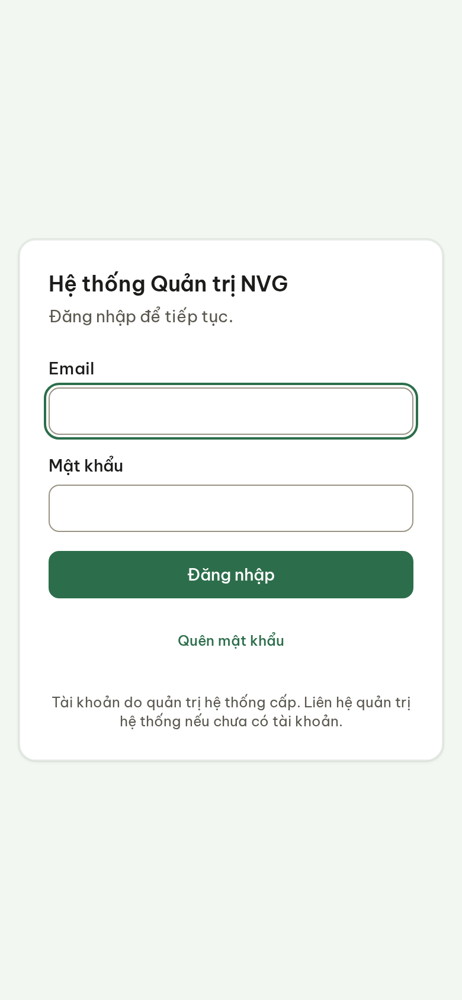
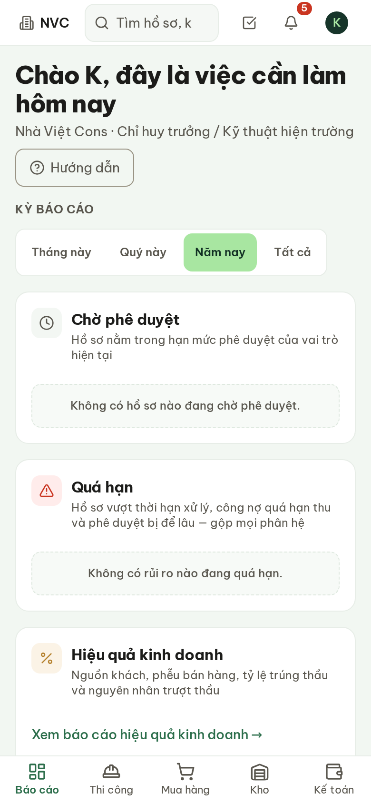
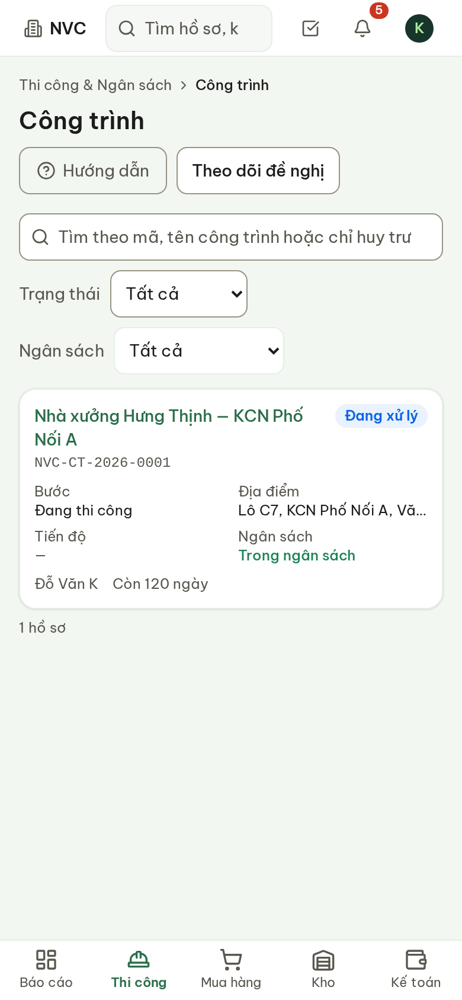
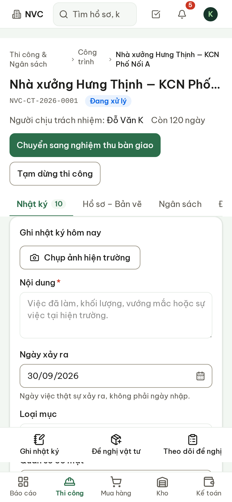
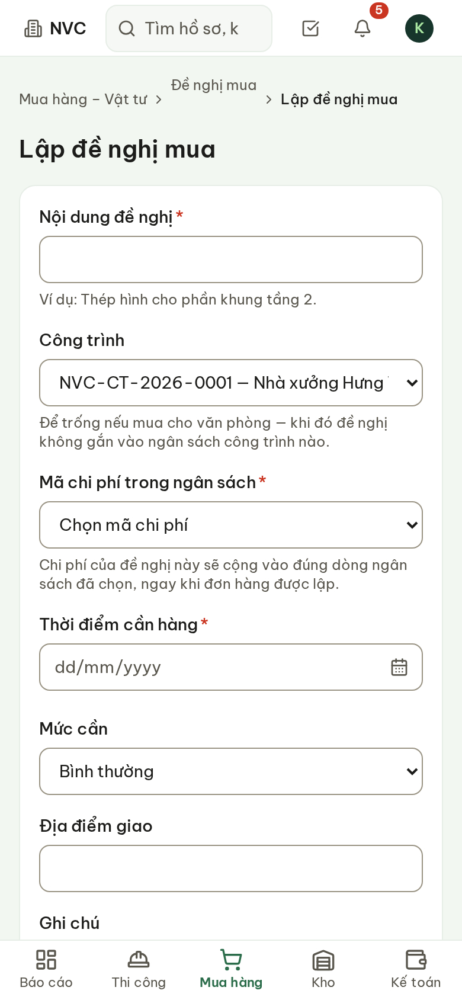
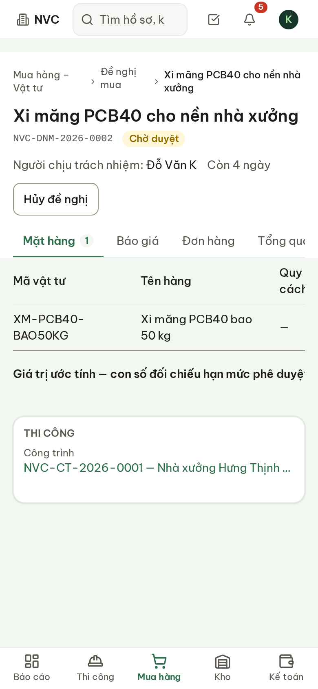
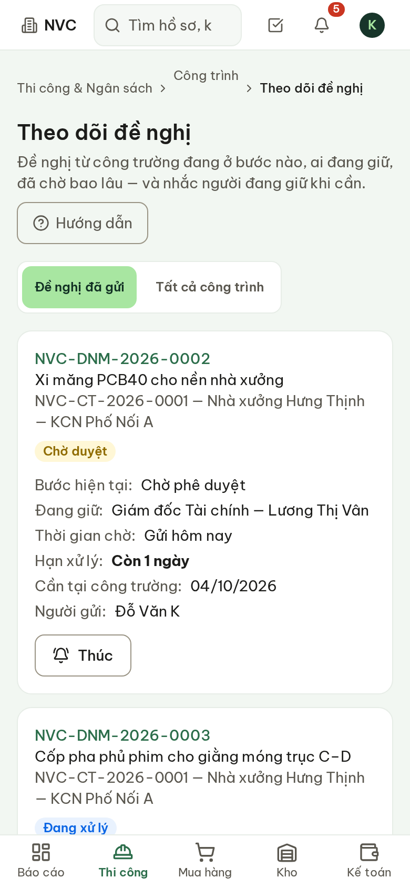
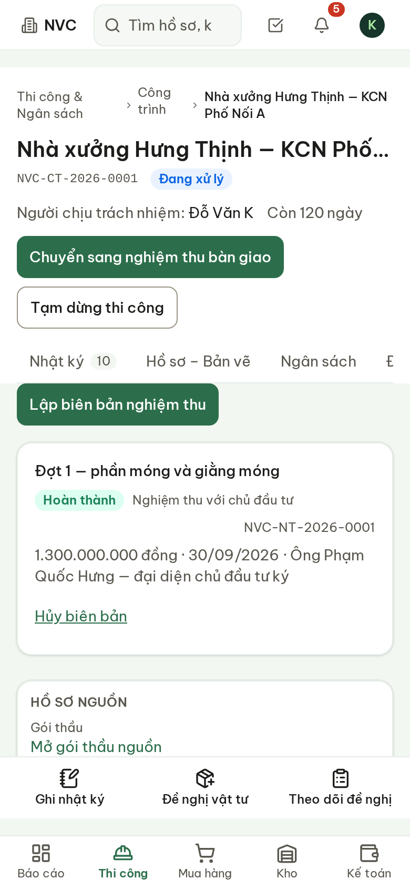
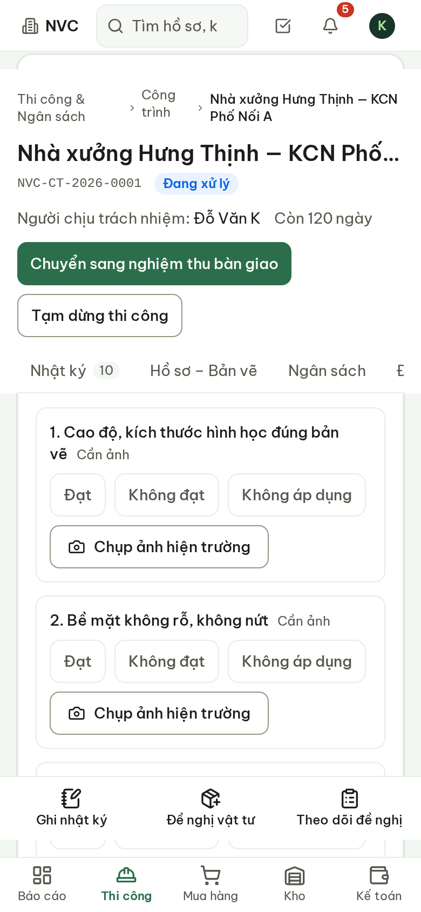

# Hướng dẫn sử dụng — Chỉ huy trưởng

Hệ thống Phần mềm Quản trị Nhà Việt Group · công việc hằng ngày tại công trường

| | |
| --- | --- |
| **Áp dụng cho** | Chỉ huy trưởng, kỹ thuật hiện trường (vai trò **Chỉ huy trưởng / Kỹ thuật hiện trường**) |
| **Thiết bị** | Điện thoại (khuyến nghị) hoặc máy tính, trình duyệt Chrome hoặc Safari |
| **Địa chỉ** | `https://nvg.tests99.workers.dev` |
| **Tài khoản demo** | `chihuytruong.nvc@nhavietgroup.test` — mật khẩu nhận riêng từ đầu mối dự án |
| **Phiên bản** | Bản dùng cho buổi trình diễn |

> Mục tiêu của vai trò này trên hệ thống: cập nhật công trường mỗi ngày trong **5–10 phút**. Mọi
> việc dưới đây làm được ngay trên điện thoại, tại hiện trường — không cần gửi ảnh qua Zalo, không
> cần tổng hợp lại trên Excel.

---

## 1. Chỉ huy trưởng làm gì trên hệ thống

Bốn việc hằng ngày, theo đúng thứ tự trên thanh thao tác nhanh của công trình:

| Việc | Khi nào | Ai nhận kết quả |
| --- | --- | --- |
| **Ghi nhật ký** kèm ảnh hiện trường | Mỗi ngày, cuối ca hoặc khi có sự việc | Trưởng phòng Thi công, Ban Giám đốc xem ngay |
| **Gửi đề nghị vật tư** | Khi cần vật tư về công trường | Người có hạn mức phê duyệt, sau đó Mua hàng |
| **Theo dõi đề nghị** và **Thúc** | Khi hàng chưa về, hoặc hồ sơ nằm lâu ở một bước | Người đang giữ đề nghị nhận thông báo |
| **Lập biên bản nghiệm thu** theo danh mục kiểm tra | Khi xong một giai đoạn / hạng mục | Kế toán (nếu nghiệm thu với chủ đầu tư) |

Chỉ huy trưởng **chỉ thấy công trình được phân công**. Công trình khác cùng pháp nhân không hiện
trong danh sách, đề nghị của công trình khác cũng không hiện ở màn hình theo dõi.

## 2. Đăng nhập và đặt biểu tượng lên màn hình điện thoại

1. Mở trình duyệt, vào địa chỉ ở trang bìa.
2. Nhập thư điện tử và mật khẩu, bấm **Đăng nhập**.
3. Đặt ứng dụng ra màn hình chính để lần sau mở bằng một chạm. Chrome trên Android: nút ba chấm →
   **Thêm vào màn hình chính**. Safari trên iPhone: nút chia sẻ → **Thêm vào MH chính**.

**Hình 1.** Màn hình đăng nhập.

Sau khi đăng nhập, trang đầu tiên là **Việc cần làm hôm nay**. Thanh dưới cùng dẫn tới các phân
hệ; với chỉ huy trưởng, việc hằng ngày nằm ở mục **Thi công**. Biểu tượng chuông ở góc trên là
thông báo — ví dụ khi đề nghị vật tư đã được duyệt.

**Hình 2.** Trang đầu sau khi đăng nhập. Thanh dưới cùng: Báo cáo · Thi công · Mua hàng · Kho · Kế toán.

> Lần đầu vào mỗi màn hình, bảng **Hướng dẫn** tự mở với ba bước ngắn. Bấm **Đã hiểu** để đóng;
> muốn xem lại thì bấm nút **Hướng dẫn** dưới tiêu đề trang.

## 3. Mở công trình

1. Bấm **Thi công** ở thanh dưới cùng → danh sách **Công trình**.
2. Bấm vào tên công trình.

Mỗi thẻ công trình cho biết trạng thái, địa điểm, người chịu trách nhiệm, số ngày còn lại tới hạn
hoàn thành và tình trạng ngân sách.

**Hình 3.** Danh sách công trình — chỉ gồm công trình được phân công.

## 4. Ghi nhật ký hằng ngày kèm ảnh

Công trình mở ở tab **Nhật ký**. Phía dưới màn hình luôn có thanh thao tác nhanh ba nút: **Ghi
nhật ký · Đề nghị vật tư · Theo dõi đề nghị**.

1. Bấm **Chụp ảnh hiện trường** — điện thoại mở máy ảnh. Chụp bao nhiêu ảnh tuỳ ý; ảnh hiện ngay
   dưới nút, chụp nhầm thì bấm nút bỏ ở góc ảnh.
2. Ghi **Nội dung**: việc đã làm, khối lượng, vướng mắc hoặc sự việc tại hiện trường.
3. Kiểm tra **Ngày xảy ra** — mặc định là hôm nay. Ghi bù cho hôm trước thì đổi ngày ở đây: đây là
   ngày việc thật sự xảy ra, không phải ngày nhập.
4. Chọn **Loại mục**, điền **Quân số có mặt** và **Thời tiết** nếu có.
5. Bấm **Lưu**.

**Hình 4.** Ghi nhật ký. Thanh thao tác nhanh nằm cố định phía dưới.

> Nội dung đang gõ **không mất** khi lỡ chuyển sang màn hình khác trong cùng phiên — quay lại tab
> Nhật ký là thấy lại. Nhật ký đã lưu **không sửa trên màn hình**, vì nhật ký là căn cứ truy vết:
> ghi nhầm thì ghi một mục mới để đính chính. Ảnh lưu theo công trình; chỉ người được xem công
> trình đó mới mở được ảnh.

## 5. Gửi đề nghị vật tư

1. Bấm **Đề nghị vật tư** trên thanh thao tác nhanh. Biểu mẫu mở sẵn với công trình đang xem.
2. Điền **Nội dung đề nghị** — ví dụ: «Thép hình cho phần khung tầng 2».
3. Chọn **Mã chi phí trong ngân sách**. Chi phí của đề nghị sẽ cộng vào đúng dòng ngân sách này
   khi đơn hàng được lập.
4. Chọn **Thời điểm cần hàng** và **Mức cần**; ghi **Địa điểm giao** nếu khác địa chỉ công trình.
5. Bấm **Lưu và nhập mặt hàng**.
6. Ở trang đề nghị vừa tạo, bấm **Thêm mặt hàng**: mã vật tư, tên hàng, quy cách, số lượng, đơn
   vị, đơn giá ước tính. Lặp lại cho từng mặt hàng.
7. Bấm **Gửi phê duyệt**.

**Hình 5.** Lập đề nghị vật tư — công trình đã điền sẵn.

**Hình 6.** Trang chi tiết đề nghị: mặt hàng, báo giá, đơn hàng và trạng thái.

> Đề nghị đi tới **đúng người có hạn mức** phê duyệt giá trị đó — hệ thống tự chọn theo bảng hạn
> mức của công ty, không cần gửi tay cho ai. Giá trị ước tính càng sát thực tế thì đề nghị càng
> tới đúng người ngay lần đầu.

## 6. Theo dõi đề nghị và nhắc người đang giữ

Hai chỗ xem:

- Tab **Đề nghị** trong trang công trình — các đề nghị của riêng công trình đó.
- Nút **Theo dõi đề nghị** trên thanh thao tác nhanh — mọi đề nghị đã gửi, gộp mọi công trình được
  phân công. Chuyển sang **Tất cả công trình** để xem cả đề nghị do người khác gửi.

Mỗi thẻ trả lời ngay ba câu hỏi mà trước đây phải gọi điện để hỏi:

| Dòng trên thẻ | Nghĩa |
| --- | --- |
| **Bước hiện tại** | Chờ phê duyệt, chờ báo giá, đã đặt hàng, đã giao… |
| **Đang giữ** | Tên và chức danh người phải xử lý bước này |
| **Thời gian chờ** | Hồ sơ đã nằm ở bước này bao lâu |
| **Hạn xử lý** | Hạn mà phòng ban cam kết cho bước này. «Chưa có thời hạn cam kết» nghĩa là Ban Giám đốc chưa khai thời hạn cho bước đó |
| **Cần tại công trường** | Ngày cần hàng đã ghi khi gửi đề nghị |

**Hình 7.** Theo dõi đề nghị: bước, người giữ, thời gian chờ, hạn xử lý.

**Thúc** — khi đề nghị nằm lâu ở một bước:

1. Bấm **Thúc** trên thẻ.
2. Hệ thống gửi thông báo tới đúng người đang giữ và ghi lại lần nhắc — ai nhắc, lúc nào, hồ sơ
   đang ở bước nào. Người giữ và văn phòng đều thấy lịch sử nhắc này.

> Mỗi đề nghị chỉ thúc lại được sau **4 giờ** kể từ lần thúc trước (quản trị viên đổi được mức
> này); nút ghi rõ giờ thúc lại được. Đề nghị còn ở bản nháp thì chưa có ai ở văn phòng để thúc —
> hãy **Gửi phê duyệt** trước.

## 7. Nghiệm thu theo danh mục kiểm tra

1. Mở công trình → tab **Nghiệm thu** → **Lập biên bản nghiệm thu**.
2. Chọn **Loại nghiệm thu**. **Nghiệm thu nội bộ** không báo Kế toán thu tiền. **Nghiệm thu với
   chủ đầu tư** là căn cứ đòi tiền: Kế toán nhận thông báo ngay khi lập biên bản.
3. Ghi **Giai đoạn / hạng mục** — ví dụ: «Đợt 1 — phần móng».
4. Chọn **Danh mục kiểm tra** phù hợp. Danh mục do văn phòng Thi công chuẩn bị sẵn cho từng loại
   công việc.
5. Chấm từng mục: **Đạt**, **Không đạt** hoặc **Không áp dụng**. Mục ghi **Cần ảnh** phải chụp ít
   nhất một ảnh ngay tại hiện trường (trừ khi chọn Không áp dụng).
6. Điền khối lượng, giá trị, ngày nghiệm thu, người ký phía đối tác, tổ đội được nghiệm thu.
7. Có mục **Không đạt** thì phải ghi **Tồn tại cần khắc phục**.
8. Bấm **Lập biên bản**.

**Hình 8.** Tab Nghiệm thu — biên bản đã lập của công trình.

**Hình 9.** Chấm từng mục: Đạt · Không đạt · Không áp dụng, kèm ảnh ở mục cần ảnh.

> **Biên bản đã lập không sửa được** — kể cả kết quả từng mục và ảnh đính kèm. Lập sai thì dùng
> **Hủy biên bản**, ghi nguyên nhân, rồi lập biên bản mới; biên bản đã huỷ vẫn được giữ lại để
> truy vết.

## 8. Câu hỏi thường gặp

| Câu hỏi | Trả lời |
| --- | --- |
| Không thấy công trình mình đang phụ trách? | Tài khoản chưa được phân công vào công trình đó. Liên hệ Trưởng phòng Thi công để được phân công. |
| Nút **Thúc** không bấm được? | Đề nghị vừa được thúc trong 4 giờ qua (nút ghi giờ thúc lại được), hoặc đề nghị còn ở bản nháp. |
| Hạn xử lý ghi «Chưa có thời hạn cam kết»? | Ban Giám đốc chưa khai thời hạn cho bước đó. Hệ thống không tự đặt con số. |
| Ghi nhầm nhật ký? | Ghi một mục mới để đính chính; nhật ký đã lưu không sửa trên màn hình. |
| Không lưu được biên bản nghiệm thu? | Kiểm tra: mục **Cần ảnh** đã có ảnh chưa; có mục **Không đạt** thì đã ghi tồn tại cần khắc phục chưa. Thông báo lỗi nói rõ mục nào còn thiếu. |
| Mất sóng giữa chừng? | Nội dung nhật ký đang gõ được giữ lại trong phiên. Bấm **Lưu** lại khi có sóng. Ứng dụng chưa hỗ trợ ghi khi hoàn toàn không có mạng. |
| Ảnh lớn có tải lên được không? | Mỗi ảnh tối đa 20 MB — ảnh chụp từ điện thoại đều nằm trong giới hạn này. |
