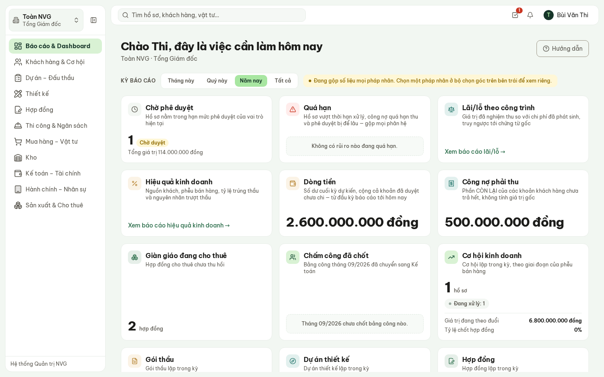
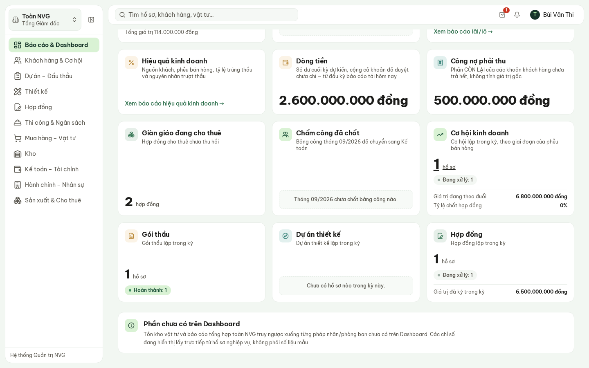
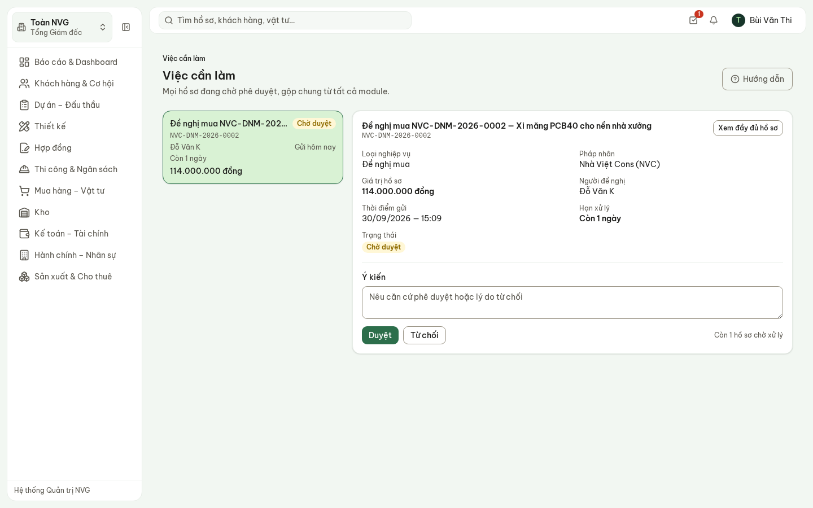
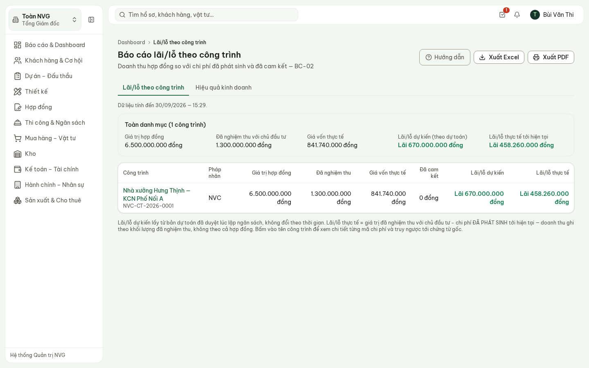
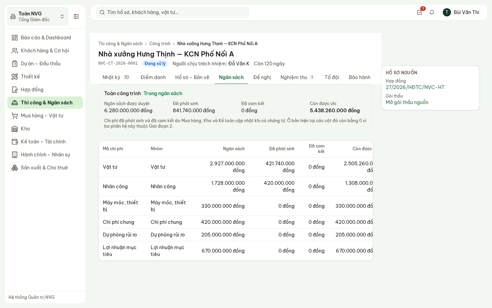
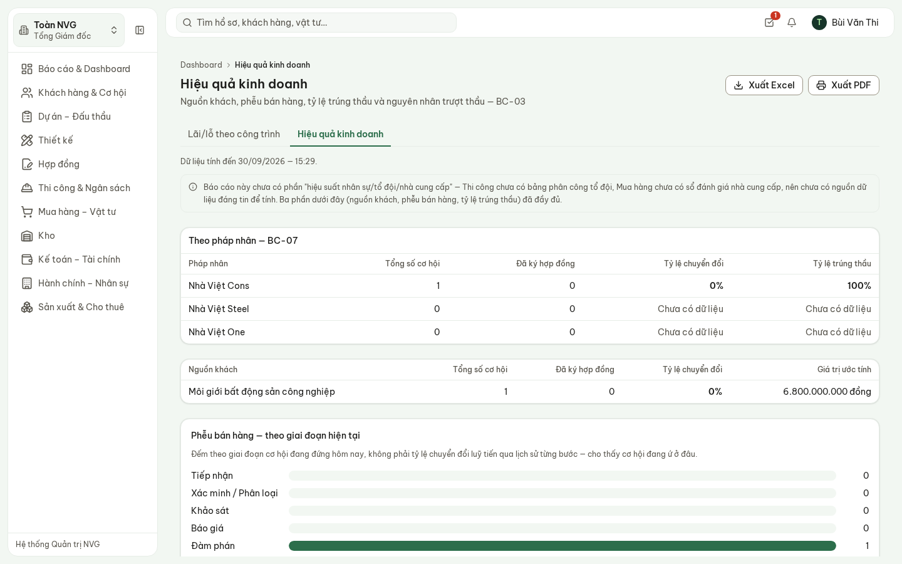
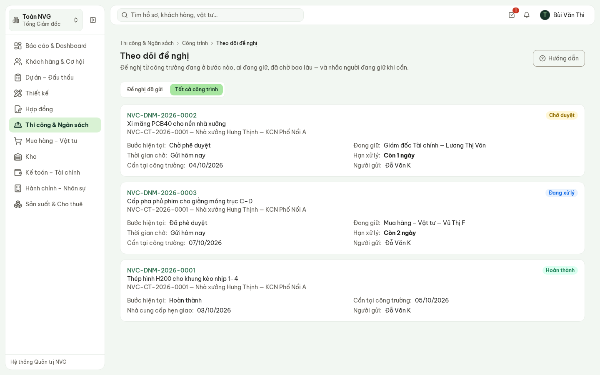
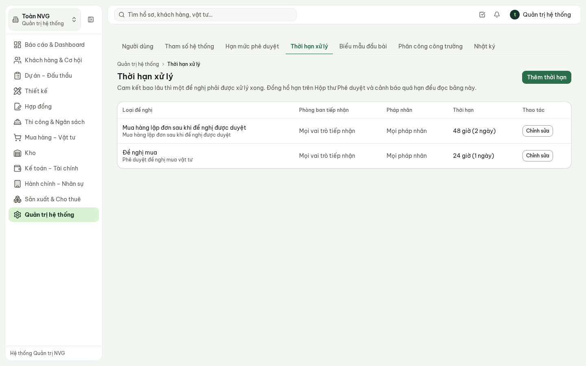
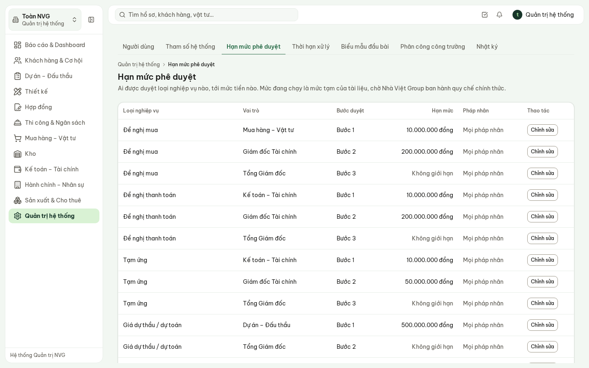

# Hướng dẫn sử dụng — Ban Giám đốc

Hệ thống Phần mềm Quản trị Nhà Việt Group · theo dõi, phê duyệt và báo cáo

| | |
| --- | --- |
| **Áp dụng cho** | Tổng Giám đốc, thành viên Ban Giám đốc, Giám đốc Tài chính (phần phê duyệt và báo cáo) |
| **Thiết bị** | Máy tính (khuyến nghị cho báo cáo); điện thoại dùng được cho Hộp thư phê duyệt |
| **Địa chỉ** | `https://nvg.tests99.workers.dev` |
| **Tài khoản demo** | `tgd@nhavietgroup.test` — mật khẩu nhận riêng từ đầu mối dự án |
| **Phiên bản** | Bản dùng cho buổi trình diễn |

> Mỗi sáng: mở **Dashboard** xem việc chờ duyệt và việc quá hạn, xử lý **Hộp thư phê duyệt**, rồi
> xem **Lãi/lỗ theo công trình** khi cần. Mọi con số lấy thẳng từ chứng từ do các bộ phận nhập tại
> nơi phát sinh — không có bảng tổng hợp làm tay, không có số ước lượng.

---

## 1. Ban Giám đốc làm gì trên hệ thống

| Việc | Màn hình | Tần suất |
| --- | --- | --- |
| Xem tình hình chung: chờ duyệt, quá hạn, dòng tiền, công nợ, cơ hội, hợp đồng | **Dashboard** | Mỗi sáng |
| Duyệt hoặc từ chối hồ sơ vượt hạn mức cấp dưới | **Việc cần làm** (Hộp thư phê duyệt) | Khi có thông báo |
| Xem lãi/lỗ từng công trình, truy ngược tới chứng từ | **Lãi/lỗ theo công trình** | Hằng tuần, hoặc khi cần |
| Xem hiệu quả kinh doanh: nguồn khách, phễu bán hàng, tỷ lệ trúng thầu | **Hiệu quả kinh doanh** | Hằng tháng |
| Theo dõi công trường: đề nghị vật tư đang kẹt ở đâu | **Theo dõi đề nghị** | Khi cần |
| Quyết định thời hạn xử lý và hạn mức phê duyệt | Quản trị viên nhập theo quyết định của Ban Giám đốc | Khi thay đổi quy chế |

## 2. Chọn pháp nhân: từng công ty hay toàn NVG

Ô chọn ở **góc trên bên trái** quyết định số liệu của pháp nhân nào hiện trên mọi màn hình:

- **Toàn NVG** — gộp số liệu cả Nhà Việt Cons, Nhà Việt Steel, Nhà Việt One. Danh sách có thêm cột
  **Pháp nhân** để phân biệt. Dashboard hiện dòng nhắc «Đang gộp số liệu mọi pháp nhân».
- Chọn **một pháp nhân** để xem riêng số liệu công ty đó.

Lựa chọn được giữ khi chuyển giữa các màn hình.

## 3. Dashboard mỗi sáng

Trang đầu tiên sau khi đăng nhập. Mỗi thẻ là một nhóm chỉ số; **bấm vào thẻ** để mở danh sách đã
lọc sẵn. Hàng nút **Kỳ báo cáo** (Tháng này · Quý này · Năm nay · Tất cả) đổi khoảng thời gian cho
các thẻ.

**Hình 1.** Dashboard của Tổng Giám đốc, đang xem Toàn NVG, kỳ Năm nay.

| Thẻ | Cho biết |
| --- | --- |
| **Chờ phê duyệt** | Số hồ sơ nằm trong hạn mức của vai trò đang chờ duyệt, và tổng giá trị |
| **Quá hạn** | Hồ sơ vượt thời hạn xử lý, công nợ quá hạn thu, phê duyệt bị để lâu — gộp mọi phân hệ |
| **Lãi/lỗ theo công trình** | Lối vào báo cáo lãi/lỗ |
| **Dòng tiền** | Số dư cuối kỳ dự kiến: số dư đầu kỳ Kế toán đã lập, cộng thu, trừ chi, trừ khoản đã duyệt chưa chi |
| **Công nợ phải thu** | Phần khách hàng **còn** phải trả, không tính phần đã thu |
| **Giàn giáo đang cho thuê** | Số hợp đồng cho thuê chưa thu hồi xong |
| **Chấm công đã chốt** | Bảng công tháng đã chuyển sang Kế toán hay chưa |
| **Cơ hội kinh doanh · Gói thầu · Dự án thiết kế · Hợp đồng** | Hồ sơ lập trong kỳ, theo trạng thái; giá trị đang theo đuổi và đã ký |

**Hình 2.** Phần dưới Dashboard: cơ hội, gói thầu, dự án thiết kế, hợp đồng trong kỳ.

> Thẻ ghi **«Chưa đủ dữ liệu»** nghĩa là nguồn số liệu chưa có — ví dụ Kế toán chưa lập kế hoạch
> dòng tiền cho kỳ đang xem. Hệ thống cố ý không hiện «0» trong trường hợp này: con số 0 sẽ đọc như
> một số liệu thật.

## 4. Hộp thư phê duyệt

Mọi loại hồ sơ cần duyệt — đề nghị mua, đề nghị thanh toán, tạm ứng, giá dự thầu, hợp đồng… — về
**một chỗ**. Mở bằng biểu tượng dấu tích ở góc trên bên phải (số đỏ là số hồ sơ đang chờ), hoặc
bấm thẻ **Chờ phê duyệt** trên Dashboard.

1. Chọn một hồ sơ ở cột trái — hồ sơ chờ lâu nhất nằm trên cùng.
2. Đọc tóm tắt bên phải: loại nghiệp vụ, pháp nhân, giá trị, người đề nghị, hạn xử lý. Cần xem kỹ
   thì bấm **Xem đầy đủ hồ sơ**.
3. Ghi **Ý kiến** nếu cần, rồi bấm **Duyệt** hoặc **Từ chối**.
4. Hệ thống tự chuyển sang hồ sơ tiếp theo.

**Hình 3.** Hộp thư phê duyệt: danh sách bên trái, tóm tắt và nút Duyệt / Từ chối bên phải.

> **Từ chối bắt buộc nêu lý do** trong ô Ý kiến — người gửi nhận lại hồ sơ kèm lý do đó. Hồ sơ đi
> tới **đúng cấp có hạn mức**: đề nghị mua 114 triệu dừng ở Giám đốc Tài chính (hạn mức 200 triệu);
> hồ sơ vượt mức đó mới tới Tổng Giám đốc. Tổng Giám đốc vẫn thấy hồ sơ đang ở cấp dưới trong Hộp
> thư. Mỗi lần duyệt, từ chối đều ghi lại người, thời điểm và ý kiến.

## 5. Lãi/lỗ theo công trình

**Báo cáo & Dashboard → Lãi/lỗ theo công trình**, hoặc bấm thẻ **Lãi/lỗ theo công trình**.

**Hình 4.** Báo cáo lãi/lỗ theo công trình.

| Cột | Cách tính |
| --- | --- |
| **Giá trị hợp đồng** | Giá trị hợp đồng đã ký với chủ đầu tư |
| **Đã nghiệm thu** | Tổng giá trị các biên bản nghiệm thu **với chủ đầu tư** — căn cứ ghi doanh thu |
| **Giá vốn thực tế** | Chi phí đã phát sinh tới hôm nay, cộng từ phiếu xuất kho, đơn hàng, đề nghị thanh toán đã chi |
| **Đã cam kết** | Chi phí đã đặt hàng hoặc đã duyệt nhưng chưa phát sinh |
| **Lãi/lỗ dự kiến** | Theo dự toán đã duyệt lúc lập ngân sách — không đổi theo thời gian |
| **Lãi/lỗ thực tế** | Đã nghiệm thu − giá vốn thực tế. Ghi theo khối lượng đã nghiệm thu, không theo cả hợp đồng |

**Truy ngược:** bấm tên công trình để mở tab **Ngân sách** của công trình — từng mã chi phí với ngân
sách, đã phát sinh, đã cam kết, còn được chi.

**Hình 5.** Tab Ngân sách của công trình — từng mã chi phí.

Nút **Xuất Excel** và **Xuất PDF** ở góc trên xuất đúng số liệu đang hiện trên màn hình.

> Số lãi/lỗ, giá vốn chỉ hiện với vai trò được phép xem, và mỗi lượt xem được ghi lại. Người không
> có quyền không thấy thẻ và không mở được báo cáo.

## 6. Hiệu quả kinh doanh

Tab **Hiệu quả kinh doanh** cạnh báo cáo lãi/lỗ: theo pháp nhân (số cơ hội, đã ký, tỷ lệ chuyển
đổi, tỷ lệ trúng thầu), theo nguồn khách, và phễu bán hàng theo giai đoạn hiện tại. Chỗ chưa có đủ
hồ sơ ghi **«Chưa có dữ liệu»** thay vì 0 %.

**Hình 6.** Hiệu quả kinh doanh: theo pháp nhân, theo nguồn khách, phễu bán hàng.

## 7. Theo dõi công trường

**Thi công & Ngân sách → Công trình → Theo dõi đề nghị**, chọn **Tất cả công trình**: mọi đề nghị
vật tư từ công trường, đang ở bước nào, **ai đang giữ**, đã chờ bao lâu, còn bao lâu tới hạn xử lý.
Đây là cùng màn hình chỉ huy trưởng dùng — hai bên nhìn cùng một số liệu.

**Hình 7.** Theo dõi đề nghị, tất cả công trình.

Trong trang từng công trình, tab **Điểm danh** cho xem ảnh điểm danh của nhân sự theo ngày (bằng
chứng có mặt; chưa liên kết bảng chấm công).

## 8. Thời hạn xử lý và hạn mức phê duyệt

Hai bảng quy định cách hồ sơ chạy trong hệ thống. **Ban Giám đốc quyết định con số; Quản trị viên
nhập** ở phân hệ Quản trị hệ thống. Không cần sửa phần mềm khi quy chế thay đổi.

- **Thời hạn xử lý** — mỗi loại đề nghị phải được xử lý trong bao lâu. Đồng hồ hạn xử lý trên Hộp
  thư phê duyệt, trên màn hình Theo dõi đề nghị của công trường, và cảnh báo quá hạn đều đọc bảng
  này. Loại nào chưa khai thì màn hình ghi «Chưa có thời hạn cam kết» — hệ thống không tự đặt số.
- **Hạn mức phê duyệt** — vai trò nào duyệt loại hồ sơ nào, tới mức tiền nào, ở bước thứ mấy.

**Hình 8.** Thời hạn xử lý (màn hình của Quản trị viên). Hai mức trong bản demo là mức tạm.

**Hình 9.** Hạn mức phê duyệt (màn hình của Quản trị viên) — mức tạm theo tài liệu, chờ quy chế chính thức.

## 9. Câu hỏi thường gặp

| Câu hỏi | Trả lời |
| --- | --- |
| Vì sao thẻ ghi «Chưa đủ dữ liệu» chứ không ghi 0? | Nguồn số liệu chưa có (ví dụ chưa có kế hoạch dòng tiền kỳ này). Hiện 0 sẽ đọc nhầm thành số liệu thật. |
| Số liệu trên Dashboard có ai tổng hợp tay không? | Không. Mọi con số cộng thẳng từ chứng từ các bộ phận đã nhập. |
| Một hồ sơ không có trong Hộp thư của tôi? | Hồ sơ đang ở bước của vai trò khác, hoặc đã được xử lý. Mở Theo dõi đề nghị hoặc tìm theo mã ở ô tìm kiếm để xem đang ai giữ. |
| Tôi muốn đổi thời hạn xử lý hoặc hạn mức duyệt? | Quyết định con số, rồi nhờ Quản trị viên nhập ở Quản trị hệ thống. |
| Lãi thực tế khác lãi dự kiến nhiều? | Lãi thực tế chỉ tính phần **đã nghiệm thu** với chủ đầu tư; công trình đang thi công dở thì hai số khác nhau là bình thường. Bấm tên công trình để xem từng mã chi phí so với ngân sách. |
| Xem trên điện thoại được không? | Được — Dashboard và Hộp thư phê duyệt có bố cục điện thoại. Báo cáo nhiều cột dễ đọc hơn trên máy tính. |
