# Hướng dẫn sử dụng — Mua hàng – Vật tư

Hệ thống Phần mềm Quản trị Nhà Việt Group · từ đề nghị mua tới hàng về công trường

| | |
| --- | --- |
| **Áp dụng cho** | Trưởng phòng và nhân viên Cung ứng – Vật tư (vai trò **Mua hàng – Vật tư**), phục vụ cả ba pháp nhân |
| **Thiết bị** | Máy tính (khuyến nghị); điện thoại dùng được để xem và ghi nhận giao hàng |
| **Địa chỉ** | `https://nvg.tests99.workers.dev` |
| **Tài khoản demo** | `muahang@nhavietgroup.test` — mật khẩu nhận riêng từ đầu mối dự án |
| **Phiên bản** | Bản dùng cho buổi trình diễn |

> Một đề nghị mua đi hết vòng trên **một hồ sơ**: công trường lập → người có hạn mức duyệt → Mua
> hàng hỏi giá, so sánh, chọn nhà cung cấp → lập đơn đặt hàng → ghi nhận giao hàng → Kho nhập kho →
> Kế toán nhận bộ chứng từ để thanh toán. Không nhập lại số liệu ở bước sau, không hỏi lại qua Zalo.

---

## 1. Mua hàng làm gì trên hệ thống

| Việc | Màn hình | Khi nào |
| --- | --- | --- |
| Xem đề nghị đã duyệt đang chờ mua | **Dashboard** → thẻ Đề nghị mua | Mỗi sáng |
| Lập đề nghị mua cho văn phòng (công trường tự lập từ điện thoại) | **Mua hàng – Vật tư** → Đề nghị mua → **Lập đề nghị mua** | Khi cần |
| Nhập báo giá, so sánh, chọn nhà cung cấp | Chi tiết đề nghị → tab **Báo giá** | Sau khi đề nghị được duyệt |
| Lập đơn đặt hàng | Chi tiết đề nghị → **Lập đơn đặt hàng** | Sau khi chọn nhà cung cấp |
| Ghi nhận hàng giao (đạt / không đạt) | Chi tiết đơn hàng → tab **Giao nhận** | Mỗi đợt hàng về |
| Duyệt đề nghị trong hạn mức của mình | **Việc cần làm** (Hộp thư phê duyệt) | Khi có thông báo |
| Quản lý và đánh giá nhà cung cấp | **Mua hàng – Vật tư** → Nhà cung cấp | Khi thêm mới, sau mỗi đơn |

Mua hàng phục vụ **cả ba pháp nhân**. Ô chọn ở góc trên bên trái đổi pháp nhân đang xem; danh mục
nhà cung cấp dùng chung, không tách theo pháp nhân.

## 2. Dashboard mỗi sáng

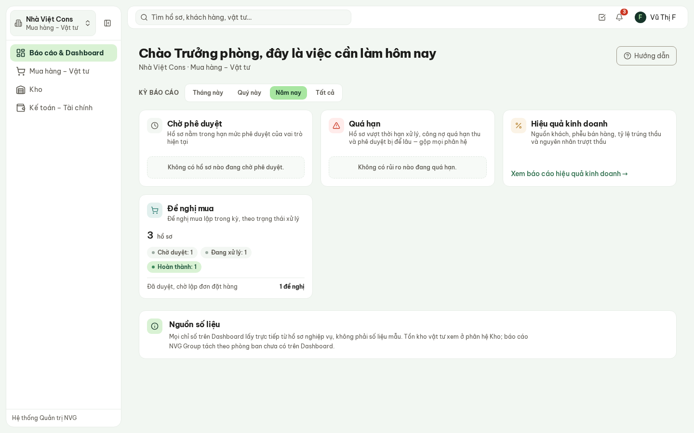

**Hình 1.** Dashboard của Trưởng phòng Mua hàng.

- **Đề nghị mua** — số đề nghị lập trong kỳ theo trạng thái (Chờ duyệt · Đang xử lý · Hoàn thành…),
  bấm vào từng nhóm để mở danh sách đã lọc sẵn. Dòng **Đã duyệt, chờ lập đơn đặt hàng** là việc
  đang chờ Mua hàng.
- **Chờ phê duyệt** — đề nghị nằm trong hạn mức duyệt của Trưởng phòng Mua hàng.
- **Quá hạn** — hồ sơ vượt thời hạn xử lý.

## 3. Danh sách đề nghị mua

**Mua hàng – Vật tư** → **Đề nghị mua**.

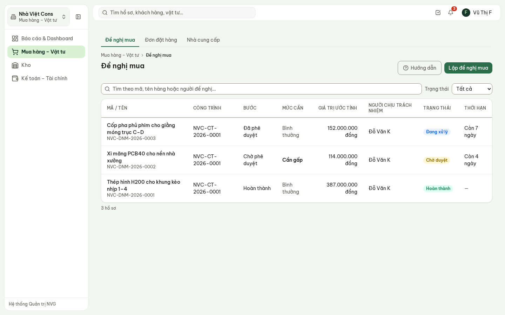

**Hình 2.** Danh sách đề nghị mua: công trình, bước hiện tại, mức cần, giá trị ước tính, thời hạn.

- Cột **Thời hạn** là **ngày cần hàng** do người đề nghị khai — mốc quyết định hàng có kịp phục vụ
  thi công. Quá ngày đó mà hồ sơ còn mở thì hiện **Quá hạn**.
- **Mức cần: Cần gấp** in đậm.
- Ô tìm kiếm và bộ lọc Trạng thái được giữ khi mở hồ sơ rồi quay lại.

Các bước của một đề nghị: **Nháp → Chờ phê duyệt → Đã phê duyệt → Đang mua → Hoàn thành**; hoặc
**Bị từ chối** (sửa rồi gửi lại) / **Đã hủy**.

## 4. Lập đề nghị mua

Công trường lập đề nghị vật tư từ điện thoại (xem hướng dẫn Chỉ huy trưởng). Mua hàng lập ở đây khi
mua cho văn phòng hoặc thay mặt bộ phận khác.

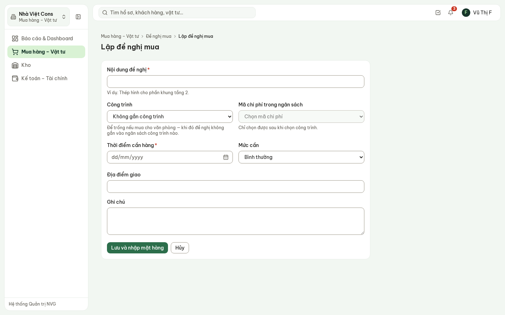

**Hình 3.** Biểu mẫu lập đề nghị mua.

1. **Nội dung đề nghị** — ví dụ «Thép hình cho phần khung tầng 2».
2. **Công trình** — để trống nếu mua cho văn phòng. Chọn công trình thì **Mã chi phí trong ngân
   sách** thành bắt buộc: khoản mua được ghi thẳng vào đúng dòng ngân sách của công trình đó.
3. **Thời điểm cần hàng**, **Mức cần**, **Địa điểm giao**.
4. **Lưu và nhập mặt hàng** → tab **Mặt hàng** → **Thêm mặt hàng**: mã vật tư, tên, quy cách,
   số lượng, đơn vị, **đơn giá ước tính**.
5. **Gửi phê duyệt**.

> **Ai duyệt?** Hệ thống cộng giá trị ước tính rồi chuyển tới đúng cấp có hạn mức. Mức trong bản
> demo (mức tạm, Tổng Giám đốc sửa được): tới **10 triệu** — Trưởng phòng Mua hàng; tới **200 triệu**
> — Giám đốc Tài chính; lớn hơn — Tổng Giám đốc. Sau khi gửi, mặt hàng khóa lại: sửa số lượng sau
> khi duyệt sẽ làm hạn mức mất tác dụng. Bị từ chối thì hồ sơ mở lại để sửa, kèm lý do của người duyệt.

## 5. Nhận đề nghị đã duyệt

Đề nghị được duyệt thì Mua hàng nhận **thông báo** (chuông góc trên bên phải) và hồ sơ hiện ở
thẻ Đề nghị mua trên Dashboard.

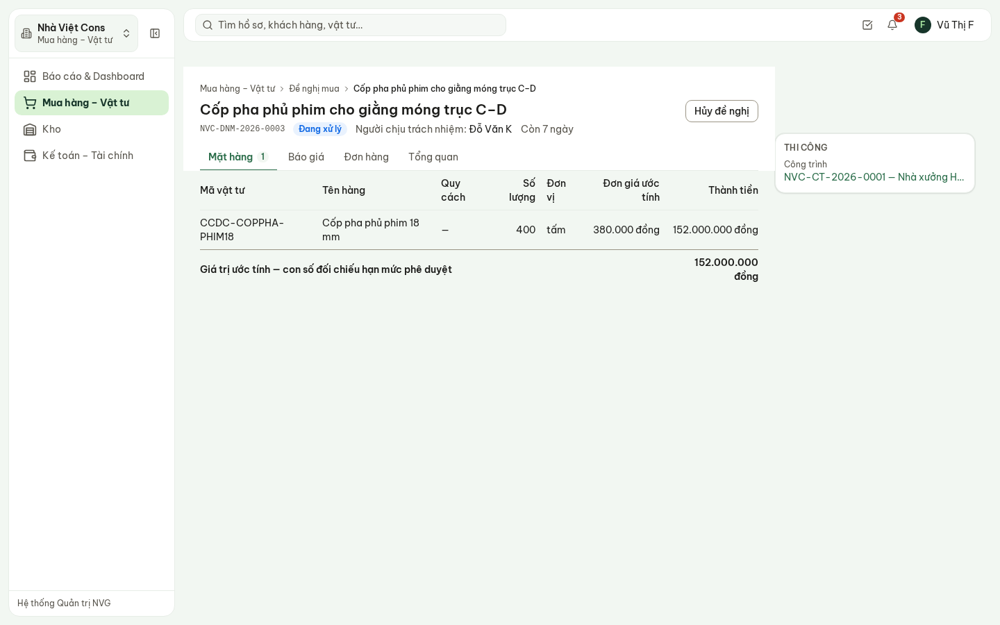

**Hình 4.** Chi tiết đề nghị: mặt hàng, giá trị ước tính; bên phải là công trình liên quan.

Tab **Tổng quan** ghi thời điểm cần hàng, địa điểm giao, mã chi phí, thời điểm gửi và được duyệt,
và dòng **Công trường đã thúc** — số lần chỉ huy trưởng đã bấm Thúc và lần gần nhất.

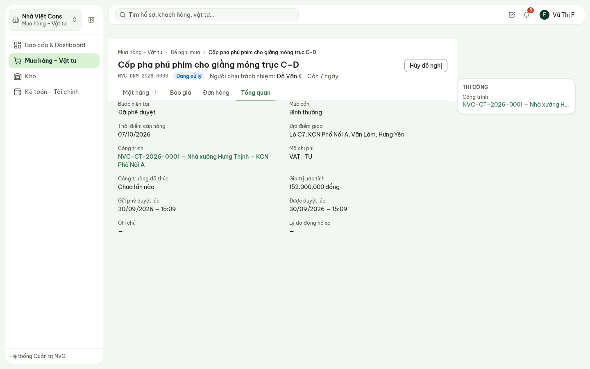

**Hình 5.** Tab Tổng quan: công trường đã thúc bao nhiêu lần hiện ngay tại nơi xử lý.

> **Thời hạn của Mua hàng.** Công trường theo dõi đề nghị trên màn hình Theo dõi đề nghị: thấy hồ
> sơ đang ở Mua hàng, chờ bao lâu, và bấm **Thúc** khi quá lâu — Mua hàng nhận thông báo. Thời hạn
> lập đơn trong bản demo là **48 giờ** sau khi đề nghị được duyệt (mức tạm, Tổng Giám đốc sửa ở
> Thời hạn xử lý).

## 6. Hỏi giá và so sánh báo giá

Tab **Báo giá** → **Nhập báo giá nhận được**, mỗi nhà cung cấp một lần:

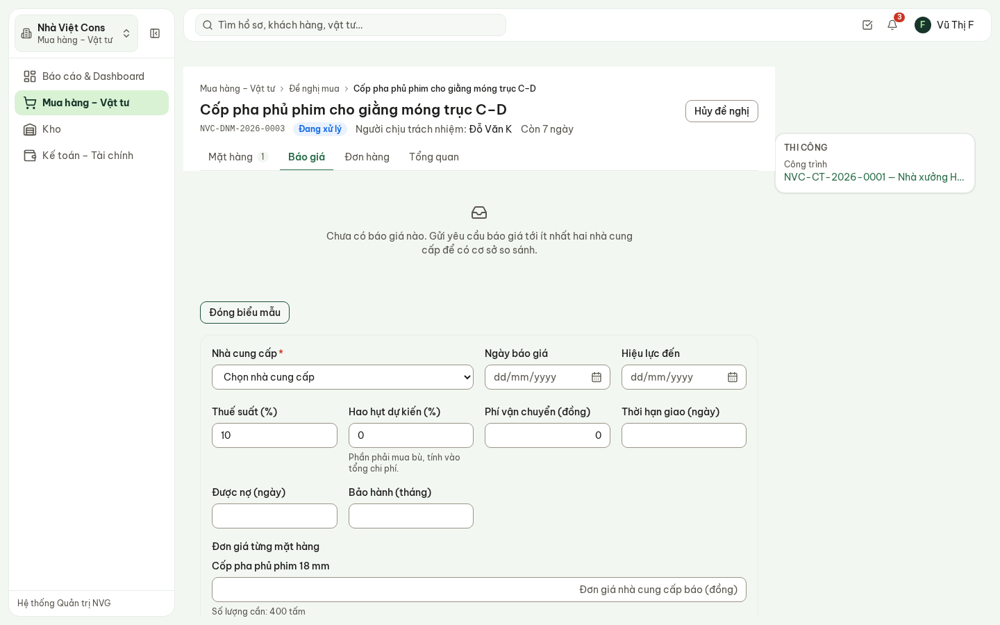

**Hình 6.** Nhập báo giá: nhà cung cấp, thuế, hao hụt, vận chuyển, thời hạn giao, được nợ, bảo hành,
đơn giá từng mặt hàng.

Nên có **ít nhất hai báo giá**. Từ báo giá thứ hai, bảng so sánh hiện ra:

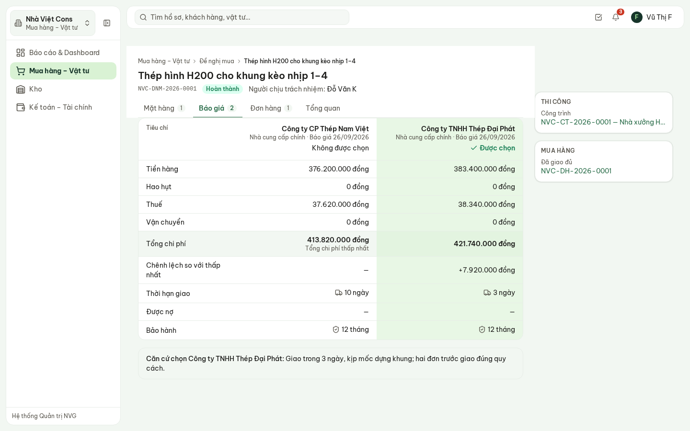

**Hình 7.** Bảng so sánh: mỗi nhà cung cấp một cột; nhà cung cấp đã chọn tô nền.

- **Nhóm tiền** (tiền hàng, hao hụt, thuế, vận chuyển) quy về cùng một mặt bằng; dòng **Tổng chi
  phí** ghi rõ nhà nào **thấp nhất**, dòng **Chênh lệch** cho biết các nhà khác đắt hơn bao nhiêu.
- **Nhóm rủi ro** (thời hạn giao, được nợ, bảo hành) để nguyên — không quy thành tiền.
- Hệ thống **không gợi ý chọn ai**. Người mua bấm **Chọn nhà cung cấp này** dưới cột tương ứng.
- Chọn nhà **không phải tổng chi phí thấp nhất** thì phải ghi **căn cứ chọn** (tiến độ giao, bảo
  hành, chất lượng đã kiểm chứng…). Căn cứ lưu cùng hồ sơ, người duyệt và Kế toán đọc lại được —
  như ví dụ trong hình: chọn Thép Đại Phát đắt hơn 7,9 triệu vì giao trong 3 ngày.

> Bảng so sánh là **nội dung thương thảo**: chỉ Ban Giám đốc, Tài chính, Dự án – Đấu thầu, Thiết kế
> và Mua hàng đọc được. Vai trò khác mở đề nghị thấy dòng giải thích thay cho bảng.

## 7. Lập đơn đặt hàng

Đã chọn nhà cung cấp thì đầu trang có nút **Lập đơn đặt hàng**. Bấm là đơn được tạo từ báo giá đã
chọn — không nhập lại mặt hàng, đơn giá. Không có nút tạo đơn hàng trống: đơn luôn đi từ một đề
nghị đã duyệt và một báo giá đã chọn.

Sau khi lập, ghi **Ngày giao cam kết** (và số hợp đồng mua bán nếu có) ở tab **Tổng quan** của đơn
hàng. Giá trị đơn được ghi vào ngân sách công trình ở phần **đã cam kết**.

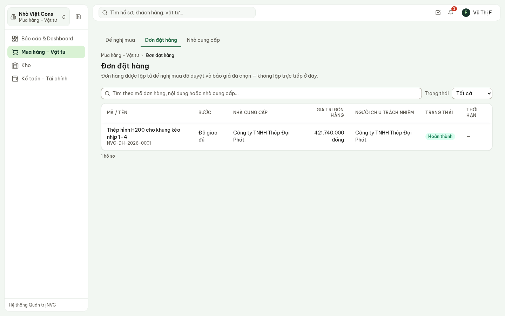

**Hình 8.** Danh sách đơn đặt hàng: nhà cung cấp, giá trị, ngày giao cam kết.

## 8. Ghi nhận giao hàng

Hàng về: mở đơn hàng → tab **Giao nhận** → **Ghi nhận đợt giao hàng**. Giao nhiều đợt thì ghi
mỗi đợt một lần.

- **Ngày nhận**, **Người giao**, **Số phiếu giao hàng**, **Số hóa đơn**, ô **Có chứng từ chất
  lượng CO/CQ kèm theo**.
- Mỗi mặt hàng: **Số lượng đạt** và **Số lượng không đạt** (thiếu, sai quy cách, hỏng) kèm ghi chú
  xử lý với nhà cung cấp.
- **Lưu biên bản giao nhận**. Người nhận là tài khoản đang đăng nhập — đây là chữ ký bên nhận.

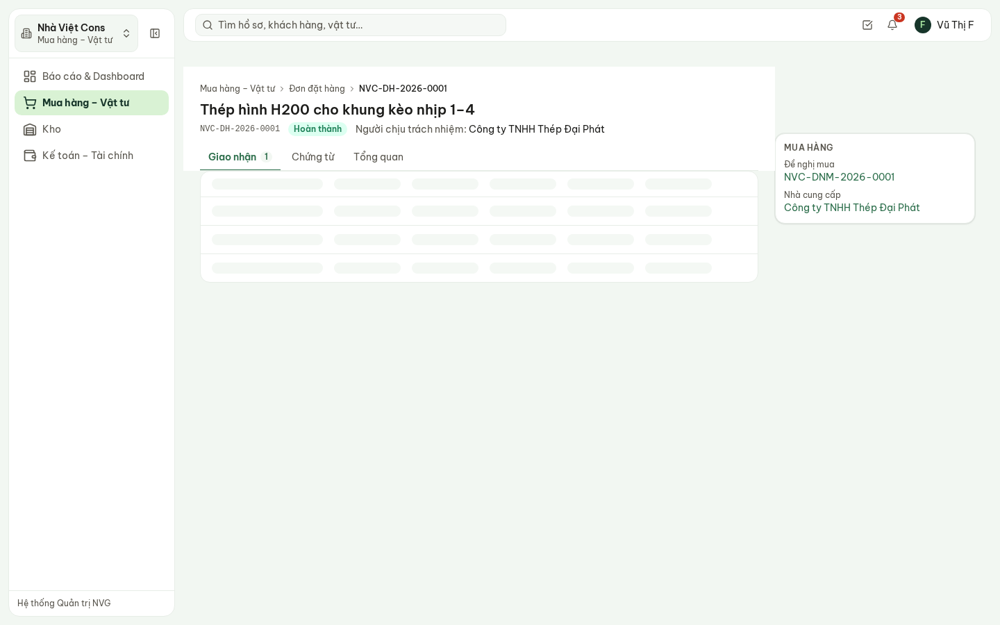

**Hình 9.** Tab Giao nhận: đã đặt, đã nhận, còn lại từng mặt hàng và các đợt đã giao.

Chỉ phần **đạt** được tính là đã nhận và chuyển sang **chi phí thực tế** của công trình; phần không
đạt ghi riêng để làm việc với nhà cung cấp. Nhận đủ thì đơn chuyển **Đã giao đủ**, đề nghị chuyển
**Hoàn thành**. **Kho** bấm **Nhập kho theo phiếu này** trên từng đợt để đưa hàng vào tồn kho.

## 9. Bộ chứng từ cho Kế toán

Tab **Chứng từ** của đơn hàng gom đủ: đơn đặt hàng, liên kết tới bảng so sánh báo giá, từng phiếu
giao nhận với số phiếu giao hàng, số hóa đơn, CO/CQ. Giao đủ thì Kế toán nhận thông báo và mở thẳng
từ đây để lập đề nghị thanh toán.

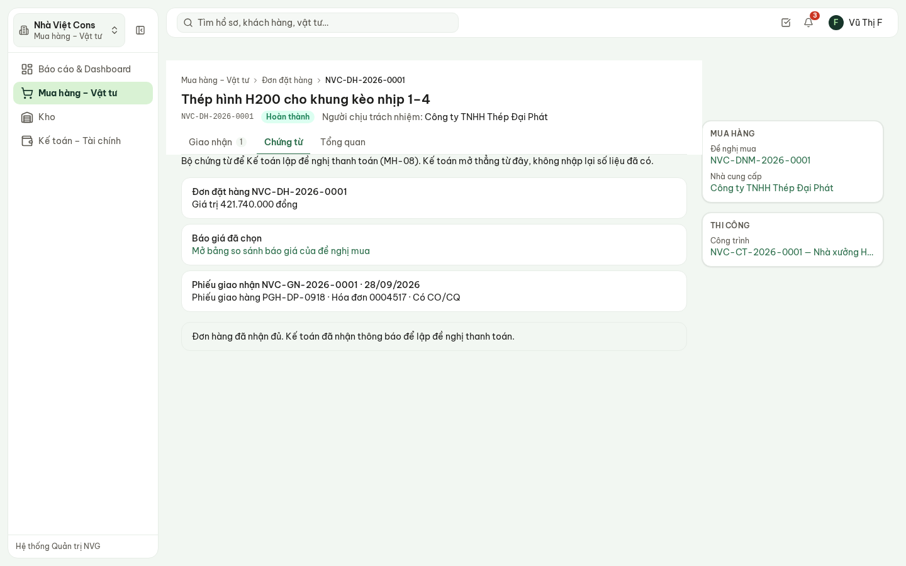

**Hình 10.** Tab Chứng từ — Kế toán không phải hỏi lại Mua hàng.

## 10. Nhà cung cấp

**Mua hàng – Vật tư** → **Nhà cung cấp**: danh mục dùng chung cho cả ba pháp nhân — một nhà cung
cấp chỉ có một mã. **Thêm nhà cung cấp**: tên, nhóm hàng, phân loại, mã số thuế, người liên hệ,
điện thoại, thư điện tử.

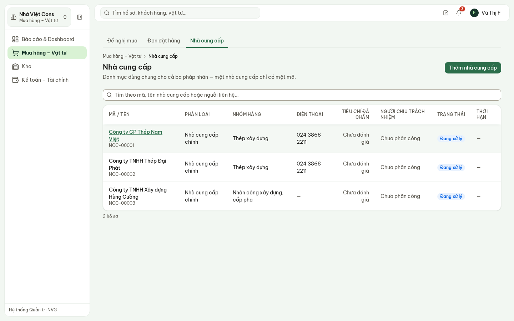

**Hình 11.** Danh mục nhà cung cấp.

Trong hồ sơ nhà cung cấp:

- Tab **Đánh giá** — tám tiêu chí, chấm từ 1 đến 5, kèm **căn cứ đánh giá**. Hệ thống không cộng
  thành điểm tổng: mỗi tiêu chí đọc riêng.
- Tab **Lịch sử giao dịch** — mọi đơn hàng đã đặt với nhà cung cấp này.
- **Đặt làm nhà cung cấp chính** hoặc **Ngừng giao dịch** (bắt buộc ghi lý do; nhà cung cấp ngừng
  giao dịch không chọn được ở đơn mới, đơn đang chạy không đổi, mở lại được).

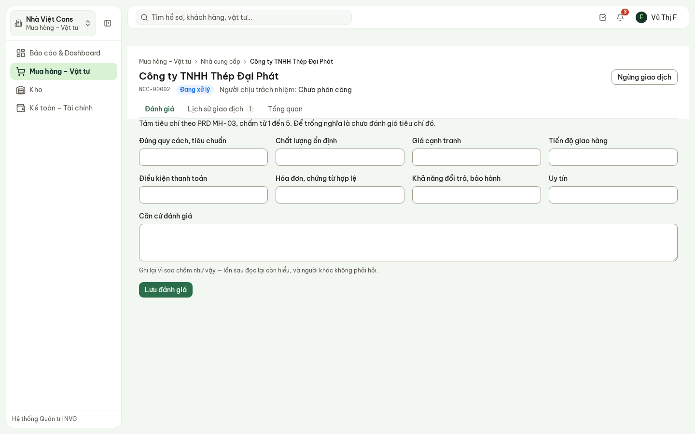

**Hình 12.** Hồ sơ nhà cung cấp — tab Đánh giá.

## 11. Hủy đề nghị, hủy đơn hàng

**Hủy đề nghị** (khi chưa có đơn hàng) và **Hủy đơn đặt hàng** đều hỏi **lý do** trong hộp thoại;
lý do lưu vào hồ sơ. Đề nghị đã hủy không lập đơn hàng được nữa.

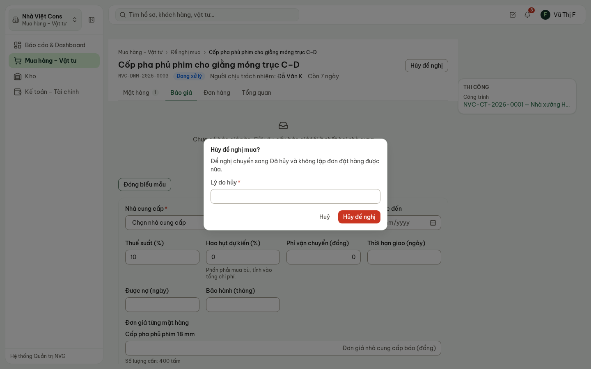

**Hình 13.** Hủy đề nghị: nói rõ hệ quả, bắt buộc ghi lý do. Bấm **Huỷ** để thôi.

## 12. Câu hỏi thường gặp

| Câu hỏi | Trả lời |
| --- | --- |
| Không thấy nút **Lập đơn đặt hàng**? | Đề nghị chưa được duyệt, hoặc chưa chọn nhà cung cấp trong bảng so sánh, hoặc đã có đơn hàng. |
| Không sửa được mặt hàng của đề nghị? | Đề nghị đã gửi phê duyệt. Chỉ sửa được khi còn Nháp hoặc bị từ chối. |
| Muốn chọn nhà cung cấp đắt hơn? | Được — ghi căn cứ chọn trong hộp thoại. Không ghi thì hệ thống không cho chọn. |
| Hàng về thiếu hoặc hỏng? | Ghi phần đạt và phần không đạt riêng. Đơn vẫn ở Đang giao cho tới khi nhận đủ phần đạt. |
| Đề nghị không gắn công trình có vào ngân sách không? | Không — đó là mua cho văn phòng. Mua cho công trình thì phải chọn công trình và mã chi phí. |
| Ai nhập kho? | Kho, từ nút **Nhập kho theo phiếu này** trên đợt giao nhận Mua hàng đã ghi. |
