# Hướng dẫn sử dụng — Kế toán – Tài chính

Hệ thống Phần mềm Quản trị Nhà Việt Group · đề nghị chi, công nợ, dòng tiền, chốt kỳ

| | |
| --- | --- |
| **Áp dụng cho** | Kế toán nội bộ, Tài chính (vai trò **Kế toán – Tài chính**), phục vụ cả ba pháp nhân; Giám đốc Tài chính ở bước kiểm tra dòng tiền |
| **Thiết bị** | Máy tính |
| **Địa chỉ** | `https://nvg.tests99.workers.dev` |
| **Tài khoản demo** | `ketoan@nhavietgroup.test` — mật khẩu nhận riêng từ đầu mối dự án |
| **Phiên bản** | Bản dùng cho buổi trình diễn |

> Hệ thống **không thay phần mềm kế toán chính thức** và không tạo bộ số thứ hai. Nó quản lý phần
> quy trình trước khi số vào sổ: ai đề nghị chi, đã qua những bước kiểm nào, ai duyệt, đã chi chưa,
> đã chuyển sang phần mềm kế toán chưa — cùng công nợ, dòng tiền và chốt kỳ. Mọi khoản chi gắn
> vào mã công trình ngay khi phát sinh, không hạch toán lại bằng tay.

---

## 1. Kế toán làm gì trên hệ thống

| Việc | Màn hình | Khi nào |
| --- | --- | --- |
| Xem tổng quan: doanh thu, đã thu, đã chi, công nợ | **Dashboard**, **Báo cáo** → Tổng quan tài chính | Mỗi sáng |
| Kiểm đề nghị chi ở bước Kế toán, trả lại nếu thiếu chứng từ | **Kế toán – Tài chính** → Đề nghị chi | Khi có thông báo |
| Lập đề nghị thanh toán cho đơn hàng đã giao | Đơn đặt hàng → tab **Chứng từ** | Khi Mua hàng báo giao đủ |
| Ghi nhận đã chi, đánh dấu đã hạch toán | Chi tiết đề nghị chi | Sau khi duyệt / sau khi chuyển sổ |
| Theo dõi tạm ứng và hạn hoàn ứng | **Tạm ứng** | Hằng tuần |
| Lập công nợ, ghi nhận thu / trả | **Công nợ** | Khi phát hành hóa đơn, khi tiền về |
| Lập kế hoạch dòng tiền kỳ | **Dòng tiền** | Đầu kỳ |
| Mở, khóa, mở lại kỳ kế toán | **Kỳ kế toán** | Cuối tháng |

Ô chọn ở góc trên bên trái đổi pháp nhân đang xem. Lập hồ sơ mới phải chọn **một** pháp nhân — khoản
chi thuộc về lãi/lỗ của đúng công ty đó.

## 2. Dashboard

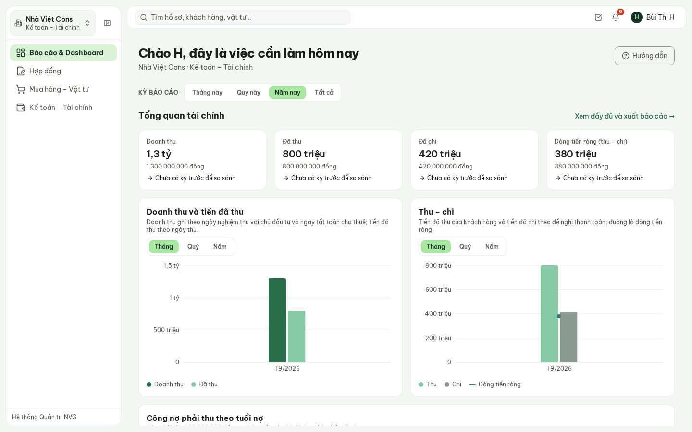

**Hình 1.** Dashboard: bốn chỉ số tài chính theo kỳ và biểu đồ thu – chi.

Kế toán thấy phần **Tổng quan tài chính** giống Ban Giám đốc: doanh thu, đã thu, đã chi, dòng tiền
ròng, so với kỳ trước cùng độ dài; bên dưới là công nợ theo tuổi nợ. **Xem đầy đủ và xuất báo cáo →**
mở tab Tổng quan tài chính có bảng số theo tháng, **Xuất Excel** và **Xuất PDF**.

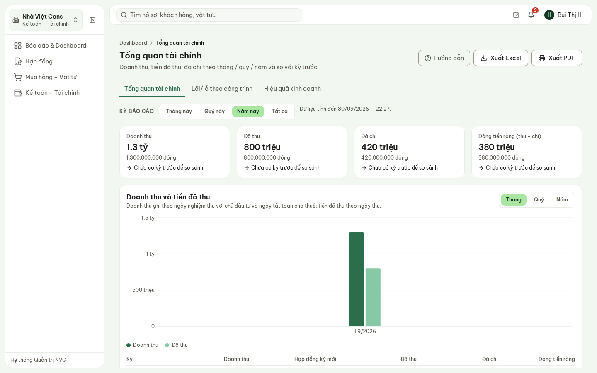

**Hình 2.** Báo cáo → Tổng quan tài chính.

## 3. Đề nghị chi — một luồng cho mọi khoản

**Kế toán – Tài chính** → **Đề nghị chi**. Ba loại đi chung một luồng: **Đề nghị thanh toán** (trả
nhà cung cấp, tổ đội), **Đề nghị tạm ứng**, **Hoàn ứng**.

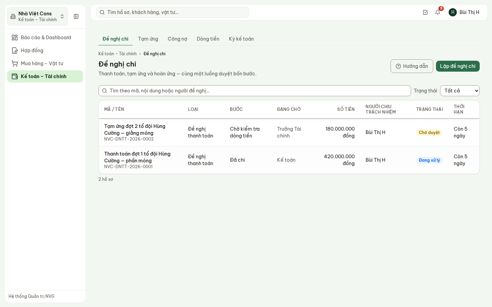

**Hình 3.** Cột **Bước** cho biết hồ sơ đang ở đâu, cột **Đang chờ** cho biết ai phải xử lý tiếp.

Các bước của một đề nghị chi:

| Bước | Ai xử lý | Việc |
| --- | --- | --- |
| Nháp | Người đề nghị | Soạn, phân bổ chi phí, **Gửi đi** |
| Đơn vị xác nhận | Trưởng bộ phận phát sinh | Xác nhận khoản chi thật sự phát sinh ở đơn vị mình |
| Kế toán kiểm tra | **Kế toán** | Kiểm bộ chứng từ, mã chi phí, số tiền |
| Kiểm tra dòng tiền | Giám đốc Tài chính | Đối chiếu kế hoạch dòng tiền, chi được vào lúc nào |
| Phê duyệt theo hạn mức | Người có hạn mức | Duyệt trong Hộp thư phê duyệt |
| Đã duyệt, chờ chi | **Kế toán / Tài chính** | **Ghi nhận đã chi** |
| Đã chi | **Kế toán** | **Đánh dấu đã hạch toán** sau khi chuyển sang phần mềm kế toán |

> **Hạn mức duyệt đề nghị chi trong bản demo** (mức tạm, Tổng Giám đốc sửa được): tới **10 triệu** —
> Kế toán; tới **200 triệu** — Giám đốc Tài chính; lớn hơn — Tổng Giám đốc.

Mở một hồ sơ: **dải bước** ngay đầu trang cho biết bước nào đã xong, bước nào đang chờ.

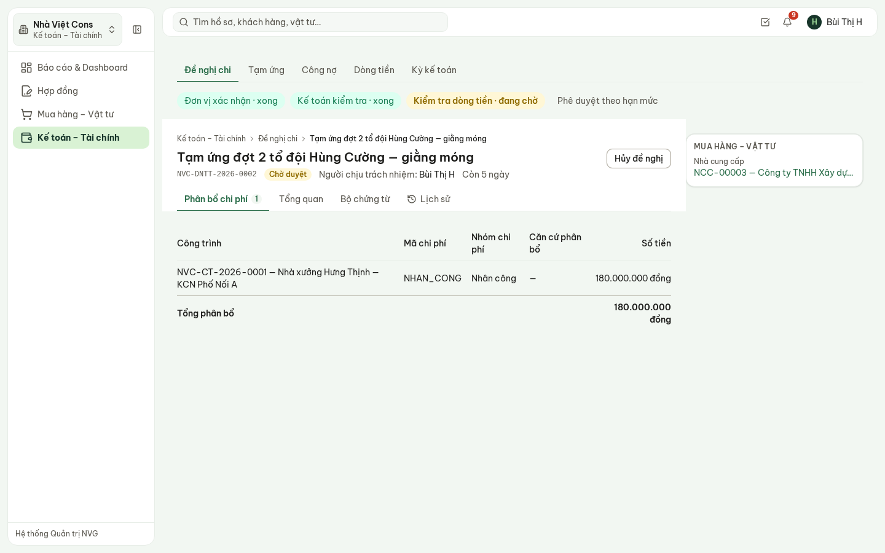

**Hình 4.** Đề nghị đợt 2 tổ đội Hùng Cường: đã qua đơn vị và Kế toán, đang chờ kiểm tra dòng tiền.

Ở bước của mình, Kế toán bấm **Xác nhận** để chuyển tiếp, hoặc **Trả lại** kèm lý do — hồ sơ về
người đề nghị, sửa xong gửi lại. Người đề nghị không tự xác nhận hồ sơ của chính mình. Tab **Lịch
sử** ghi từng bước: ai xác nhận, ai trả lại, lúc nào, ý kiến gì.

## 4. Phân bổ chi phí

Tab **Phân bổ chi phí** gắn khoản chi vào đúng công trình, mã chi phí và nhóm chi phí — **trước**
khi gửi đi; sau đó không sửa được.

**Hình 5.** Một dòng phân bổ: công trình, mã chi phí trong ngân sách, nhóm chi phí, số tiền.

- **Thêm dòng phân bổ**: công trình (để trống nếu là chi phí văn phòng), mã chi phí, nhóm chi phí,
  số tiền, căn cứ phân bổ. Một khoản chia được cho nhiều công trình.
- **Tổng các dòng phải bằng số tiền đề nghị** — màn hình báo phần còn lệch ngay.
- Hệ thống không tự chia theo tiêu thức: chọn tiêu thức nào là quy chế của NVG.

## 5. Lập đề nghị chi

**Đề nghị chi** → **Lập đề nghị chi**:

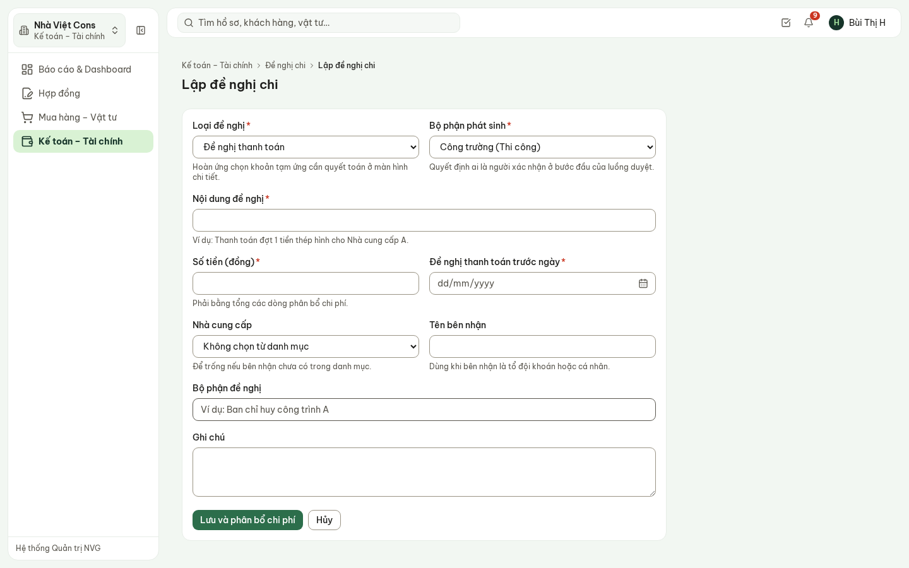

**Hình 6.** Biểu mẫu lập đề nghị chi.

1. **Loại đề nghị** và **Bộ phận phát sinh** (quyết định ai xác nhận ở bước đầu).
2. **Nội dung**, **Số tiền**, **Đề nghị thanh toán trước ngày**.
3. Bên nhận: chọn **Nhà cung cấp** trong danh mục, hoặc ghi **Tên bên nhận** (tổ đội khoán, cá nhân).
   Tạm ứng thì chọn **Người nhận tạm ứng** và **Hạn hoàn ứng**.
4. **Lưu và phân bổ chi phí** → tab Phân bổ → **Gửi đi**.

Hệ thống không lưu số tài khoản ngân hàng cá nhân của người nhận — chỉ lưu số chứng từ chi.

## 6. Thanh toán cho đơn đặt hàng

Khi Mua hàng ghi nhận giao đủ, Kế toán nhận thông báo. Mở đơn hàng → tab **Chứng từ**: đủ đơn
hàng, bảng so sánh báo giá đã chọn, từng phiếu giao nhận với số hóa đơn và CO/CQ.

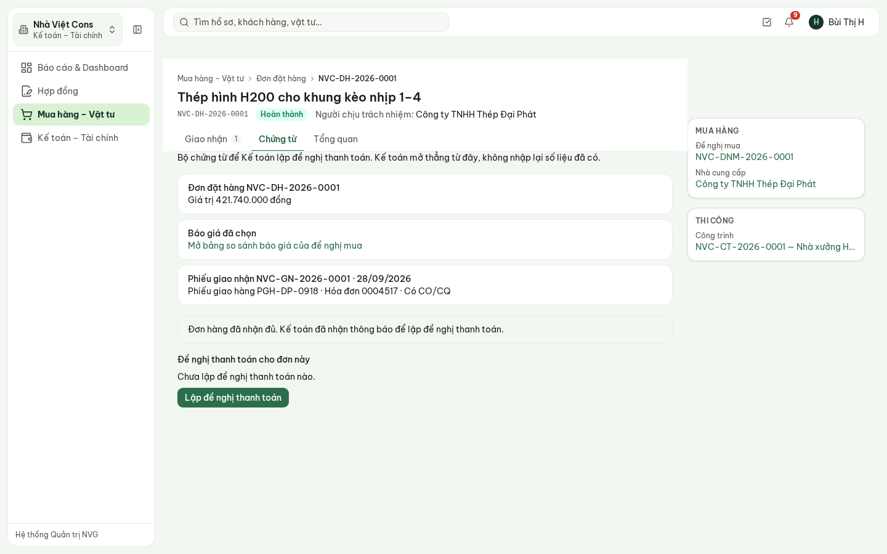

**Hình 7.** Tab Chứng từ: bộ chứng từ, các đề nghị thanh toán đã lập cho đơn, nút **Lập đề nghị thanh toán**.

Bấm **Lập đề nghị thanh toán**: biểu mẫu mở sẵn loại, bộ phận Mua hàng, nội dung, số tiền và nhà
cung cấp của đơn.

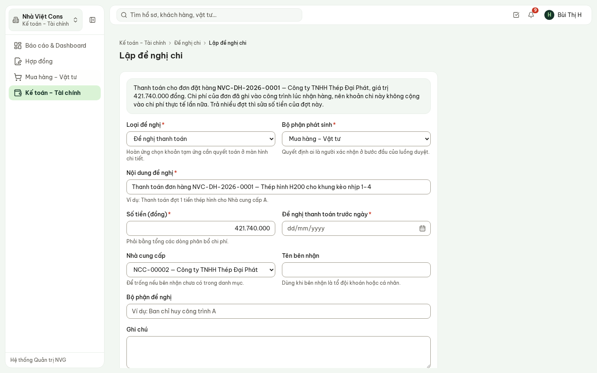

**Hình 8.** Đề nghị lập từ đơn hàng — trả nhiều đợt thì sửa số tiền của đợt này.

> **Luôn lập từ đơn hàng, đừng lập tay.** Chi phí của đơn đã ghi vào công trình lúc nhận hàng. Đề
> nghị lập từ đơn mang mã đơn, nên khi ghi đã chi hệ thống không cộng chi phí lần nữa. Lập tay thì
> công trình bị ghi chi phí hai lần.

## 7. Ghi nhận đã chi và hạch toán

- Hồ sơ **Đã duyệt, chờ chi** → **Ghi nhận đã chi**: ngày chi, hình thức (**Ủy nhiệm chi** hoặc
  **Phiếu chi**), số chứng từ. Khoản chi có phân bổ vào công trình được cộng vào **chi phí thực tế**
  của công trình ngay lúc này.
- Hồ sơ **Đã chi** → sau khi đã nhập sang phần mềm kế toán chính thức → **Đánh dấu đã hạch toán**,
  ghi số chứng từ bên phần mềm kế toán (để trống nếu chưa có).

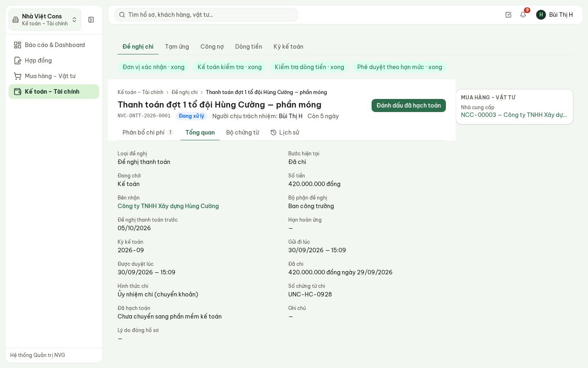

**Hình 9.** Đề nghị đợt 1 đã chi 420 triệu bằng ủy nhiệm chi, chờ đánh dấu đã hạch toán.

## 8. Tạm ứng

**Tạm ứng**: các khoản **đã ứng ra** (tiền đã rời quỹ) và phần còn phải hoàn. Một đề nghị tạm ứng
xuất hiện ở đây khi được ghi nhận đã chi.

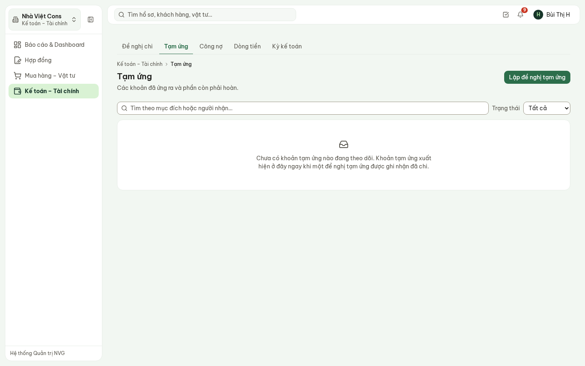

**Hình 10.** Tạm ứng — bản demo chưa có khoản nào.

- Quá **hạn hoàn ứng** thì hiện **Quá hạn**. Người đó xin ứng tiếp thì phải nêu lý do.
- Hoàn ứng là một đề nghị chi loại **Hoàn ứng**, đi đúng luồng duyệt như mọi khoản khác — không có
  nút hoàn ứng nhanh.

## 9. Công nợ

**Công nợ** — hai tab **Phải thu** và **Phải trả**. Đầu trang là **bảng tuổi nợ**: chưa đến hạn,
quá hạn 1–30, 31–60, 61–90, trên 90 ngày (mốc tạm; Quản trị hệ thống sửa được khi NVG ban hành quy
chế công nợ).

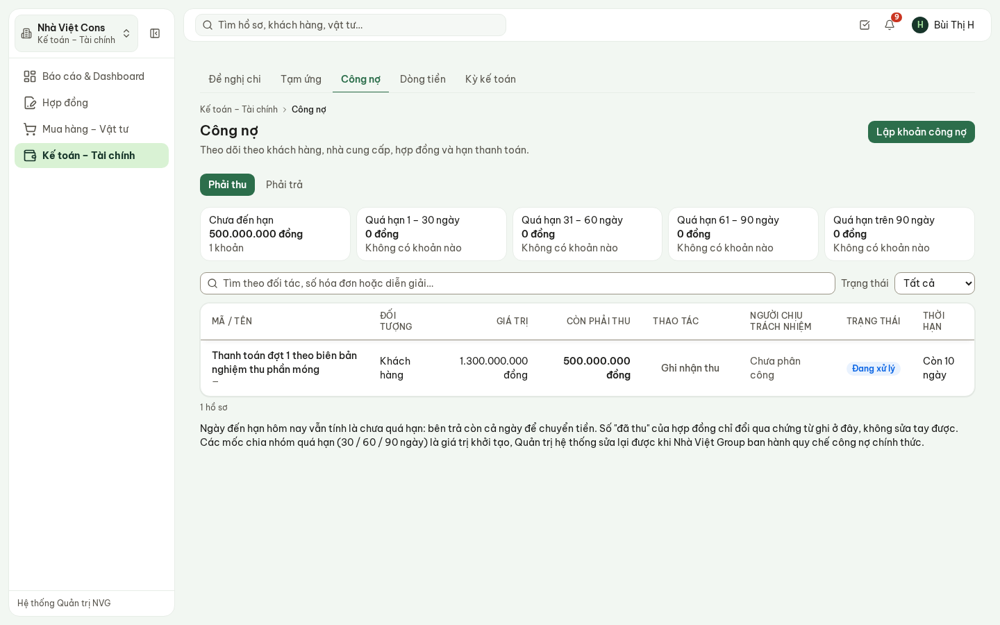

**Hình 11.** Phải thu: 1,3 tỷ đợt 1 nghiệm thu phần móng, đã thu 800 triệu, còn 500 triệu.

- **Lập khoản công nợ**: diễn giải, hợp đồng, đối tác, số tiền, số hóa đơn, ngày hóa đơn, **hạn
  thanh toán**.
- Tiền về: **Ghi nhận thu** (phải trả: **Ghi nhận trả**) trên dòng tương ứng — ngày, số tiền, hình
  thức, số chứng từ. Số «đã thu» trên hợp đồng chỉ đổi qua thao tác này, nên luôn truy được về
  từng chứng từ.

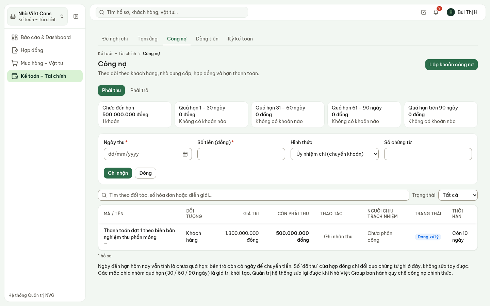

**Hình 12.** Ghi nhận thu tiền.

## 10. Dòng tiền

**Dòng tiền** đặt cạnh nhau cho từng pháp nhân: số dư đầu kỳ, dự kiến thu, công nợ đến hạn thu, dự
kiến chi, công nợ đến hạn trả, **khoản đã duyệt nhưng chưa chi**, và **số dư cuối kỳ dự kiến**. Chỗ
âm được chỉ ra; hệ thống không kết luận nên hoãn khoản nào.

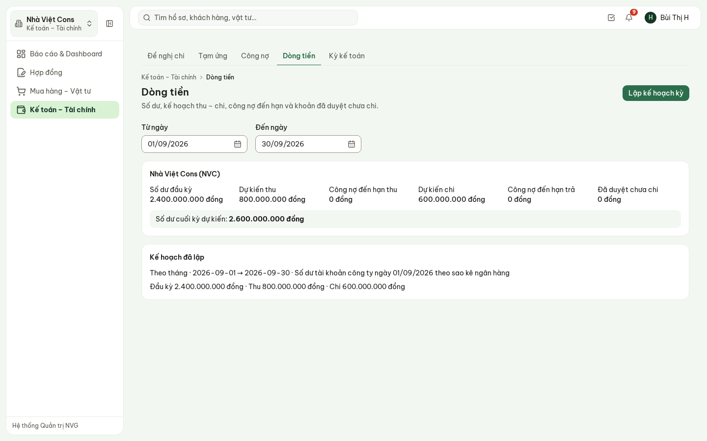

**Hình 13.** Dòng tiền tháng 9 của Nhà Việt Cons.

**Lập kế hoạch kỳ**: kỳ, từ ngày – đến ngày, **số dư đầu kỳ** (nhập tay theo sao kê — hệ thống
không nối ngân hàng điện tử), dự kiến thu, dự kiến chi, nguồn số dư. Chưa lập kế hoạch thì thẻ Dòng
tiền trên Dashboard ghi «Chưa đủ dữ liệu» thay vì «0 đồng».

## 11. Kỳ kế toán

**Kỳ kế toán** — chốt sổ theo tháng.

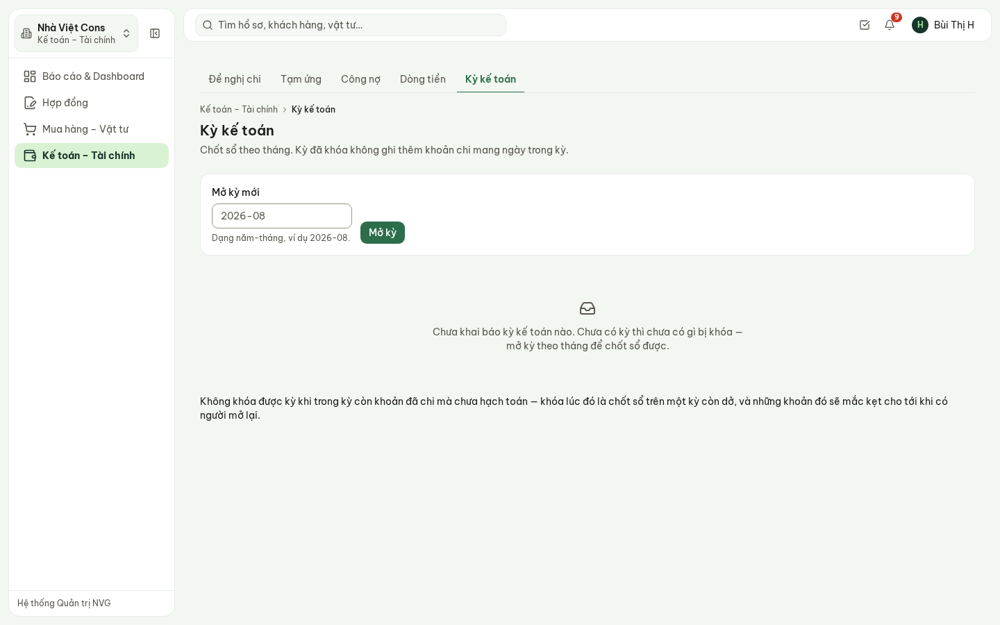

**Hình 14.** Kỳ kế toán — bản demo chưa mở kỳ nào.

- **Mở kỳ**: gõ năm-tháng, ví dụ `2026-09`.
- **Khóa kỳ**: sau khi khóa, hệ thống **từ chối mọi khoản chi mang ngày trong kỳ**. Không khóa được
  khi trong kỳ còn khoản đã chi mà chưa hạch toán.
- **Mở lại kỳ**: bắt buộc ghi nguyên nhân; nguyên nhân và người mở được lưu lại.

## 12. Câu hỏi thường gặp

| Câu hỏi | Trả lời |
| --- | --- |
| Không gửi đi được đề nghị chi? | Màn hình nói rõ thiếu gì: chưa có bên nhận tiền, chưa có dòng phân bổ nào, hoặc tổng phân bổ khác số tiền đề nghị. |
| Không thấy nút **Xác nhận**? | Hồ sơ đang ở bước của người khác (xem cột Đang chờ), hoặc chính mình là người đề nghị. |
| Muốn sửa phân bổ sau khi đã gửi? | Không sửa được. Người ở bước đang giữ **Trả lại**, người đề nghị sửa rồi gửi lại. |
| Trả tiền cho đơn hàng thì lập ở đâu? | Từ tab **Chứng từ** của đơn hàng — để không ghi chi phí công trình hai lần. |
| Số dư đầu kỳ lấy ở đâu? | Nhập tay theo sao kê ngân hàng. Hệ thống không kết nối ngân hàng điện tử. |
| Có thay phần mềm kế toán không? | Không. **Đánh dấu đã hạch toán** chỉ ghi nhận khoản chi đã chuyển sang phần mềm kế toán chính thức. |
