# Hướng dẫn sử dụng — Kho

Hệ thống Phần mềm Quản trị Nhà Việt Group · nhập, xuất, tồn kho, kiểm kê, giàn giáo

| | |
| --- | --- |
| **Áp dụng cho** | Thủ kho, nhân viên kho (vai trò **Kho**) của Nhà Việt Cons và Nhà Việt Steel |
| **Thiết bị** | Máy tính bảng hoặc điện thoại tại kho (quét mã, lập phiếu); máy tính (tồn kho, kiểm kê) |
| **Địa chỉ** | `https://nvg.tests99.workers.dev` |
| **Tài khoản demo** | `kho@nhavietgroup.test` — mật khẩu nhận riêng từ đầu mối dự án |
| **Phiên bản** | Bản dùng cho buổi trình diễn |

> **Sổ kho chỉ đổi qua phiếu**: nhập, xuất, điều chuyển, hoặc điều chỉnh sau kiểm kê đã được duyệt.
> Không có ô nào sửa thẳng con số tồn. Hàng mua về nhập từ chính phiếu giao nhận của Mua hàng — không
> gõ lại mặt hàng, số lượng.

---

## 1. Kho làm gì trên hệ thống

| Việc | Màn hình | Khi nào |
| --- | --- | --- |
| Tra nhanh một vật tư: còn bao nhiêu, ở kho nào | **Quét mã** | Mỗi lần có hàng ra vào |
| Nhập hàng mua về từ phiếu giao nhận | Đơn đặt hàng → tab **Giao nhận** → **Nhập kho theo phiếu này** | Khi Mua hàng ghi nhận giao hàng |
| Lập phiếu nhập, xuất, điều chuyển | **Phiếu kho** → **Lập phiếu** | Mỗi lần có hàng ra vào |
| Xem tồn, cảnh báo sắp hết, tồn lâu | **Tồn kho** | Hằng ngày |
| Kiểm kê định kỳ | **Kiểm kê** | Theo lịch kiểm kê |
| Theo dõi giàn giáo theo lô và tình trạng | **Giàn giáo** (Nhà Việt Steel) | Khi giao, thu hồi, sửa chữa |
| Quản lý danh mục vật tư, danh mục kho | **Danh mục vật tư**, **Danh mục kho** | Khi có vật tư, kho mới |

Sau khi đăng nhập, Kho vào thẳng màn hình **Quét mã** — việc làm nhiều nhất. Ô chọn góc trên bên trái
đổi pháp nhân: **Nhà Việt Cons** (kho công trình) hoặc **Nhà Việt Steel** (giàn giáo).

## 2. Quét mã

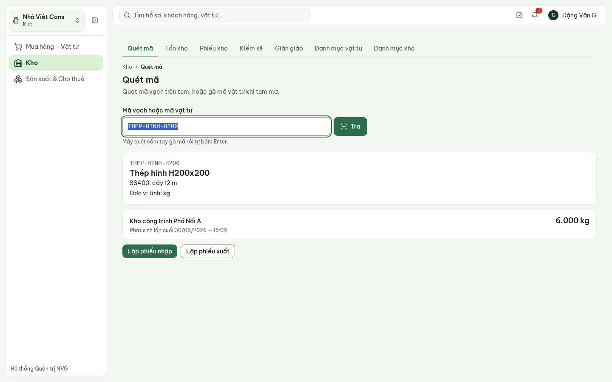

**Hình 1.** Quét mã thép hình H200: tồn 6.000 kg tại kho công trình Phố Nối A, lần phát sinh cuối.

- Quét mã vạch trên tem bằng **máy quét cầm tay** (máy gõ mã rồi tự bấm Enter), hoặc gõ mã vật tư
  khi tem mờ, rồi bấm **Tra**.
- Kết quả: tên, quy cách, đơn vị, tồn ở từng kho. Bấm **Lập phiếu nhập** / **Lập phiếu xuất** để lập
  phiếu cho đúng vật tư đó.
- Bản demo chưa quét bằng camera điện thoại — dùng máy quét cầm tay hoặc gõ mã.

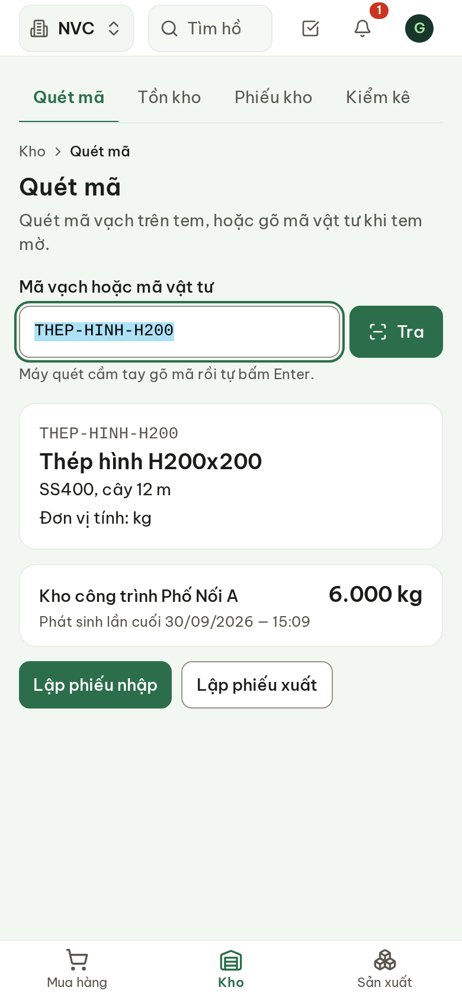

**Hình 2.** Trên điện thoại: thanh dưới cùng chuyển giữa Mua hàng · Kho · Sản xuất.

## 3. Nhập hàng mua về

Khi Mua hàng ghi nhận một đợt giao hàng, mở đơn đặt hàng → tab **Giao nhận**. Trên từng đợt giao:
chọn **Kho nhận** → **Nhập kho theo phiếu này**. Phiếu nhập được lập từ phần hàng **đạt** của đợt
giao — không gõ lại mặt hàng, số lượng, và mỗi đợt chỉ nhập được một lần.

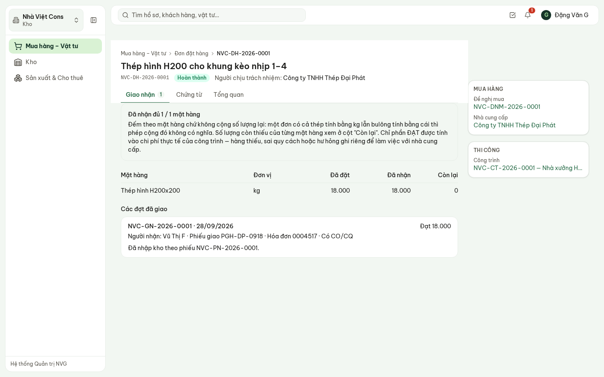

**Hình 3.** Đợt giao thép đã nhập kho: dòng «Đã nhập kho theo phiếu NVC-PN-2026-0001» thay cho nút.

## 4. Phiếu kho: nhập, xuất, điều chuyển

**Phiếu kho**: danh sách mọi phiếu, mới nhất trên cùng. Phiếu nhập từ giao nhận ghi rõ lập theo
phiếu giao nhận nào, của đơn hàng nào.

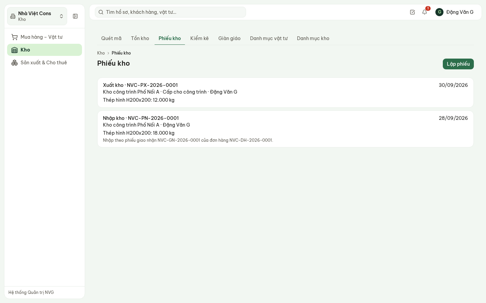

**Hình 4.** Danh sách phiếu kho.

**Lập phiếu**:

1. **Loại phiếu**: Nhập kho · Xuất kho · Điều chuyển.
2. **Kho** (điều chuyển: **Kho xuất** và **Kho nhận**).
3. Xuất kho: **Lý do xuất** (Cấp cho công trình · Xuất cho sản xuất · Xuất cho thuê · Lý do khác).
   Cấp cho công trình thì chọn **Công trình nhận** — chi phí vật tư gắn vào mã công trình ngay khi xuất.
4. Từng mặt hàng: **Vật tư**, **Số lượng** (nhập kho thêm **Đơn giá nhập**). **Thêm dòng** cho mặt
   hàng tiếp theo.
5. **Lưu phiếu**.

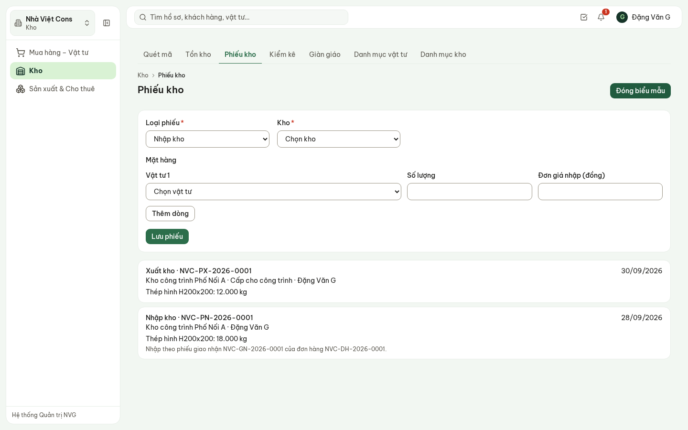

**Hình 5.** Lập phiếu nhập.

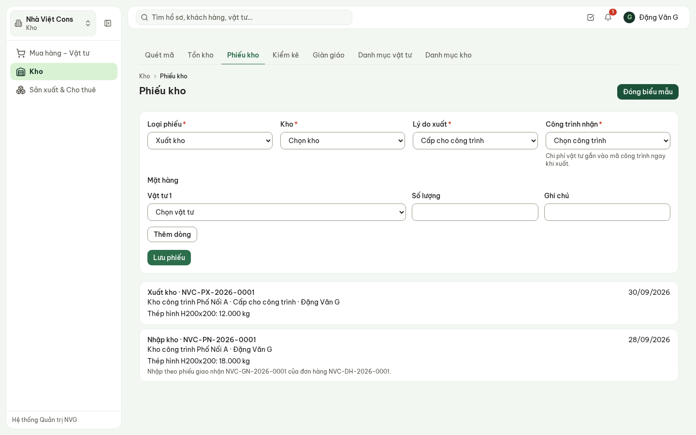

**Hình 6.** Lập phiếu xuất cấp cho công trình.

> Mất sóng giữa chừng rồi bấm **Lưu phiếu** lại: hệ thống nhận ra đó là cùng một phiếu, không lập
> phiếu thứ hai, tồn kho không bị cộng đôi. Xuất quá số tồn thì hệ thống từ chối.

## 5. Tồn kho và cảnh báo

**Tồn kho**: mỗi dòng là một vật tư ở một kho — tồn, tồn tối thiểu, ngày phát sinh cuối, cảnh báo.

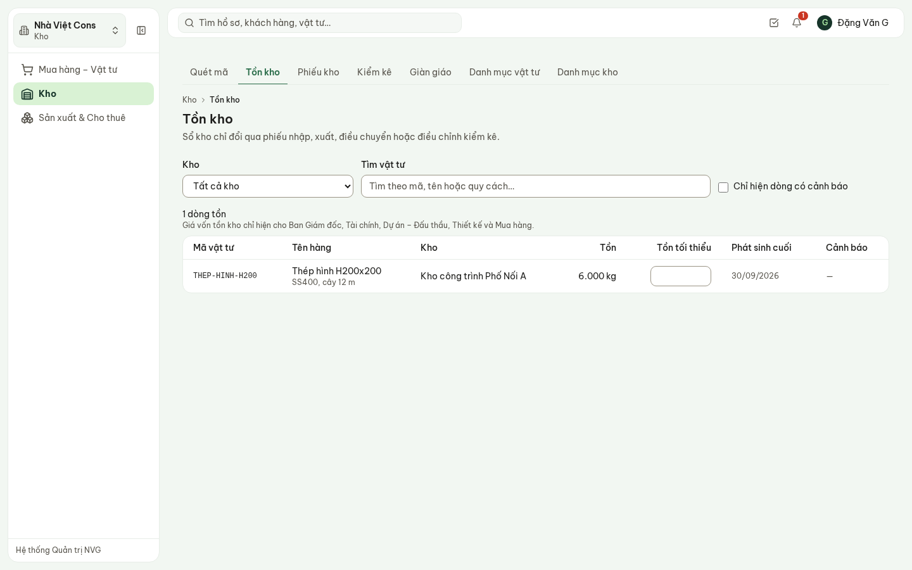

**Hình 7.** Tồn kho — lọc theo kho, tìm theo mã, tên hoặc quy cách.

- **Tồn tối thiểu**: gõ thẳng vào ô trên dòng. Dưới mức đó hiện **Sắp hết**; về 0 hiện **Đã hết hàng**.
- **Tồn lâu, chậm luân chuyển**: không phát sinh nhập xuất trong 90 ngày (mốc tạm, chờ NVG xác nhận).
- Dòng có cảnh báo được đẩy lên đầu; tích **Chỉ hiện dòng có cảnh báo** để chỉ xem các dòng đó.
- Giá vốn tồn kho chỉ hiện cho Ban Giám đốc, Tài chính, Dự án – Đấu thầu, Thiết kế và Mua hàng.

## 6. Kiểm kê

**Kiểm kê** theo đúng bốn bước: tạm dừng nhập xuất → đếm thực tế → xác định nguyên nhân chênh lệch →
lập biên bản và **trình duyệt trước khi điều chỉnh sổ**.

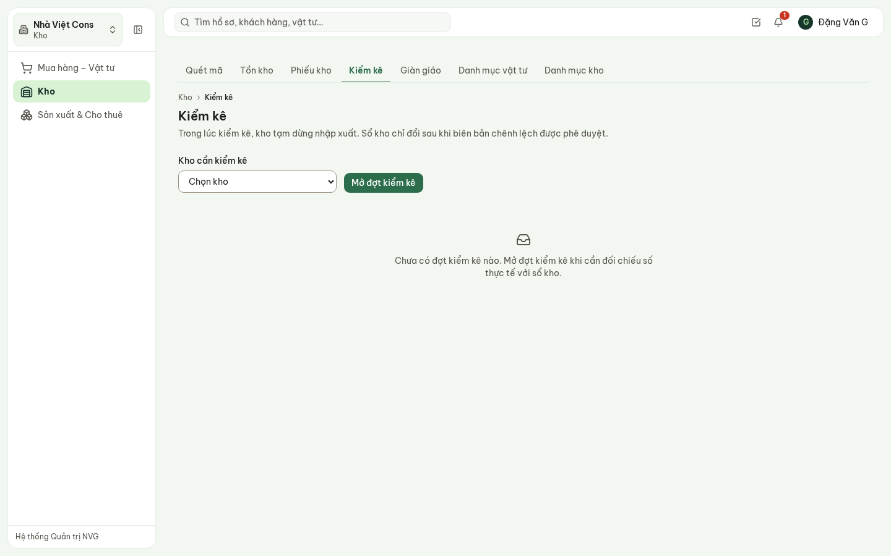

**Hình 8.** Kiểm kê — chọn kho rồi mở đợt.

1. Chọn **Kho cần kiểm kê** → **Mở đợt kiểm kê**. Trong lúc kiểm, kho **tạm dừng nhập xuất**.
2. Mở đợt → nhập **số đếm thực tế** từng vật tư → **Lưu số đếm**. Màn hình ghi đã đếm bao nhiêu
   dòng, bao nhiêu dòng lệch.
3. Đếm xong:
   - **Khớp sổ** ở mọi vật tư → **Đóng đợt kiểm kê**. Sổ kho giữ nguyên, kho mở lại nhập xuất.
   - **Có chênh lệch** → **Lập biên bản và gửi phê duyệt**, ghi nguyên nhân (hao hụt bốc xếp, thất
     thoát, đếm sót lần trước…).
4. Biên bản đi theo hạn mức: tới **10 triệu** — Kho (Thủ kho); lớn hơn — Giám đốc Tài chính (mức tạm).
   **Sổ kho chưa đổi** cho tới khi được duyệt; duyệt xong hệ thống tự lập phiếu điều chỉnh kiểm kê.

## 7. Giàn giáo (Nhà Việt Steel)

Chọn **Nhà Việt Steel** ở góc trên bên trái → **Giàn giáo**.

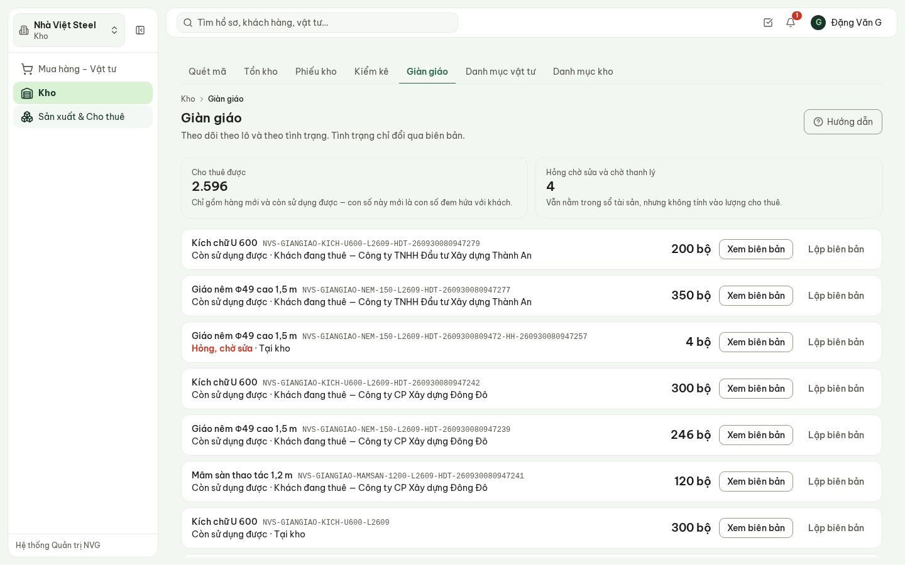

**Hình 9.** Giàn giáo theo lô: số lượng, tình trạng, đang ở đâu (tại kho, công trình, khách thuê).

- Hai con số đầu trang: **Cho thuê được** (chỉ hàng mới và còn sử dụng được — con số đem hứa với
  khách) và **Hỏng chờ sửa và chờ thanh lý** (vẫn trong sổ tài sản nhưng không tính vào lượng cho thuê).
- Tình trạng **chỉ đổi qua biên bản**. **Lập biên bản** trên lô: loại (Sửa chữa · Mất mát · Thanh
  lý), số lượng, ngày, tình trạng sau biên bản, chi phí hoặc bồi thường, **bên chịu trách nhiệm**,
  **nguyên nhân** (bắt buộc — không có nguyên nhân thì không truy được trách nhiệm).
- **Xem biên bản**: các biên bản đã lập cho lô.

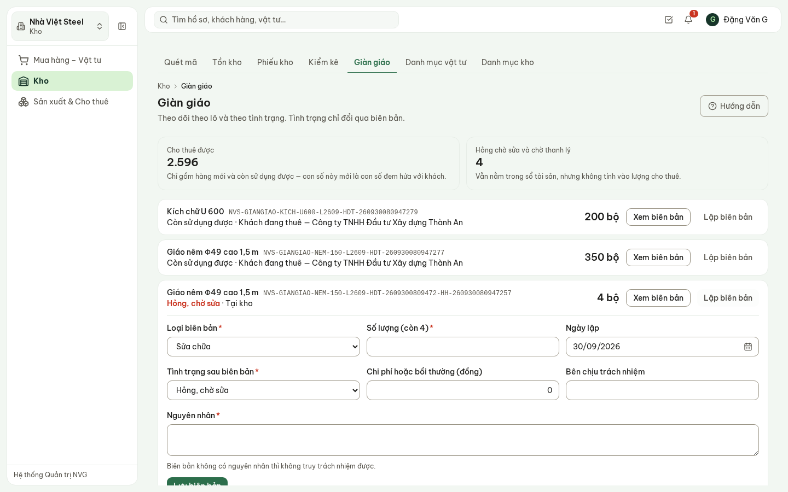

**Hình 10.** Lập biên bản sửa chữa cho lô giáo nêm đang hỏng.

Giao và thu hồi giàn giáo cho khách thuê làm ở phân hệ **Sản xuất & Cho thuê** (hướng dẫn riêng).

## 8. Danh mục vật tư và danh mục kho

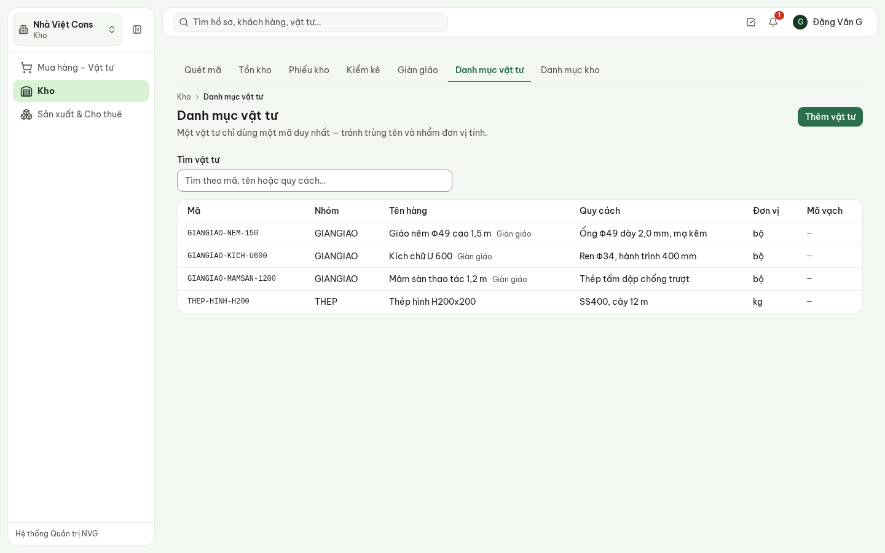

**Hình 11.** Danh mục vật tư — mỗi vật tư một mã duy nhất, dùng chung cho dự toán, mua hàng và kho.

- **Thêm vật tư**: mã, nhóm, tên, quy cách, đơn vị, mã vạch. Nút gợi ý ghép mã theo quy tắc nhóm –
  viết tắt – quy cách; người phụ trách danh mục vẫn là người chốt mã.
- **Danh mục kho**: kho vật tư xây dựng, kho nguyên liệu xưởng, kho giàn giáo thành phẩm, kho công
  cụ dụng cụ, kho tại công trình.

## 9. Câu hỏi thường gặp

| Câu hỏi | Trả lời |
| --- | --- |
| Muốn sửa số tồn cho đúng thực tế? | Không sửa thẳng được. Lập đợt **Kiểm kê**; chênh lệch được duyệt thì sổ tự điều chỉnh. |
| Nút **Nhập kho theo phiếu này** không còn? | Đợt giao đó đã nhập kho — dòng thay thế ghi mã phiếu nhập. |
| Không lập được phiếu xuất? | Kho đang kiểm kê (tạm dừng nhập xuất), hoặc số xuất lớn hơn tồn. |
| Quét mã không ra vật tư? | Mã chưa có trong danh mục, hoặc vật tư chưa có tồn ở kho nào của pháp nhân đang chọn. |
| Nhập giàn giáo bằng phiếu kho được không? | Không. Giàn giáo quản lý theo lô ở màn hình **Giàn giáo**, không vào sổ tồn kho vật tư. |
| Giàn giáo hỏng có tính vào lượng cho thuê không? | Không. Chỉ hàng mới và còn sử dụng được mới tính. |
| Dùng được khi mất mạng không? | Bản demo cần mạng. Bấm lưu lại khi có sóng không tạo phiếu trùng. |
