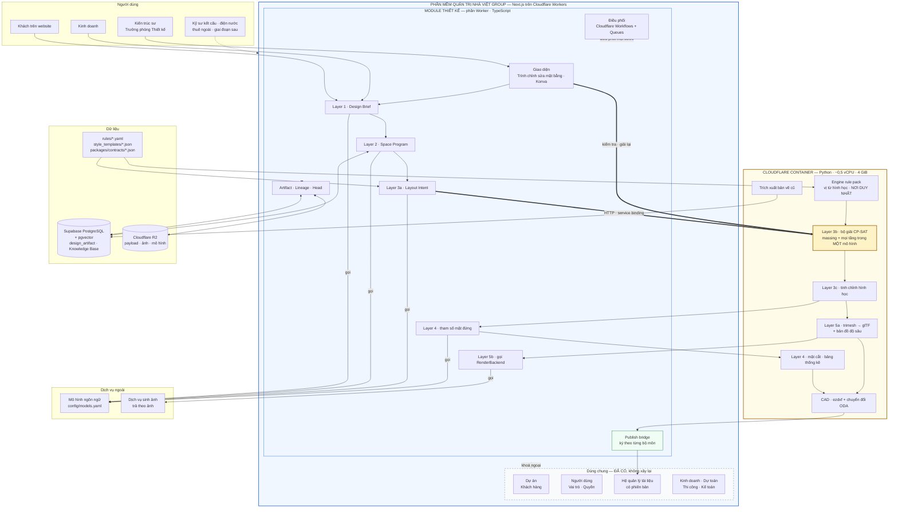

# 02 — Kiến trúc và ranh giới module

## 2.0 Sơ đồ cấu trúc

Luồng thiết kế một công trình nằm ở `11-design-flow.md`.



### Đọc sơ đồ — bốn điều quan trọng

**Khung xanh là một codebase.** Module thiết kế không phải hệ thống riêng — nó nằm cùng
Next.js với các module Kinh doanh, Dự toán, Thi công, và tham chiếu tới bảng dự án, khách
hàng, người dùng đã có bằng khoá ngoại.

**Khung vàng là ranh giới runtime duy nhất.** Mọi thứ cần thư viện Python nặng nằm bên
đó, gọi qua HTTP. Nhầm chỗ là lỗi kiến trúc: đừng gọi mô hình ngôn ngữ từ Container, đừng
cài thư viện hình học phía TypeScript.

**Rule pack chỉ có một nơi thực thi.** Ô `C7` là nơi duy nhất cài đặt vị từ hình học.
Worker đọc rule pack để hiển thị cho người dùng nhưng không tự đánh giá — nếu không sẽ có
hai bản thực thi lệch nhau. Đây cũng là lý do hoãn tầng WebAssembly.

**Mũi tên tới mô hình ngôn ngữ chỉ xuất phát từ Worker.** Bộ giải CP-SAT là tất định và
không được phụ thuộc mô hình ngôn ngữ — cưỡng chế bằng kiểm thử cấm `solver/` import phần
gọi mô hình.

## 2.1 Vị trí trong hệ thống

Module thiết kế **nằm bên trong** phần mềm quản trị Nhà Việt Group: cùng codebase Next.js, cùng
database Supabase, cùng người dùng và phân quyền.

```
Phần mềm quản trị NVG (Next.js / TypeScript / Cloudflare)
├── Kinh doanh, Dự toán, Thi công, Kho, Kế toán…   ← đã có
├── Dự án · Khách hàng · User · Phân quyền          ← đã có, DÙNG CHUNG
├── Quản lý tài liệu có phiên bản                    ← đã có, DÙNG CHUNG
└── Module Thiết kế                                  ← phần này
    ├── Worker (TS)  — UI, API, LLM, artifact, điều phối
    └── Container (Python) — solver, hình học, CAD, 3D
```

**Nguyên tắc số một của module:** không tạo lại bất cứ thứ gì đã có. Dự án, khách hàng,
user, vai trò, tài liệu — tham chiếu, không sao chép.

## 2.2 Hai runtime

Cloudflare Workers không phải Node.js và không chạy được thư viện Python có native
extension. Toàn bộ lõi tính toán vì vậy nằm trong Cloudflare Container.

| | **Worker (TypeScript)** | **Container (Python)** |
|---|---|---|
| Layer 1 — Design Brief | ✔ toàn bộ (gọi LLM) | |
| Layer 2 — Space Program | ✔ toàn bộ (LLM + truy hồi SQL) | |
| Layer 3a — Layout Intent | ✔ gọi LLM, validate cấu trúc | |
| Layer 3b — giải ràng buộc CP-SAT | | ✔ |
| Layer 3c — Refinement | | ✔ |
| Layer 4 — Facade params | ✔ gọi LLM chọn tham số | |
| Layer 4 — Mặt cắt, bảng thống kê | | ✔ |
| Layer 5 — 3D → glTF | | ✔ |
| Layer 5 — Render | ✔ gọi `RenderBackend` | |
| Đọc/ghi tệp DXF (Drawing Exchange Format — định dạng trao đổi bản vẽ) | | ✔ |
| Artifact, lineage, publish | ✔ | |
| Điều phối | ✔ Cloudflare Workflows | |

Worker gọi Container qua **service binding** (địa chỉ theo hostname). Container **không
gọi ngược** Worker — nó nhận input, trả output, không có side effect ngoài giá trị trả về.

### Giới hạn của Container và hệ quả

| Giới hạn | Hệ quả với code |
|---|---|
| ~0,5 vCPU (virtual CPU — phần bộ xử lý được chia cho một máy ảo) mỗi instance | Bộ giải CP-SAT chạy `num_search_workers=1`. Đặt timeout rõ ràng, đo ở Mốc 0 |
| 4 GiB RAM | Đủ cho nhà phố; biệt thự nhiều wing cần đo lại |
| Đĩa ephemeral (xoá sạch sau mỗi lần chạy) | Công cụ chuyển đổi ODA và mọi tài nguyên nằm trong image. Không cache giữa các lần gọi |
| Linux/amd64 | Build image đúng kiến trúc |
| Tính theo CPU thực dùng | Phù hợp workload nhàn rỗi phần lớn thời gian — đúng hồ sơ của NVG |

**Container phải stateless và không dùng API đặc thù Cloudflare bên trong.** Nếu Mốc 0
cho thấy nửa vCPU quá chậm, chuyển sang VPS chỉ là đổi chỗ deploy chứ không phải viết lại.

## 2.3 Luồng dữ liệu

```
  DesignBrief ─► SpaceProgram ─► LayoutIntent ─► FloorPlan ─► ArchModel ─► Mesh3D ─► Renders
   (Worker)       (Worker)        (Worker)       (Container)  (cả hai)    (Container) (Worker)
```

Mỗi mũi tên là một **contract có JSON Schema**. Mỗi hộp là một artifact bất biến, băm
nội dung, có cạnh lineage trỏ về input.

**Hệ quả cho code:** mỗi layer là hàm thuần `(input_artifact, config) -> output_artifact`.
Không đọc trạng thái toàn cục, không ghi sang layer khác. Nhờ vậy regenerate một layer
là chạy lại đúng hàm đó với input cũ.

## 2.4 Contract sinh tự động — quan trọng vì có hai ngôn ngữ

Với hai runtime, viết schema tay ở cả hai bên là con đường chắc chắn dẫn tới lệch nhau.

```
packages/contracts/*.schema.json          ← NGUỒN GỐC, viết tay ở đây
        ├─► zod + TypeScript types        (json-schema-to-zod)   → Worker
        └─► Pydantic v2 models            (datamodel-code-generator) → Container
```

- Sinh code là bước build, kết quả **commit vào repo** để review được diff.
- **Cả hai đầu đều validate** ở ranh giới. Container không tin Worker và ngược lại.
- Sửa schema thì tăng `schema_version`; đổi phá vỡ tương thích thì tăng major.
- CI kiểm tra code sinh ra khớp với schema — lệch thì fail build.

## 2.5 Điều phối

Dùng **Cloudflare Workflows** (durable execution) + **Queues**. Không dùng Hatchet,
Celery hay Redis — đã ở trên Cloudflare thì không thêm hạ tầng.

Mỗi layer là một step trong Workflow. Yêu cầu bắt buộc:

- **Chạy lại được từng phần.** "Chạy lại Layer 3, giữ nguyên Layer 1–2" là một lời gọi.
- **Retry có phân biệt.** Lỗi mạng thì retry; lỗi schema thì không retry, báo lỗi ngay.
- **Idempotent.** Cùng input + cùng config → cùng artifact hash. Artifact đã tồn tại thì
  trả về luôn, không tính lại.

Pipeline số hoá Knowledge Base cũng chạy trên Workflows: mỗi file là một step, một file
lỗi không giết cả mẻ.

## 2.6 Ranh giới module trong repo

```
apps/web/                          Next.js hiện có
  src/modules/design/              ← module thiết kế phía Worker
    layer1-brief/
    layer2-program/
    layer3-intent/                 chỉ phần gọi LLM + validate
    layer5-render/                 RenderBackend interface + adapter
    artifacts/                     băm nội dung, lineage, publish bridge
    workflows/                     định nghĩa Cloudflare Workflow
    llm/                           router model, prompt, tool schema

services/design-compute/           ← Container Python
  solver/                          CP-SAT: massing + floorplan. KHÔNG import llm
  geometry/                        shapely, refinement
  cad/                             ezdxf + ODA converter
  mesh/                            trimesh → glTF, mặt cắt
  schedules/                       bảng thống kê
  kb_extract/                      trích xuất bản vẽ cũ
  Dockerfile

packages/contracts/                JSON Schema — nguồn gốc
rules/                             Rule pack YAML (dữ liệu)
style_templates/                   Template mặt đứng JSON (dữ liệu)
config/models.yaml                 Định tuyến LLM
tests/golden/                      Bộ dự án chuẩn cho eval
```

### Quy tắc phụ thuộc

- `packages/contracts/` không phụ thuộc gì — nó là lá.
- `solver/` **không import phần gọi LLM**. Solver là tất định.
- Rule pack đọc được từ **cả hai** runtime, nhưng **chỉ Container cài đặt vị từ**. Worker
  chỉ hiển thị kết quả, không tự đánh giá rule — nếu không sẽ có hai bản thực thi lệch nhau.
- `layer5-render/` chỉ ra ngoài qua interface `RenderBackend`.

## 2.7 Hạ tầng — CHỐT

| Thành phần | Chọn |
|---|---|
| Frontend + API | Next.js / TypeScript trên Cloudflare Workers |
| Lõi tính toán | Cloudflare Containers (Python) |
| Điều phối | Cloudflare Workflows + Queues |
| Database | Supabase PostgreSQL + pgvector (dùng chung với phần mềm quản trị) |
| Xác thực + phân quyền | Supabase Auth + RLS — Row Level Security, phân quyền mức từng dòng dữ liệu (dùng chung) |
| File storage | Cloudflare R2 |
| GPU render | **Dịch vụ API trả theo ảnh.** Không tự vận hành hạ tầng GPU. Vẫn code sau `RenderBackend` để đổi được |

## 2.7b Bộ môn (discipline) — xuyên suốt mọi bảng

Đích đến là bộ hồ sơ nhiều bộ môn (`01-overview.md` mục 1.1). Vì vậy **mọi artifact và
mọi tài liệu phát hành ra đều mang trường `discipline`** (bộ môn): `KT` (kiến trúc),
`KC` (kết cấu), `DN` (điện nước).

Giai đoạn 1 chỉ sinh ra `KT`. Nhưng trường phải có từ đầu — thêm sau nghĩa là sửa mọi
bảng, mọi contract, mọi RLS policy.

Mô hình dữ liệu giữ **ngữ nghĩa IFC** (Industry Foundation Classes — tiêu chuẩn mở mô tả
dữ liệu công trình: IfcSpace, IfcWall, IfcDoor, IfcBuildingStorey)
để ba bộ môn tham chiếu **cùng một hình học** thay vì mỗi bộ môn giữ một bản sao. Đây là
nguồn gốc của vướng mắc "phát hiện xung đột muộn" trong khảo sát, và là lý do việc này
chuyển từ "nên có" thành "bắt buộc".

## 2.8 Multi-tenant

Module chuẩn bị bán lại cho công ty xây dựng khác, nên **mọi bảng của module mang
`tenant_id`** ngay từ khung — kể cả khi hiện chỉ có một tenant.

Tenant-scoped bắt buộc, vì đây chính là tài sản có giá trị khi bán:

- Knowledge Base (công trình, thống kê thực nghiệm)
- Rule pack
- Style template
- Đơn giá, cấu hình

Chính sách RLS (Row Level Security — phân quyền ở mức từng dòng dữ liệu, do cơ sở dữ
liệu cưỡng chế thay vì ứng dụng) trên mọi bảng module kiểm tra **ba chiều**:

1. `tenant_id` — không rò rỉ giữa khách hàng
2. Phân công dự án — kỹ sư thuê ngoài chỉ thấy dự án được giao
3. `discipline` — ghi được phần bộ môn mình phụ trách

Thiếu một chiều ở một bảng là một lỗ hổng.

**Về vai trò:** phần mềm quản trị đã có bảng vai trò cấu hình được. Module **khai báo
quyền** (`design.brief.read`, `design.floorplan.write`, `design.publish.KC`…) và để việc
gán quyền vào vai trò cho bảng đó. **Không hard-code tên vai trò trong policy** — tenant
thứ hai sẽ có cơ cấu tổ chức khác.

**Lưu ý:** các bảng dùng chung (dự án, khách hàng, user) hiện có thể chưa có `tenant_id`.
Module vẫn mang `tenant_id` của riêng nó; khi phần mềm quản trị chuyển sang multi-tenant
thì hai bên khớp nhau. Đừng chờ.

## 2.8b Khách vãng lai từ website

Tính năng thiết kế AI mở cho khách truy cập website. Hệ quả cho khung:

- Dự án có trạng thái **nháp** — do khách vãng lai tạo, chưa phải dự án chính thức
- Cơ chế **chuyển đổi** dự án nháp thành dự án chính thức khi Kinh doanh tiếp nhận, giữ
  nguyên artifact và lineage
- Rate limit và giới hạn số phương án cho khách vãng lai
- Tải không đoán trước được → hạ tầng render phải co giãn (mục 2.7)

## 2.8c Vận hành không có người trực

Bàn giao theo hợp đồng bảo trì định kỳ, không có nhân sự trực hàng ngày. Yêu cầu bắt buộc:

- Mọi tác vụ nền **tự thử lại** và tự phục hồi sau lỗi tạm thời
- Lỗi ghi log đủ để chẩn đoán từ xa, không cần vào máy
- **Cảnh báo chủ động** khi có tác vụ kẹt hoặc hàng đợi ứ, thay vì chờ người dùng báo
- Không có bước nào cần thao tác tay định kỳ để hệ thống chạy tiếp

## 2.9 Frontend

- React + TypeScript + zod (sinh từ contract).
- **Trình chỉnh sửa mặt bằng: Konva.js + react-konva.** Không dùng PixiJS (thừa cho quy mô này), không tự viết trên Canvas thuần.
- **Mô hình tương tác quan trọng hơn thư viện vẽ:** KTS kéo một bức tường = *đổi tỉ lệ
  một nút trong cây chia không gian*, không phải *di chuyển một đường thẳng*. Ràng buộc
  được bảo toàn theo cấu trúc.
- **Trình xem ba chiều: Three.js chỉ đọc tệp glTF** (Graphics Language Transmission
  Format — định dạng mô hình ba chiều dùng trên web). Không dựng hình phía trình duyệt.
- **Giao diện có hệ thị giác riêng** — xem `12-ux-ui.md`. Module thiết kế là công cụ
  chuyên nghiệp dùng nhiều giờ liền, yêu cầu về mật độ, chế độ tối và vị trí cố định
  khác hẳn phần nghiệp vụ. Kế thừa thanh điều hướng ngoài, đăng nhập và hồ sơ người
  dùng; riêng mọi thứ bên trong khung làm việc.
- **Giai đoạn 1 kiểm tra trên máy chủ** qua API. Tầng Rust biên dịch sang WebAssembly
  (WASM) hoãn lại: nó tạo bản thực
  thi rule thứ ba, là tối ưu trải nghiệm chứ không phải khung xương.

## 2.10 Ranh giới với AutoCAD — ĐỀ XUẤT

- Web editor là **nguồn sự thật cho phương án sơ bộ**.
- Xuất DXF **một chiều** sang AutoCAD cho hồ sơ kỹ thuật.
- **Không round-trip hai chiều.** Nhập ngược file CAD đã sửa sẽ mất toàn bộ metadata
  ràng buộc và không có cách nào biết ràng buộc nào đã bị phá.

Đã chốt (D20). Round-trip hai chiều sẽ phá vỡ metadata ràng buộc và làm kiến trúc slicing tree vô nghĩa.
