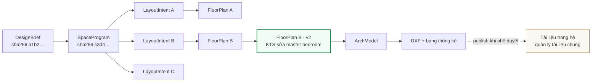
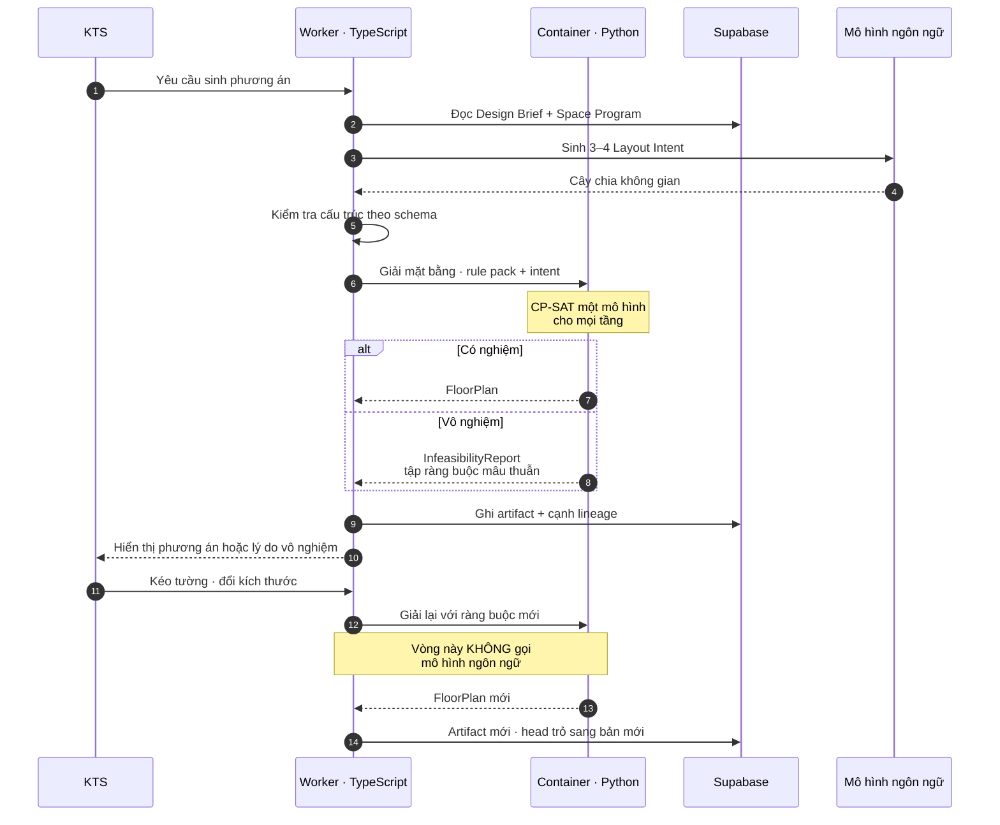

# 11 — Luồng thiết kế một công trình

Sơ đồ này đi từ lúc tiếp nhận yêu cầu tới lúc phát hành bộ hồ sơ. Sơ đồ cấu trúc hệ thống
nằm ở `02-architecture.md` mục 2.0.

Viết tắt trong tài liệu này: **KTS** kiến trúc sư, **KT** kiến trúc, **KC** kết cấu,
**DN** điện nước, **DXF** Drawing Exchange Format là định dạng trao đổi bản vẽ. Bảng đầy
đủ ở `10-glossary.md`.

---

## 11.1 Luồng chính — Giai đoạn 1

Phần trong khung **Giai đoạn 1** là phạm vi đang xây. Phần sau đó thuộc các mốc tiếp theo
nhưng vẽ ở đây để thấy đích đến, vì nó quyết định hình dạng dữ liệu ngay từ bây giờ.

```mermaid
flowchart TD
    START(["Khách trên website<br/>hoặc Kinh doanh nhập"]) --> L1

    subgraph P1["GIAI ĐOẠN 1"]
        direction TB

        L1["Layer 1<br/>Design Brief<br/>Worker · mô hình ngôn ngữ"]
        Q1{"Đầy đủ?<br/>completeness_score"}
        ASK["Hỏi bổ sung<br/>thông tin còn thiếu"]

        L2["Layer 2<br/>Space Program<br/>Worker · truy hồi Knowledge Base"]
        L3A["Layer 3a<br/>Layout Intent × 3–4 phương án<br/>Worker · sinh cây chia không gian"]
        VAL{"Cấu trúc cây<br/>hợp lệ?"}

        L3B["Layer 3b<br/>Bộ giải CP-SAT<br/>massing + mặt bằng mọi tầng cùng lúc<br/>Container"]
        Q2{"Có nghiệm?"}
        INF["InfeasibilityReport<br/>tập ràng buộc mâu thuẫn<br/>+ đề xuất nới lỏng"]

        L3C["Layer 3c<br/>Tinh chỉnh hình học<br/>Container"]
        REVIEW["KTS xem, so sánh,<br/>chỉnh sửa trên trình duyệt"]
        Q3{"KTS chấp nhận?"}

        PKG["Gói trình khách<br/>mặt bằng tô màu công năng<br/>khối 3D đơn giản · bảng so sánh"]
        QC{"Khách chốt<br/>phương án?"}

        SCHED["Bảng thống kê tự sinh<br/>cửa · diện tích · vật liệu"]
        DXF["Xuất DXF mặt bằng<br/>khung tên + mã phiên bản<br/>theo quy ước Nhà Việt Group"]
        APPROVE{"Trưởng phòng<br/>phê duyệt?"}
        PUB1["Publish bộ môn KT<br/>ký bởi người có quyền<br/>design.publish.KT"]
    end

    subgraph P2["GIAI ĐOẠN SAU"]
        direction TB
        L4["Mốc 6 · Layer 4<br/>Mặt đứng · mặt cắt"]
        L5["Mốc 6 · Layer 5<br/>Mô hình ba chiều → glTF<br/>→ phối cảnh qua dịch vụ ảnh"]
        TECH["Mốc 6b<br/>Nâng KT lên chất lượng<br/>bản vẽ kỹ thuật"]
        KC["Kỹ sư kết cấu làm việc<br/>trên nền hình học chung"]
        DN["Kỹ sư điện nước làm việc<br/>trên nền hình học chung"]
        CLASH["Phát hiện xung đột<br/>liên bộ môn"]
        PUB2["Publish KC · ký bởi<br/>kỹ sư kết cấu"]
        PUB3["Publish DN · ký bởi<br/>kỹ sư điện nước"]
        FULL["Kiểm tra đầy đủ ba bộ môn<br/>→ phát hành bộ hồ sơ"]
    end

    L1 --> Q1
    Q1 -- "chưa đủ" --> ASK --> L1
    Q1 -- "đủ" --> L2 --> L3A --> VAL
    VAL -- "sai cấu trúc" --> L3A
    VAL -- "hợp lệ" --> L3B --> Q2
    Q2 -- "vô nghiệm" --> INF --> REVIEW
    Q2 -- "có nghiệm" --> L3C --> REVIEW --> Q3
    Q3 -- "sửa ràng buộc" --> L3B
    Q3 -- "đổi hướng bố cục" --> L3A
    Q3 -- "chấp nhận" --> PKG --> QC
    QC -- "đổi bố cục" --> L3A
    QC -- "đổi chương trình không gian" --> L2
    QC -- "chốt" --> SCHED --> DXF --> APPROVE
    APPROVE -- "trả lại" --> REVIEW
    APPROVE -- "duyệt" --> PUB1

    PUB1 --> L4 --> L5 --> TECH --> KC & DN --> CLASH
    CLASH -- "có xung đột" --> KC
    CLASH -- "sạch" --> PUB2 & PUB3 --> FULL

    style P1 fill:#f0f7ff,stroke:#2563eb,stroke-width:2px
    style P2 fill:#faf8f0,stroke:#a16207,stroke-width:1px,stroke-dasharray: 5 5
    style INF fill:#fff1f2,stroke:#be123c
    style PKG fill:#fdf6ec,stroke:#a16207,stroke-width:2px
    style QC fill:#fdf6ec,stroke:#a16207,stroke-width:2px
    style PUB1 fill:#f0fdf4,stroke:#15803d
    style PUB2 fill:#f0fdf4,stroke:#15803d
    style PUB3 fill:#f0fdf4,stroke:#15803d
```



---

## 11.2 Đọc sơ đồ — bốn điểm quan trọng

**Cổng chốt với khách hàng đặt trước phần chi tiết.** Đây là điểm quan trọng nhất của
luồng. Khách chọn phương án khi chi phí thay đổi còn thấp — chỉ mất một lần giải lại tính
bằng giây. Nếu để khách xem sau khi đã xuất bản vẽ và phát hành thì mỗi lần đổi ý là làm
lại toàn bộ chuỗi phía sau.

Ba đường ra từ cổng này ứng với ba mức thay đổi khác nhau, chi phí tăng dần: đổi bố cục
thì quay về Layer 3a, đổi chương trình không gian thì quay về Layer 2, chốt thì đi tiếp.

**Ba vòng lặp, ba mục đích khác nhau.** Đừng gộp chúng khi cài đặt:

| Vòng lặp | Khi nào | Xử lý ở đâu | Có gọi mô hình ngôn ngữ không |
|---|---|---|---|
| `VAL → Layer 3a` | Cây chia không gian sai cấu trúc | Kiểm tra bằng schema | Sinh lại phương án mới, **không** bảo mô hình tự sửa |
| `Q3 → Layer 3b` | KTS đổi kích thước, đổi ràng buộc | Bộ giải chạy lại | **Không** |
| `Q3 → Layer 3a` | KTS muốn hướng bố cục khác hẳn | Sinh phương án mới | Có |

Vòng giữa là vòng chạy nhiều nhất trong thực tế và nó **không tốn tiền mô hình ngôn ngữ**
— đó là lợi ích trực tiếp của việc để bộ giải gánh phần kích thước.

**Vô nghiệm không phải lỗi.** Nhánh `Q2 → InfeasibilityReport` là một kết quả hợp lệ và
hữu ích: nó nói chính xác ràng buộc nào xung đột với ràng buộc nào, kèm đề xuất nới lỏng.
Đây là tính năng phân tích tác động, không phải trường hợp lỗi cần ẩn đi.

**Phát hành tách theo bộ môn.** Ba nút publish riêng biệt, mỗi nút yêu cầu quyền
`design.publish.<bộ môn>` tương ứng. Trưởng phòng Thiết kế không ký được hồ sơ kết cấu.
Bộ hồ sơ hoàn chỉnh là tập hợp ba lần phát hành, hệ thống kiểm tra đầy đủ trước khi cho
phát hành ra ngoài.

**Mốc 6b không bỏ qua được.** Không thể nối thẳng từ phương án sơ bộ sang bước kỹ sư kết
cấu làm việc — họ cần nền hình học ở mức bản vẽ kỹ thuật, không phải mức phương án.

---

## 11.3 Vòng đời artifact của một công trình

Mỗi hộp ở sơ đồ trên sinh ra một artifact bất biến, định danh bằng hàm băm nội dung. Quan
hệ giữa chúng tạo thành đồ thị phụ thuộc.



Nút tô đậm là bản **đang có hiệu lực**, ghi trong bảng `design_head`. Các nhánh khác
không bị xoá — chúng vẫn truy lại được, so sánh được, và tái lập được chính xác.

Ba câu hỏi trả lời được ngay từ cấu trúc này, không cần viết thêm chức năng:

- Bản nào đang có hiệu lực cho dự án này?
- Phương án B khác phương án A ở chỗ nào?
- Bản vẽ đang gửi khách sinh ra từ đầu bài nào, phiên bản rule pack nào?

Đây là câu trả lời trực tiếp cho vướng mắc số 1 và số 3 của Phòng Thiết kế trong khảo
sát: không chắc file đang dùng có phải bản mới nhất, và mất thời gian tìm lại hồ sơ cũ.

---

## 11.4 Nơi chạy từng bước

Cùng một luồng, nhìn theo môi trường chạy. Chi tiết bảng phân chia ở `02-architecture.md`
mục 2.2.



Bước 12 và 13 là vòng lặp thường xuyên nhất khi KTS làm việc. Nó chỉ đi qua Worker và
Container, không chạm tới mô hình ngôn ngữ — nên nhanh, tất định và gần như không tốn chi
phí biến đổi.

---

## 11.4b Gói trình khách — chốt phương án sớm

### Vì sao đặt cổng này ở đây

Chi phí sửa một phương án tăng theo cấp số nhân dọc chuỗi. Đổi bố cục ở bước Layer 3 là
một lần giải lại, tính bằng giây. Đổi sau khi đã xuất bản vẽ, phát hành hồ sơ và kỹ sư
kết cấu đã vào làm việc thì kéo theo cả chuỗi.

Theo khảo sát, nguyên nhân gốc khiến phương án phải sửa nhiều lần là **thiếu thông tin và
thiếu người quyết định ngay từ đầu**. Cổng chốt sớm không xoá được nguyên nhân đó, nhưng
nó dời thời điểm phát hiện về chỗ rẻ nhất.

### Ba thứ khách hàng cần, xếp theo chi phí xây dựng

| Output | Chi phí xây | Khách hiểu được không | Giai đoạn |
|---|---|---|---|
| **Mặt bằng tô màu theo công năng** | Gần bằng không — tô màu `FloorPlan` đã có | Rất tốt. Khối màu dễ đọc hơn nét kỹ thuật nhiều lần | **Giai đoạn 1** |
| **Khối 3D đơn giản, không vật liệu** | Thấp — đùn khối bằng `trimesh`, xuất glTF, Three.js đã có sẵn | Tốt. Thấy được tỉ lệ và hình khối tổng thể | **Giai đoạn 1** |
| **Ảnh phối cảnh photorealistic** | Cao — cần dịch vụ render, bản đồ độ sâu, preset phong cách | Tốt nhất | Mốc 6 |

**Điểm cần nói rõ:** thứ đắt nhất không phải thứ cần nhất để khách ra quyết định. Ở bước
chốt phương án, khách quyết định về **công năng và bố cục** — phòng nào ở đâu, có bao
nhiêu tầng, ông bà ở tầng mấy. Đó là câu hỏi mà mặt bằng tô màu trả lời tốt hơn ảnh
phối cảnh. Ảnh phối cảnh trả lời câu hỏi về **thẩm mỹ**, vốn đến sau.

Vì vậy kéo phần đùn khối tối thiểu vào Giai đoạn 1 là đủ để cổng chốt hoạt động. Không
cần chờ tới Mốc 6.

### Nội dung gói trình khách

1. **Mặt bằng từng tầng tô màu theo nhóm công năng** — sinh hoạt chung, phòng ngủ, phụ
   trợ, giao thông, ngoài trời. Có ghi tên và diện tích từng phòng bằng chữ thường, không
   dùng ký hiệu viết tắt kiểu bản vẽ kỹ thuật.
2. **Khối 3D xoay được trên trình duyệt** — trắng hoặc xám nhạt, không vật liệu, không
   ánh sáng phức tạp. Có nhãn "Khối sơ bộ — chưa thể hiện vật liệu và mặt đứng".
3. **Bảng so sánh 2–3 phương án** bằng ngôn ngữ khách hiểu: tổng diện tích sử dụng, số
   phòng ngủ, vị trí phòng ông bà, vị trí phòng thờ, ưu điểm và đánh đổi của từng phương
   án. **Không** dùng thuật ngữ như "diện tích giao thông 11,2%".
4. **Khoảng giá xây dựng sơ bộ** khi phần bóc tách khối lượng có sẵn ở Mốc 9. Chưa có ở
   Giai đoạn 1.

### Ranh giới trách nhiệm

Gói trình khách là tài liệu trao đổi, không phải hồ sơ phát hành. Mọi trang mang nhãn
**"Phương án sơ bộ — chưa phải hồ sơ thi công"**, do mã nguồn chèn.

Việc khách chốt phương án được ghi lại thành một sự kiện có mốc thời gian và người xác
nhận, gắn vào lineage của artifact tương ứng. Đây là căn cứ khi sau này phát sinh tranh
luận về việc đã thống nhất cái gì.

---

## 11.5 Hoàn thành Giai đoạn 1 — mỗi bên nhận được gì

Mục này trả lời câu hỏi thực tế: khi Mốc 5 đạt điều kiện ra, ai cầm được cái gì trên tay.

### Bảng tổng hợp

| Người dùng | Nhận được | Chưa có ở Giai đoạn 1 |
|---|---|---|
| **Kiến trúc sư** | 3–4 phương án mặt bằng đủ mọi tầng, nhất quán liên tầng; trình chỉnh sửa trên trình duyệt; giải thích khi vô nghiệm kèm phương án nới lỏng; tệp DXF; bảng thống kê tự cập nhật; lịch sử phiên bản so sánh được | Mặt đứng, mặt cắt, mô hình ba chiều |
| **Trưởng phòng Thiết kế** | Trạng thái ràng buộc của từng phương án; thao tác phê duyệt và ký phát hành bộ môn kiến trúc; truy vết đầy đủ ai đổi gì, lúc nào, dưới phiên bản quy chuẩn nào | Phối hợp liên bộ môn |
| **Kinh doanh** | Bộ mặt bằng dạng PDF và bảng diện tích để trao đổi với khách; đầu bài đã chuẩn hoá thay cho phiếu tiếp nhận cũ | Phối cảnh để chào hàng |
| **Khách hàng** | **Gói trình khách để chốt phương án**: mặt bằng tô màu công năng, khối 3D xoay được, bảng so sánh phương án bằng ngôn ngữ dễ hiểu | Ảnh phối cảnh photorealistic; khoảng giá xây dựng |
| **Kỹ sư kết cấu, điện nước** | Chưa tham gia ở giai đoạn này | Toàn bộ luồng phối hợp, thuộc Mốc 6c |

### Điểm cần thống nhất kỳ vọng với Nhà Việt Group

**Khách hàng chốt được phương án ngay trong Giai đoạn 1**, dựa trên mặt bằng tô màu và
khối 3D. Đây là thứ đủ để quyết định về công năng và bố cục.

**Nhưng chưa có ảnh phối cảnh photorealistic.** Cái đó thuộc Mốc 6. Nếu cần trình khách
ảnh đẹp trước khi ký hợp đồng, kiến trúc sư vẫn dùng công cụ dựng ảnh sẵn có như hiện nay —
nhưng nhập tệp DXF do hệ thống xuất ra thay vì dựng lại mô hình từ đầu trong SketchUp.

> ⚠️ **Sửa 05/09/2026 sau khi đối chiếu hai hồ sơ thật.** Câu gốc ghi "Veras và Enscape".
> Ảnh phối cảnh trong hồ sơ thật mang tên `aicomplex_angle_*.jpg` và
> `aicomplex-edited-*.png` — **NVG đã dùng một công cụ dựng ảnh AI trong sản xuất**.
>
> **Haan chốt 05/09/2026: giai đoạn dev và test dùng tạm Gemini API** (tuyến `layer5_render`
> ở `config/models.yaml`). Việc của engine là **cấp liệu** cho nó, không phải sở hữu bộ dựng
> ảnh — một de-scope đáng kể cho Mốc 6, và là lý do **phối cảnh thành việc DỄ, không phải
> việc khó**. Vì Gemini nhận ảnh + chữ chứ không nhận điều kiện hoá depth/normal, engine chỉ
> cần dựng **một ảnh khối trắng** thay vì cả bộ bản đồ điều kiện.
>
> ⚠️ Tuyến đang **tắt**: đo 05/09/2026 thấy khoá gói miễn phí không có hạn mức sinh ảnh (hai
> mô hình ảnh trả 429 trong khi mô hình chữ vẫn OK). Chạy được thì phải nâng gói trả phí —
> xem `13-ho-so-thuc-te.md` 13.13b và 13.13c.

Theo khảo sát, riêng khâu dựng mô hình ba chiều đang mất 1–2 ngày mỗi phương án.

**Giá trị Giai đoạn 1 nằm ở hai chỗ.** Với nội bộ: thời gian ra phương án, khả năng đổi
số tầng mà không vẽ lại, bảng thống kê tự cập nhật, chấm dứt tình trạng không biết bản
nào đang có hiệu lực. Với khách hàng: chốt phương án sớm khi chi phí thay đổi còn thấp,
thay vì phát hiện không ưng sau khi đã làm hết một lượt.

---

## 11.6 Ví dụ minh hoạ — dự án NVO-028

Dữ liệu dưới đây là **ví dụ minh hoạ để hình dung định dạng output**, không phải dự án có
thật.

### Đầu vào

> Lô đất 5,0 × 18,0 m, hướng Đông Nam, hẻm 2 m bên phải. Bốn tầng.
> Gia đình ba thế hệ, sáu người: ông bà, vợ chồng, hai con.
> Yêu cầu: gara xe máy, phòng thờ, sân phơi. Phong cách hiện đại.
> Ưu tiên: lấy sáng tự nhiên, phong thuỷ, hiệu quả diện tích.

### Output 1 — Đầu bài đã chuẩn hoá

Thay thế phiếu tiếp nhận yêu cầu cũ. Kinh doanh và Dự toán đọc cùng bản ghi này.

```
NVO-028 · Nhà anh Tuấn
Loại hình      nhà phố
Khu đất        5,0 × 18,0 m · hướng Đông Nam · tiếp cận mặt trước
Số tầng        4
Gia đình       ông bà 2 · vợ chồng 2 · con 2
Bắt buộc       gara xe máy · phòng thờ · sân phơi
Phong cách     hiện đại
Ngân sách      2,0 – 3,0 tỷ
Người quyết định cuối    chủ nhà
Độ đầy đủ      0,95 · còn thiếu: hồ sơ pháp lý quy hoạch
```

### Output 2 — Chương trình không gian

```
Tầng 1   gara xe máy 13,2 · phòng khách 21,8 · bếp và ăn 31,4 · vệ sinh 3,2 · lõi thang 6,4
Tầng 2   phòng ngủ ông bà 18,0 · phòng ngủ master 20,5 · vệ sinh 2×4,2 · lõi thang 6,4
Tầng 3   phòng ngủ con 2×14,5 · phòng làm việc 12,0 · vệ sinh 4,2 · lõi thang 6,4
Tầng 4   phòng thờ 16,0 · sân phơi 18,5 · kho 6,0 · lõi thang 6,4

Diện tích sàn xây dựng   306 m²
Tham chiếu               NVO-015 · NVO-023 · NVO-031
```

### Output 3 — Ba phương án mặt bằng

Kiến trúc sư so sánh trên cùng màn hình. Mỗi phương án là một cấu trúc bố cục khác nhau,
không phải vài con số khác nhau.

| | A · thang hông | B · thang giữa | C · bếp mở |
|---|---|---|---|
| Vị trí lõi thang | Sát tường trái | Giữa nhà | Sát tường trái |
| Phòng khách | 21,8 m² | 19,4 m² | 24,6 m² |
| Bếp và ăn | 31,4 m² | 28,2 m² | 33,0 m² |
| Diện tích giao thông | 11,2% | 14,6% | 10,8% |
| Ràng buộc | Đạt 18/18 | Đạt 18/18 | 16 đạt · 2 cảnh báo |
| Ghi chú | Mặt tiền rộng cho gara và khách | Phân khu riêng tư tốt hơn | Phòng thờ tầng 3, lệch kinh nghiệm |

Bấm vào một phương án là xem được đủ bốn tầng, đã đảm bảo lõi thang và trục tường chịu
lực chồng đúng vị trí giữa các tầng.

### Output 4 — Bảng thống kê tự sinh

Xuất kèm dạng XLSX, **tự cập nhật khi mặt bằng đổi**. Theo khảo sát, hiện các bảng này
phải sửa tay từng bản vẽ.

```
THỐNG KÊ CỬA
D1  cửa đi 1 cánh   900 × 2200    gỗ công nghiệp    12
D2  cửa đi 2 cánh  1600 × 2400    gỗ tự nhiên        1
D3  cửa vệ sinh     700 × 2100    nhựa composite     6
W1  cửa sổ         2400 × 2200    nhôm kính          8
W2  cửa sổ lật      600 × 600     nhôm kính          6

THỐNG KÊ DIỆN TÍCH
Tầng 1   76,0 m²      Tầng 3   76,0 m²
Tầng 2   76,0 m²      Tầng 4   76,0 m²
Tổng sàn xây dựng    304,0 m²
```

### Output 5 — Tệp DXF bàn giao

Đặt tên theo quy ước hiện hành của Nhà Việt Group, khổ A3, khung tên và mã phiên bản do
hệ thống tự điền.

```
NVO028_NhaAnhTuan_KT_MatBang_T1_V01_28082026.dxf
NVO028_NhaAnhTuan_KT_MatBang_T2_V01_28082026.dxf
NVO028_NhaAnhTuan_KT_MatBang_T3_V01_28082026.dxf
NVO028_NhaAnhTuan_KT_MatBang_T4_V01_28082026.dxf
NVO028_NhaAnhTuan_KT_ThongKe_V01_28082026.xlsx
```

Mỗi tệp có lớp `KT-TUONG`, `KT-CUA`, `KT-CUASO`, `KT-THANG`, `KT-TRUC`, `KT-KICHTHUOC`,
`KT-GHICHU` theo bảng ánh xạ ở `12-ux-ui.md` mục 12.8. Kiến trúc sư mở trực tiếp trong
AutoCAD để triển khai hồ sơ kỹ thuật.

### Output 6 — Bản gửi khách hàng

Bộ PDF gồm bốn mặt bằng có ghi diện tích từng phòng, kèm bảng tổng hợp diện tích và phần
so sánh ngắn giữa các phương án.

Chưa có ảnh phối cảnh ở giai đoạn này. Nếu cần trình khách, kiến trúc sư nhập tệp DXF vào
SketchUp hoặc Revit rồi render bằng công cụ sẵn có như quy trình hiện tại — nhưng
không phải dựng lại khối từ đầu.

### Tình huống kiểm chứng giá trị

Khách xem xong phương án A rồi đổi ý: **muốn thành năm tầng**.

Theo khảo sát, tình huống này hiện phải sửa 15–20 bản vẽ và mất 3–5 ngày.

Với hệ thống: kiến trúc sư xác nhận chương trình không gian cho tầng mới, hệ thống thêm
một khối biến vào cùng mô hình, giữ nguyên lõi thang và trục kết cấu, giải lại. Toàn bộ
năm tầng nhất quán, bảng thống kê và tệp DXF sinh lại theo. Kết quả tính bằng giây, và
phương án cũ vẫn còn nguyên trong lịch sử để so sánh.

Đây là phép thử rõ nhất cho việc Giai đoạn 1 có đạt mục tiêu hay không, và nó nằm trong
điều kiện ra của Mốc 5.
