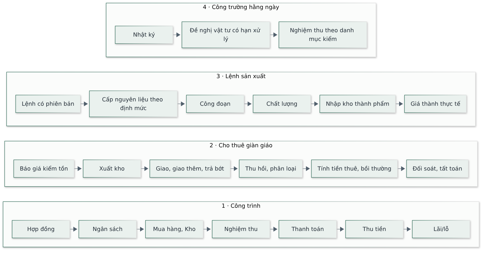

# Tài liệu Yêu cầu Sản phẩm (Product Requirements Document)

Hệ thống Phần mềm Quản trị Nhà Việt Group

| | |
| --- | --- |
| **Phiên bản** | 2.0 |
| **Ngày soạn** | 26/09/2026 |
| **Trạng thái** | Bản nháp — chờ Haan duyệt, sau đó trình Ban Giám đốc |
| **Người soạn** | Đội triển khai — vai trò Chủ sản phẩm và Phân tích nghiệp vụ |
| **Thay thế** | Bản 1.4 |

> Tài liệu này trả lời câu hỏi **hệ thống phải làm gì** và **ranh giới không làm**. Vì sao làm và
> tiêu chí thành công tổng thể nằm ở tài liệu Tầm nhìn sản phẩm. Mỗi yêu cầu có một mã (ví dụ
> NEN-01) để tiện truy vết; mã là của chính tài liệu này. Chỗ chưa có số ghi **Chưa xác định**;
> điều chưa ai xác nhận ghi **Giả định**. Tài liệu không cam kết mốc thời gian — chỉ cam kết thứ tự
> và tiêu chí hoàn thành.

---

## 0. Viết tắt và thuật ngữ

| Viết tắt / thuật ngữ | Nghĩa |
| --- | --- |
| NVG | Nhà Việt Group — tập đoàn gồm ba pháp nhân |
| NVC · NVO · NVS | Ba pháp nhân: xây dựng công nghiệp (NVC) · nhà ở dân dụng (NVO) · giàn giáo, kết cấu thép (NVS) |
| Back Office | Khối dùng chung: Kế toán, Tài chính, Nhân sự, Cung ứng |
| Pháp nhân | Một công ty thành viên có tư cách pháp lý riêng |
| Phân hệ | Một nhóm chức năng của phần mềm, có mã ở Mục 3 |
| Yêu cầu chức năng | Việc hệ thống phải làm được, có mã và tiêu chí nghiệm thu |
| Tiêu chí nghiệm thu | Điều kiện kiểm được để xác nhận một yêu cầu đã đạt |
| Người chịu trách nhiệm | Người chính chịu trách nhiệm một hồ sơ hoặc công việc |
| Hạn mức phê duyệt | Giá trị tối đa mà một vai trò được phép duyệt |
| Chứng từ | Bản ghi có giá trị pháp lý hoặc kế toán (phiếu, biên bản, hợp đồng) |
| Đầu bài (thiết kế) | Bản mô tả yêu cầu của một dự án thiết kế đang có hiệu lực |
| AI | Trí tuệ nhân tạo (Artificial Intelligence) |
| AI Design | Tính năng thiết kế sơ bộ nhà ở bằng AI (phân hệ Thiết kế) |
| PWA | Ứng dụng web cài được lên điện thoại, chạy được khi mạng yếu (Progressive Web App) |
| QR | Mã vạch hai chiều quét bằng điện thoại (Quick Response) |
| DXF | Định dạng tệp bản vẽ mà AutoCAD mở trực tiếp (Drawing Exchange Format) |
| BOQ | Bảng khối lượng công việc (Bill of Quantities) |
| RFI | Yêu cầu làm rõ kỹ thuật gửi từ công trường (Request For Information) |
| CO / CQ | Chứng nhận xuất xứ / chứng nhận chất lượng vật tư |
| MEP | Cơ điện: điện, nước, thông gió (Mechanical, Electrical, Plumbing) |
| PCCC | Phòng cháy chữa cháy |
| API | Cổng kết nối tự động giữa hai phần mềm (Application Programming Interface) |

---

## 1. Lịch sử thay đổi 1.4 → 2.0

Bản 2.0 giữ nguyên bản chất yêu cầu của bản 1.4, viết gọn lại và cập nhật theo các quyết định chốt
sau bản 1.4.

| Điểm | Bản 1.4 | Bản 2.0 |
| --- | --- | --- |
| Cách trình bày | Chủ yếu đoạn văn | Bảng yêu cầu có tiêu chí nghiệm thu; sơ đồ cho các luồng chính |
| Tham chiếu tài liệu nội bộ | Dẫn chiếu nhiều tài liệu kỹ thuật | Bỏ; tài liệu tự đủ nghĩa cho người đọc nghiệp vụ |
| Tên người | Ghi tên nhân sự cụ thể | Dùng chức danh |
| Vai trò người dùng | Chưa liệt kê đủ | 14 vai trò (Mục 3), gồm vai trò Xưởng sản xuất – Cho thuê và Chỉ huy trưởng |
| AI Design (TK-10, TK-12→TK-17) | Mô tả theo phương án 5 lớp ban đầu, có bước chương trình không gian (TK-11) | Cập nhật theo hiện trạng: một nhánh AI, bỏ bước chương trình không gian riêng (gộp vào sinh mặt bằng); đầu ra mặt bằng chỉnh sửa được, mặt đứng, ảnh minh hoạ, tệp bản vẽ |
| Giao diện di động | Áp cho ba nhóm hiện trường | Mọi màn hình có bố cục di động; cài được lên điện thoại (PWA) |
| Quy tắc nghiệp vụ chung | Rải trong từng module | Gom ở Mục 4 |

---

## 2. Mục tiêu và phạm vi

Mục tiêu kinh doanh và người dùng đã trình bày ở tài liệu Tầm nhìn sản phẩm. Tóm tắt: một hệ thống
quản trị nội bộ trên web, một cơ sở dữ liệu cho cả ba pháp nhân, thay cho Excel, Zalo, Google Drive
và giấy; mỗi việc có người chịu trách nhiệm, thời hạn, trạng thái và lịch sử.

**Trong phạm vi:** 12 phân hệ ở Mục 3 cộng tính năng AI Design.

**Ngoài phạm vi — chỉ liên kết, không thay thế:** phần mềm kế toán chính thức (không tạo hai bộ số
liệu); hoá đơn điện tử, chữ ký số, kê khai thuế, ngân hàng điện tử, bảo hiểm xã hội điện tử; phần
mềm thiết kế và kết cấu (AutoCAD, Revit, SketchUp, ETABS); phần mềm dự toán chuyên dụng; thiết bị đo
đạc và chấm công. Hệ thống tiếp nhận, liên kết hoặc lưu kết quả từ các hệ thống này.

---

## 3. Vai trò người dùng

Một người có thể được gán nhiều vai trò trong cùng một pháp nhân (ví dụ nhân sự NVS vừa làm kinh
doanh vừa xử lý kho). Quyền được cấu hình theo vai trò, không viết cứng trong mã.

| Vai trò | Phạm vi dữ liệu | Phê duyệt và ghi chú |
| --- | --- | --- |
| Tổng Giám đốc | Toàn NVG | Xem và phê duyệt mọi phân hệ |
| Giám đốc Tài chính | Toàn NVG | Xem và phê duyệt như Ban Giám đốc; toàn quyền phân hệ Kế toán |
| Ban Giám đốc | Toàn NVG | Xem và phê duyệt; không trực tiếp tạo, sửa |
| Kinh doanh | Một pháp nhân | Làm CRM, soạn hợp đồng từ cơ hội, xem báo cáo |
| Dự án – Đấu thầu | Một pháp nhân (NVC) | Khảo sát, bóc tách, dự toán, hồ sơ thầu; soạn hợp đồng từ gói thầu |
| Thiết kế | Một pháp nhân (NVO) | Thiết kế đa bộ môn, phiên bản bản vẽ, dự toán; dùng AI Design |
| Trưởng phòng Thi công | Nhiều công trình | Phê duyệt trong phân hệ Thi công; tạo đề nghị mua và đề nghị chi |
| Chỉ huy trưởng / Kỹ thuật hiện trường | Chỉ công trình được phân công | Ký xác nhận tại hiện trường; quyền như Thi công nhưng giới hạn phạm vi công trình |
| Mua hàng – Vật tư | Toàn NVG | Xử lý đề nghị mua, so sánh nhà cung cấp, đơn hàng; phê duyệt trong Mua hàng |
| Kho | Toàn NVG | Nhập, xuất, điều chuyển, kiểm kê; phê duyệt trong Kho; kiểm đếm, bàn giao lô giàn giáo |
| Kế toán – Tài chính | Toàn NVG | Thanh toán, tạm ứng, công nợ, hạch toán |
| Hành chính – Nhân sự | Toàn NVG | Tuyển dụng, hồ sơ nhân sự, chấm công ba khối; ký bảng chấm công văn phòng và xưởng |
| Xưởng sản xuất – Cho thuê | Một pháp nhân (NVS) | Lệnh sản xuất, sửa chữa giàn giáo, hợp đồng cho thuê; **không tự phê duyệt** — biểu mẫu xưởng do Ban Giám đốc duyệt |
| Quản trị hệ thống | Toàn NVG | Toàn quyền cấu hình: phân quyền, hạn mức, danh mục, tham số, nhật ký |

«Phê duyệt» ở bảng trên là quyền **ký xác nhận trong nghiệp vụ**. Hạn mức phê duyệt theo giá trị
tiền là tham số riêng, cấu hình ở bảng tham số hệ thống (Mục 4.3).

---

## 4. Quy tắc nghiệp vụ xuyên suốt

Áp dụng cho mọi phân hệ; từng phân hệ ở Mục 5 chỉ ghi thêm quy tắc riêng.

### 4.1 Đa pháp nhân

- Dữ liệu **dùng chung**: khách hàng, nhà cung cấp, nhân sự, tài sản.
- Dữ liệu **tách theo pháp nhân**: doanh thu, chi phí, công nợ, lợi nhuận. Mọi chứng từ giao dịch gắn mã pháp nhân.
- Báo cáo xem được theo từng pháp nhân và hợp nhất toàn NVG; báo cáo hợp nhất **loại trừ** giao dịch nội bộ giữa các đơn vị.

### 4.2 Phân quyền — năm mẫu

Quyền xem và sửa dữ liệu theo một trong năm mẫu; mỗi bảng dữ liệu áp đúng một mẫu.

| Mẫu | Logic |
| --- | --- |
| A — theo pháp nhân | Chỉ thấy dữ liệu thuộc pháp nhân của mình; Ban Giám đốc và Quản trị viên thấy tất cả |
| B — theo người chịu trách nhiệm | Như A, và chỉ người chịu trách nhiệm, người phối hợp hoặc quản lý trực tiếp mới được sửa |
| C — theo hạn mức phê duyệt | Hồ sơ hiện trong hộp thư phê duyệt và cho duyệt nếu giá trị nằm trong hạn mức của vai trò |
| D — hạn chế cột nhạy cảm | Cột nhạy cảm (giá vốn, lợi nhuận, lương) chỉ hiện giá trị thật cho vai trò được phép; mọi lượt xem/sửa ghi nhật ký |
| E — theo phạm vi hiện trường | Chỉ thấy dữ liệu công trình hoặc xưởng được phân công; quên phân công thì thấy ít đi, không phải nhiều hơn |

### 4.3 Phê duyệt và hạn mức

- Hạn mức phê duyệt theo vai trò, loại nghiệp vụ và pháp nhân — **cấu hình được**, không viết cứng.
- Mọi loại phê duyệt dùng chung một hộp thư; duyệt xong tự sang hồ sơ tiếp theo.
- Người gửi đề nghị luôn thấy: đang ở bước nào, ai đang giữ, đã chờ bao lâu, hạn xử lý còn lại.

### 4.4 Trạng thái chuẩn

Mọi hồ sơ quy về sáu trạng thái: **Nháp · Chờ duyệt · Đang xử lý · Hoàn thành · Quá hạn · Tranh
chấp**. Trạng thái luôn đi kèm chữ, không chỉ dùng màu.

### 4.5 Tham số hoá và chứng từ bất biến

- Mọi giá trị biến động (đơn giá thuê, giá bồi thường, hạn mức, ngưỡng tỷ lệ lỗi, thời hạn phản hồi) là **tham số cấu hình được**, có lịch sử (giá trị cũ, mới, ngày áp dụng, người duyệt).
- Đổi tham số **không hồi tố**: chứng từ đã phát hành giữ nguyên giá trị đã áp dụng.
- Chứng từ đã ký hai bên hoặc kỳ kế toán đã khoá **chỉ sửa bằng chứng từ điều chỉnh có người duyệt**, không sửa đè.

### 4.6 Trách nhiệm hai chiều và nhắc việc

- Không chỉ hiện trường cập nhật; văn phòng cũng có **hạn xử lý** trên cùng hệ thống, quá hạn thì cảnh báo lên cấp trên và lên Dashboard.
- Hệ thống nhắc chủ động: quá hạn, thiếu chứng từ, giấy tờ sắp hết hạn, vượt ngân sách, công nợ đến hạn, giàn giáo quá hạn trả.

### 4.7 Ranh giới AI và dữ liệu

- Phần mềm và AI **không tự quyết, không tự phê duyệt**: nội dung chuyên môn, pháp lý, kỹ thuật, nhân sự; giá bán cuối, tỷ lệ lợi nhuận, mức dự phòng; giải pháp kết cấu, điện nước, phòng cháy; chọn nhà cung cấp; phê duyệt thanh toán.
- Mọi kết quả AI là **bản nháp / đề xuất** tới khi người có thẩm quyền duyệt.
- **Không** gửi dữ liệu nhạy cảm (bản vẽ, giá vốn, khách hàng, lương) lên AI công cộng chưa kiểm soát.
- **Không hiển thị số ước lượng.** Chưa có dữ liệu thật thì hiện «Chưa đủ dữ liệu», không hiện 0, không điền mặc định.
- **Nhập một lần** tại nơi phát sinh; phân hệ khác liên kết, không nhập lại.

### 4.8 Giao diện và ngôn ngữ

- Giao diện tiếng Việt 100%. Web ưu tiên máy tính cho văn phòng; mọi màn hình có bố cục di động và cài được lên điện thoại (PWA), riêng ba nhóm hiện trường (Kho, Xưởng, Công trường) thiết kế cho điện thoại là chính.
- Không hiện rồi báo lỗi: ẩn menu, nút, liên kết khi không có quyền.
- Không bắt nhập hai lần; không bao giờ mất dữ liệu đang nhập (tự lưu nháp).

---

## 5. Yêu cầu chức năng theo phân hệ

Mỗi phân hệ: mục đích, bảng yêu cầu (mã · tên · hệ thống phải làm gì · tiêu chí nghiệm thu), rồi
ranh giới không làm.

### 5.1 NEN — Nền tảng dùng chung · Giai đoạn 1

Nền tảng cho mọi phân hệ khác: pháp nhân, người dùng, quyền, phê duyệt, tham số, hồ sơ, nhắc việc.

| Mã | Tên | Hệ thống phải | Nghiệm thu |
| --- | --- | --- | --- |
| NEN-01 | Đa pháp nhân | Tách doanh thu, chi phí, công nợ, lợi nhuận theo pháp nhân; chứng từ gắn mã pháp nhân | Báo cáo từng pháp nhân và hợp nhất khớp nhau; hợp nhất đã loại giao dịch nội bộ |
| NEN-02 | Phân quyền và hạn mức | Cấu hình quyền theo vai trò, phòng ban, pháp nhân, hạn mức; gán nhiều vai trò cho một người | Đổi hạn mức không cần sửa mã; một người nhiều vai trò dùng được |
| NEN-03 | Hồ sơ có trách nhiệm | Mỗi hồ sơ có mã, người chịu trách nhiệm, người phối hợp, đầu ra, thời hạn, trạng thái, lịch sử | Mở hồ sơ bất kỳ thấy đủ sáu thông tin và tab Lịch sử |
| NEN-04 | Cảnh báo và nhắc việc | Nhắc tự động: quá hạn, thiếu chứng từ, giấy tờ sắp hết hạn (90/60/30/7 ngày), vượt ngân sách, công nợ, giàn giáo quá hạn trả | Mỗi loại cảnh báo hiện đúng đối tượng và đúng thời điểm |
| NEN-05 | Phiên bản tài liệu | Xác định bản đang hiệu lực; lưu người sửa, ngày, lý do; báo cho mọi bên khi phát hành bản mới, kể cả người xem bản cũ trên điện thoại | Tại mọi thời điểm chỉ một bản hiệu lực; người hiện trường nhận thông báo bản mới |
| NEN-06 | Kho hồ sơ tập trung | Lưu hồ sơ theo pháp nhân – dự án – loại; quy định người sở hữu và người được xem | Tìm ra hồ sơ theo ba trục; quyền xem đúng |
| NEN-07 | Nhật ký dữ liệu nhạy cảm | Ghi ai xem, ai sửa, khi nào với giá vốn, lợi nhuận, lương, thương thảo, thuế, ngân hàng | Mọi lượt truy cập dữ liệu nhạy cảm có vết; chỉ vai trò được phép đọc nhật ký |
| NEN-08 | Xuất và nhập theo mẫu | Xuất báo cáo ra Excel/PDF; nhập từ Excel theo mẫu chuẩn cho nghiệp vụ chưa nối API | Xuất và nhập chạy đúng mẫu, có bước kiểm tra |
| NEN-09 | Web và di động | Web cho văn phòng; giao diện điện thoại cho Kho, Xưởng, Công trường | Ba nhóm hiện trường thao tác được trên điện thoại |
| NEN-10 | Bàn giao khi nghỉ việc | Chuyển hồ sơ, khách hàng, việc đang xử lý sang người kế nhiệm, giữ lịch sử; thu hồi quyền | Bàn giao xong không mất lịch sử; người cũ hết quyền |
| NEN-11 | Sao lưu và khôi phục | Sao lưu định kỳ, có phương án khôi phục; dữ liệu thuộc sở hữu NVG | Khôi phục thử thành công từ bản sao lưu |
| NEN-12 | Bảng tham số hệ thống | Quản trị viên cấu hình: hạn mức, đơn giá thuê, giá bồi thường, giá thuê nội bộ, ngưỡng tỷ lệ lỗi, thời hạn phản hồi; lưu lịch sử; không hồi tố | Đổi tham số có lịch sử; chứng từ cũ giữ giá trị đã áp dụng |

**Không làm:** để AI tự quyết nội dung chuyên môn, pháp lý, giá bán, lợi nhuận; gửi dữ liệu nhạy cảm
lên AI công cộng; lưu tin đồn, mật khẩu, mã dùng một lần, tài khoản ngân hàng cá nhân.

### 5.2 CRM — Khách hàng và Cơ hội kinh doanh · Giai đoạn 1

Áp dụng cho cả ba pháp nhân.

| Mã | Tên | Hệ thống phải | Nghiệm thu |
| --- | --- | --- | --- |
| CRM-01 | Hồ sơ khách hàng | Lưu tập trung: liên hệ, nguồn khách, nhu cầu, loại và quy mô công trình, ngân sách, người phụ trách, lịch sử liên hệ | Một khách hàng chỉ một hồ sơ; tra được lịch sử liên hệ |
| CRM-02 | Phễu cơ hội | Theo dõi cơ hội qua các bước: Tiếp nhận → Phân loại → Khảo sát → Báo giá → Đàm phán → Ký hoặc Mất | Kéo cơ hội qua từng bước; thống kê được theo bước |
| CRM-03 | Khảo sát khách hàng | Đặt lịch và lưu biên bản khảo sát: nhu cầu, người quyết định, ngân sách, tiến độ, ảnh hiện trạng | Biên bản khảo sát gắn với cơ hội, có ảnh |
| CRM-04 | Báo giá có phê duyệt | Theo dõi các bản báo giá đã gửi và phản hồi; báo giá qua duyệt nội bộ trước khi gửi | Báo giá chưa duyệt không gửi được; lưu các phiên bản |
| CRM-05 | Quyền giảm giá | Quy định ai được giảm giá; lưu lịch sử phê duyệt giá đặc biệt | Giảm giá ngoài quyền bị chặn; có vết phê duyệt |
| CRM-06 | Bàn giao cơ hội đã chốt | Chuyển hồ sơ đã chốt sang Dự án/Thiết kế, Thi công, Kế toán kèm toàn bộ lịch sử, phạm vi, giá, điều kiện | Bên nhận thấy đủ thông tin, không phải hỏi lại |
| CRM-07 | Chăm sóc sau bán | Lịch bảo hành, tiếp nhận phản hồi, khai thác nhu cầu mới và giới thiệu | Nhắc bảo hành đúng hạn; ghi nhận nhu cầu mới |
| CRM-08 | Khiếu nại | Phân luồng khiếu nại: mức độ, người chủ trì, hạn phản hồi, phương án, kết quả, xác nhận của khách | Khiếu nại có hạn xử lý và trạng thái đóng |
| CRM-09 | Báo cáo kinh doanh | Khách mới, tỷ lệ chuyển đổi theo bước, hiệu quả từng nguồn khách, giá trị theo người phụ trách, lý do mất cơ hội | Số liệu khớp dữ liệu gốc; lọc theo pháp nhân |
| CRM-10 | Bàn giao dữ liệu khách | Chuyển dữ liệu khách khi nhân viên kinh doanh nghỉ (theo NEN-10) | Bàn giao không mất khách và lịch sử |
| CRM-11 | Bán và cho thuê giàn giáo | Khi báo giá thuê, hiện ngay: tồn sẵn có theo mã (dùng được / đang thuê / chờ sửa), hàng dự kiến thu hồi, phí vận chuyển, công nợ khách; báo giá ghi đơn giá theo mã và đơn vị thời gian, đặt cọc, điều khoản bồi thường | Màn hình báo giá thuê hiện đủ tồn và công nợ; báo giá đủ điều khoản |

**Không làm:** đưa lên hệ thống trao đổi cá nhân, tin đồn, đánh giá con người chưa kiểm chứng; hiển
thị đại trà nội dung đàm phán, biên lợi nhuận, lương.

### 5.3 DA — Dự án và Đấu thầu (NVC) · Giai đoạn 1

| Mã | Tên | Hệ thống phải | Nghiệm thu |
| --- | --- | --- | --- |
| DA-01 | Gói thầu có mã | Mỗi gói thầu có mã, trạng thái, người phụ trách, thời hạn từng bước | Mở gói thầu thấy trạng thái và người phụ trách |
| DA-02 | Hồ sơ mời thầu | Tiếp nhận hồ sơ, bản vẽ, BOQ, yêu cầu kỹ thuật, thời hạn; tự lập danh sách nội dung cần làm rõ khi thiếu hoặc mâu thuẫn | Hồ sơ thiếu sinh danh sách cần làm rõ |
| DA-03 | Khảo sát hiện trạng | Lưu biên bản, ảnh, điều kiện thi công, rủi ro | Biên bản khảo sát gắn gói thầu |
| DA-04 | Bóc tách khối lượng | Nhập khối lượng theo hạng mục, gắn mã bản vẽ và phiên bản hiệu lực; cảnh báo khi bản vẽ nguồn đổi | Bản vẽ đổi thì cảnh báo bóc theo bản cũ |
| DA-05 | Đơn giá và định mức | Cơ sở dữ liệu giá vật tư, nhân công, định mức nội bộ; lưu lịch sử theo mã, nhà cung cấp, ngày, dự án | Tra được giá theo mã và lịch sử |
| DA-06 | Lập dự toán | Tổng hợp chi phí trực tiếp, chung, dự phòng, thuế, lợi nhuận; khoá ô công thức, rõ ô nhập | Ô công thức không sửa nhầm được |
| DA-07 | Phê duyệt giá | Trưởng nhóm kiểm tra → Trưởng phòng hoặc Tổng Giám đốc duyệt giá cuối; lưu các phiên bản và căn cứ | Truy được ai đổi giá và căn cứ duyệt |
| DA-08 | Hồ sơ dự thầu | Danh mục kiểm hồ sơ; theo dõi thời hạn nộp, các lần làm rõ, kết quả và lý do | Danh mục kiểm đủ; ghi kết quả trúng/trượt |
| DA-09 | Chuyển thành ngân sách | Sau ký hợp đồng, chuyển dự toán thành ngân sách thi công theo mã công việc; bàn giao đủ hồ sơ cho Thi công, Cung ứng, Kế toán | Bên nhận có ngân sách theo mã, không chỉ một số tổng |
| DA-10 | Đối chiếu sau công trình | So dự toán với chi phí thực tế theo mã; xác định sai lệch; tích luỹ cho gói sau | Ra được bảng sai lệch theo mã chi phí |
| DA-11 | Hỗ trợ đọc bản vẽ | AI đọc bản vẽ PDF/scan: dò thiếu hạng mục, sai đơn vị, khối lượng bất thường, đếm cấu kiện lặp, gợi ý đơn giá; hiện mức tin cậy | Kết quả AI hiện độ tin cậy; người kiểm tra toàn bộ |

**Không làm:** để AI tự quyết giá dự thầu cuối, lợi nhuận, dự phòng, biện pháp; đưa bản vẽ, giá vốn
lên AI công cộng; bỏ bước người kiểm tra kết quả bóc tách.

### 5.4 TK — Thiết kế (NVO) · Giai đoạn 1 (TK-01→TK-09) và Giai đoạn 3 (AI Design)

| Mã | Tên | Hệ thống phải | Nghiệm thu |
| --- | --- | --- | --- |
| TK-01 | Đầu bài hiệu lực | Mỗi dự án có mã và một đầu bài đang hiệu lực: nhiệm vụ, công năng, ngân sách, phong cách, hiện trạng đất, pháp lý | Chỉ một đầu bài hiệu lực tại một thời điểm |
| TK-02 | Khảo sát hiện trạng | Lưu đo đạc, ảnh, ghi chú nhu cầu | Biên bản khảo sát gắn dự án |
| TK-03 | Phương án kiến trúc | Lưu mặt bằng, phối cảnh; lịch sử các vòng góp ý; xác nhận duyệt của khách làm căn cứ chuyển bước | Có vết duyệt của khách trước khi chuyển bước |
| TK-04 | Hồ sơ đa bộ môn | Theo dõi tiến độ kiến trúc, kết cấu, điện nước; kiểm xung đột giữa bộ môn trước khi phát hành | Phát hiện xung đột bộ môn trước phát hành |
| TK-05 | Phiên bản bản vẽ | Một bản hiệu lực; phát hành bản mới báo đồng thời các bộ môn, dự toán, kinh doanh và công trường; đánh dấu bản cũ hết hiệu lực trên giao diện công trường | Công trường nhận báo và thấy bản cũ hết hiệu lực |
| TK-06 | Yêu cầu thay đổi | Ghi người yêu cầu, nội dung, nguyên nhân, ảnh hưởng tiến độ, chi phí, số bản vẽ phải sửa | Mỗi thay đổi có đủ căn cứ và ảnh hưởng |
| TK-07 | Bóc tách và dự toán NVO | Dùng chung cơ chế với DA-04→DA-06 | Ra dự toán NVO như gói DA |
| TK-08 | Bàn giao và giải đáp | Kiểm đủ và đồng bộ bộ môn trước phát hành; RFI từ công trường là luồng chính thức có người nhận và hạn trả lời | RFI có người nhận và hạn, không qua Zalo |
| TK-09 | Thư viện thiết kế | Mẫu bản vẽ, chi tiết, vật liệu, đơn giá tham khảo; phân loại, tìm kiếm, người kiểm, ngày cập nhật | Tìm ra mẫu theo bộ môn và từ khoá |

**AI Design (TK-10, TK-12→TK-17) — thiết kế sơ bộ nhà ở bằng AI.** Cập nhật so với bản 1.4: bỏ bộ
giải hình học tự xây; còn một nhánh AI. Bước «chương trình không gian» (mã TK-11 cũ) đã gộp vào bước
sinh mặt bằng (TK-12), không còn là bước riêng. Đầu vào là đầu bài và khảo sát; đầu ra là **đề
xuất**, kiến trúc sư sửa và duyệt, không tự phát hành. Không kiểm quy chuẩn xây dựng — màn hình nói
rõ điều này.

| Mã | Tên | Hệ thống phải | Nghiệm thu |
| --- | --- | --- | --- |
| TK-10 | Đầu bài có cấu trúc | Hỏi đầu bài theo sáu mục (công trình và khu đất; gia đình và sinh hoạt; công năng và lưu trữ; khối nhà, thang, mặt ngoài; kỹ thuật và dự trù; ưu tiên, ngân sách, người quyết định); kiến trúc sư sửa được mục khảo sát | Đủ sáu mục; quản trị sửa được nhãn, gợi ý, thứ tự câu hỏi |
| TK-12 | Sinh mặt bằng | Từ đầu bài, sinh phương án mặt bằng là **dữ liệu hình học chỉnh sửa được** (không chỉ ảnh); mọi toạ độ, cửa, cửa sổ, bậc thang do chương trình gán; đầu bài đã khai là ràng buộc, bác phương án thiếu so với đầu bài | Mặt bằng bám đầu bài; thang máy chồng khít các tầng; ban công đúng mặt khai; thiếu so đầu bài thì báo |
| TK-13 | Chấm điểm và sửa | Chấm điểm chất lượng; dưới ngưỡng thì tự sửa trong giới hạn; kiến trúc sư sửa tiếp bằng ô yêu cầu | Có điểm chất lượng; kiến trúc sư sửa được bằng câu lệnh |
| TK-14 | Mặt đứng mặt tiền | Suy khung, lỗ mở, ban công từ mặt bằng đã chọn và khoá; AI chọn mái, vật liệu, màu, cổng, rào trong thư viện | Mặt đứng khớp mặt bằng; bề rộng cửa lấy từ mặt bằng |
| TK-15 | Ảnh minh hoạ | Vẽ ảnh mặt bằng có nội thất và ảnh phối cảnh từ phương án đã chọn, kèm nhãn cảnh báo là hình minh hoạ | Ảnh minh hoạ đi kèm tờ vẽ vector, có nhãn |
| TK-16 | Tờ vẽ và xuất bản vẽ | Tờ vẽ vector tất định; xuất tệp DXF một chiều từ tờ vẽ | Mở tệp DXF trong AutoCAD ra đúng tờ vẽ |
| TK-17 | Đầu ra chuẩn và duyệt | Mỗi dự án có đủ bộ đầu ra: đầu bài, mặt bằng chỉnh sửa được, mặt đứng, ảnh minh hoạ, tệp bản vẽ; mỗi đầu ra đi qua luồng duyệt của TK-03 | Đủ bộ đầu ra; ở trạng thái nháp tới khi duyệt |

**Không làm:** để AI tự quyết công năng cuối, thẩm mỹ, kết cấu, nền móng, điện nước, phòng cháy, khả
năng thi công, tuân thủ pháp luật — kết cấu, điện nước, an toàn do kỹ sư có chứng chỉ ký; mỗi lần
phát hành đúng một bộ môn. Mọi phương án AI là nháp tới khi Phòng Thiết kế duyệt.

### 5.5 HD — Hợp đồng · Giai đoạn 1

| Mã | Tên | Hệ thống phải | Nghiệm thu |
| --- | --- | --- | --- |
| HD-01 | Soạn và lưu hợp đồng | Hợp đồng (thiết kế, thi công, mua bán, cho thuê, khoán) gắn cơ hội/dự án; lưu bản dự thảo và bản ký | Hợp đồng gắn đúng dự án; có các phiên bản |
| HD-02 | Điều khoản chính | Theo dõi phạm vi, giá trị, tiến độ thanh toán, tạm ứng, bảo lãnh, phạt, bảo hành; hợp đồng thuê thêm đơn giá theo mã, đặt cọc, vận chuyển, bồi thường | Tra được điều khoản; hợp đồng thuê đủ trường riêng |
| HD-03 | Giá trị và công nợ | Theo dõi giá trị, phát sinh, đã thu, còn phải thu, khoản sắp đến hạn | Số khớp phân hệ Kế toán |
| HD-04 | Phát sinh ngoài hợp đồng | Mọi phát sinh có đề xuất, báo giá, xác nhận khách trước khi làm, trừ khẩn cấp có người duyệt | Phát sinh chưa xác nhận không đưa vào thanh toán |
| HD-05 | Phê duyệt trước khi ký | Duyệt theo hạn mức thẩm quyền trước khi ký | Vượt hạn mức không ký được |

### 5.6 TC — Thi công, Ngân sách và Hiện trường · Giai đoạn 2 (NVC và NVO)

Ưu tiên số một của công trường: luồng đề nghị – phê duyệt hai chiều với văn phòng (TC-10).

| Mã | Tên | Hệ thống phải | Nghiệm thu |
| --- | --- | --- | --- |
| TC-01 | Nhận bàn giao và kế hoạch | Nhận ngân sách và hồ sơ từ Dự án/Thiết kế; lập kế hoạch, tiến độ, nhu cầu nhân lực, vật tư, máy, thầu phụ; hiện rõ phần hồ sơ còn thiếu | Hệ thống chỉ ra phần bàn giao còn thiếu |
| TC-02 | Tiếp nhận mặt bằng | Lưu biên bản bàn giao mặt bằng, ảnh hiện trạng, hạ tầng tạm, pháp lý ban đầu | Biên bản và ảnh gắn công trình |
| TC-03 | Bản vẽ hiệu lực tại hiện trường | Chỉ hiện bản đang hiệu lực; bản cũ tra được nhưng đánh dấu hết hiệu lực; báo và cảnh báo việc đang làm theo bản cũ; xác nhận đúng bản trước khi giao việc | Người giao việc xác nhận bản; vết xác nhận lưu lại |
| TC-04 | Giao việc | Phiếu giao việc theo hạng mục/tổ đội, khối lượng mục tiêu, thời hạn, biện pháp, cảnh báo an toàn; nối sang nhật ký và xác nhận khối lượng | Giao việc nối thẳng nhật ký và khối lượng |
| TC-05 | Nhật ký thi công điện tử | Nhập một lần trên điện thoại, tự thành nhật ký ngày/tuần và dữ liệu nghiệm thu; nội dung: nhân lực, máy, công việc, khối lượng, vật tư, an toàn, thời tiết, ảnh | Nhập dưới 20 phút/ngày; không nhập lại ở biểu mẫu khác |
| TC-06 | Ảnh có ngữ cảnh | Ảnh chụp trong ứng dụng tự gắn thời gian, vị trí, hạng mục; sắp sẵn theo ngày – vị trí – hạng mục | Ảnh dùng lại được cho nghiệm thu, phát sinh mà không sắp lại tay |
| TC-07 | Chạy khi mạng yếu | Nhật ký, ảnh, danh mục kiểm, giao nhận vật tư, chấm công làm được khi mất mạng, tự đồng bộ khi có mạng; hiện trạng thái đồng bộ | Thao tác offline đồng bộ đúng, không tạo bản ghi trùng |
| TC-08 | Chấm công hiện trường | Chấm công theo ngày, phân biệt nhân sự công ty và tổ đội; công nhân chấm công bằng chụp ảnh có gắn thời gian và vị trí; tổ trưởng báo, kỹ thuật kiểm, chỉ huy trưởng xác nhận; chuyển sang Nhân sự/Kế toán không nhập lại | Công đã xác nhận sang lương không nhập lại |
| TC-09 | Đề nghị vật tư | Lập tại hiện trường; đối chiếu ngân sách và khối lượng còn lại, cảnh báo vượt; chỉ huy trưởng xác nhận rồi chuyển Mua hàng | Đề nghị vượt ngân sách bị cảnh báo; nối thẳng Mua hàng |
| TC-10 | Theo dõi và cảnh báo quá hạn | Mọi đề nghị từ công trường hiện: đang ở bước nào, ai giữ, chờ bao lâu, hạn cam kết; quá hạn cảnh báo lên cấp trên và Dashboard | Đề nghị quá hạn tự cảnh báo đúng người |
| TC-11 | Nhận vật tư tại công trường | Đối chiếu đơn đã duyệt, kiểm đếm, ghi thiếu/sai/hỏng kèm ảnh, ký trên điện thoại; cập nhật tồn công trường và chuyển chứng từ | Nhận hàng cập nhật tồn và chứng từ một lần |
| TC-12 | Ngân sách so chi phí | So ngân sách với chi phí đã phát sinh, cam kết, còn phải chi theo mã; cảnh báo sớm vượt; chỉ huy trưởng chỉ thấy phần trong phạm vi | Cảnh báo vượt ngân sách; giá vốn phân quyền riêng |
| TC-13 | Nghiệm thu theo danh mục kiểm | Mỗi loại việc có bộ tiêu chí; quy trình: tổ đội báo xong → kỹ thuật kiểm → sửa lỗi → nghiệm thu với chủ đầu tư; hồ sơ tự gom; việc che khuất phải nghiệm thu trước khi che | Không cho che khuất khi chưa nghiệm thu phần khuất |
| TC-14 | Danh sách tồn tại | Mỗi tồn tại có mô tả, ảnh, vị trí, người xử lý, hạn, trạng thái; tồn tại chưa đóng chặn đóng hạng mục | Tồn tại chưa đóng chặn nghiệm thu giai đoạn |
| TC-15 | Yêu cầu làm rõ (RFI) | Công trường lập RFI kèm ảnh, kích thước, mô tả; định tuyến đúng người trả lời, có hạn và cảnh báo quá hạn; lưu câu trả lời gắn bản vẽ | RFI có người trả lời và hạn; câu trả lời lưu gắn hạng mục |
| TC-16 | Thay đổi và phát sinh | Ghi nguồn phát sinh, chụp và đo trước khi bị che, đánh giá ảnh hưởng, lập biên bản; chuyển Dự án làm dự toán và xin xác nhận khách trước khi thi công | Phát sinh chưa xác nhận đánh dấu chưa đủ căn cứ thanh toán |
| TC-17 | Khối lượng tổ đội | Lưu phạm vi khoán, đơn giá, cách đo; kỹ thuật đo và xác nhận, chỉ huy trưởng kiểm trước khi chuyển thanh toán; lưu lịch sử ký từng giai đoạn | Khối lượng chưa nghiệm thu không vào bảng thanh toán |
| TC-18 | An toàn và sự cố | Hồ sơ huấn luyện, cấp bảo hộ; danh mục kiểm định kỳ; giấy phép việc nguy cơ cao; ghi sự cố kèm ảnh, nguyên nhân, khắc phục; sự cố nghiêm trọng báo ngay | Sự cố nghiêm trọng cảnh báo ngay, không chờ kỳ báo cáo |
| TC-19 | Giàn giáo tại công trường | Ghi nguồn cấp, phiếu giao nhận có chủng loại, số lượng, tình trạng; theo dõi cấp phát, điều chuyển, hoàn trả; khi trả kiểm đếm và phân loại kèm ảnh, chữ ký; công trình nội bộ vẫn lập chứng từ đầy đủ | Số trả đối chiếu số nhận; công trình nội bộ có chứng từ như khách ngoài |
| TC-20 | Bàn giao và bảo hành | Hồ sơ hoàn công, bản vẽ hoàn công; thời hạn bảo hành theo hạng mục; tiếp nhận phản ánh sau bàn giao; lưu đủ nhật ký, biên bản, phiên bản bản vẽ để truy vết | Truy được hồ sơ khi có tranh chấp trách nhiệm |

**Không làm:** thay việc kiểm tra trực tiếp chất lượng, an toàn, khối lượng thực tế; bắt nhập lại vào
Excel/giấy khi dữ liệu đã có; chặn thao tác cứu hộ vì thiếu phê duyệt; thay bản gốc phải ký.

### 5.7 MH — Mua hàng và Vật tư · Giai đoạn 2

| Mã | Tên | Hệ thống phải | Nghiệm thu |
| --- | --- | --- | --- |
| MH-01 | Tiếp nhận yêu cầu mua | Biểu mẫu chuẩn: tên hàng, quy cách, số lượng, thời điểm cần, nơi giao, mã công trình/xưởng; nhận từ Dự án, Thi công (TC-09), Xưởng (SX-08) | Yêu cầu từ ba nguồn vào chung một luồng |
| MH-02 | Phê duyệt theo hạn mức | Duyệt theo giá trị, nhóm vật tư, pháp nhân; mỗi bước có hạn và cảnh báo quá hạn | Bước duyệt quá hạn tự cảnh báo |
| MH-03 | Danh mục nhà cung cấp | Lịch sử giao dịch, tiêu chí đánh giá, phân loại chính/dự phòng/ngừng | Tra được lịch sử và xếp loại nhà cung cấp |
| MH-04 | So sánh báo giá | Gửi hỏi giá nhiều nhà cung cấp; bảng so sánh chuẩn hoá gồm giá, thuế, vận chuyển, giao hàng, thanh toán, bảo hành — so tổng chi phí và rủi ro | Bảng so sánh không chỉ so giá thấp nhất |
| MH-05 | Lịch sử giá | Lưu giá theo mã – nhà cung cấp – ngày – dự án; gợi ý giá cho dự toán và lần mua sau | Tra được lịch sử giá theo mã |
| MH-06 | Đơn đặt hàng | Lập đơn/hợp đồng mua sau khi chọn; theo dõi tiến độ giao; lưu thời gian giao thực tế theo nhóm | Theo dõi được tiến độ giao theo cam kết |
| MH-07 | Giao nhận | Kiểm đếm, kiểm quy cách (CO/CQ khi cần), biên bản có chữ ký; xử lý hàng thiếu/sai/hỏng | Giao nhận có biên bản và cách xử lý sai lệch |
| MH-08 | Chuyển chứng từ Kế toán | Hoàn thiện bộ chứng từ và chuyển Kế toán để thanh toán, không nhập lại | Kế toán nhận đủ chứng từ, không nhập lại |
| MH-09 | Giá khung | Bảng giá khung cho vật tư mua lặp lại, có hiệu lực và cơ chế điều chỉnh | Áp giá khung đúng hiệu lực |
| MH-10 | Nguyên liệu sản xuất giàn giáo | Mua thép ống, hộp, tôn, phụ kiện, que hàn, khí, sơn; kiểm chặt quy cách kỹ thuật (mác thép, đường kính, độ dày, mạ kẽm); số lượng gắn kế hoạch sản xuất và định mức; quy đổi giá cùng đơn vị | Quy cách kiểm được; giá quy đổi cùng đơn vị khi so sánh |

**Không làm:** để AI tự chọn nhà cung cấp, đánh giá kỹ thuật, đàm phán giá, duyệt thanh toán; bỏ lưu
bản gốc chứng từ bắt buộc.

### 5.8 KHO — Quản lý Kho · Giai đoạn 2

| Mã | Tên | Hệ thống phải | Nghiệm thu |
| --- | --- | --- | --- |
| KHO-01 | Kho đa địa điểm | Danh mục kho: vật tư xây dựng, nguyên liệu xưởng, thành phẩm giàn giáo, công cụ, kho công trình, cơ sở NVS; mỗi kho gắn pháp nhân; xem tồn theo kho và tổng | Tồn xem được theo từng kho và tổng NVS |
| KHO-02 | Mã hoá thống nhất | Mã theo nhóm – tên viết tắt – quy cách; một vật tư một mã; giàn giáo khởi tạo theo danh mục NVS | Không có hai mã cho một vật tư |
| KHO-03 | Nhập kho | Đối chiếu đơn/đề nghị đã duyệt; kiểm chủng loại, quy cách, số lượng, chất lượng; ghi thiếu/thừa/sai; chữ ký; lập phiếu; cập nhật tồn | Nhập kho cập nhật tồn và có chữ ký |
| KHO-04 | Xuất kho | Kiểm phiếu đã duyệt và tồn; soạn đúng mã, số lượng; chữ ký người nhận; lập phiếu; giảm tồn | Xuất kho giảm tồn đúng mã |
| KHO-05 | Điều chuyển | Lệnh điều chuyển giữa kho/công trình/xưởng; kiểm đếm hai đầu; hàng trên đường là trạng thái riêng | Hàng trên đường không tính vào tồn khả dụng hai đầu |
| KHO-06 | Vòng đời giàn giáo | Theo dõi giàn giáo như tài sản luân chuyển với các trạng thái (mới, dùng được, đang thuê, trên đường, chờ kiểm, chờ sửa, đang sửa, hỏng, chờ thanh lý, đã thanh lý, thiếu); tổng theo mã luôn cân; mọi chuyển trạng thái có chứng từ | Tổng theo mã cân giữa các trạng thái; lệch thì cảnh báo |
| KHO-07 | Kiểm kê và xử lý chênh lệch | Kiểm kê bắt buộc cuối mỗi tháng và đột xuất; tạm dừng nhập–xuất khi kiểm; đối chiếu số thực tế với số hệ thống theo mã – kho; khi lệch, ghi nguyên nhân (mất mát, xuất hoặc nhập quên ghi nghiệp vụ...) và cảnh báo ngay lên cấp trên; lập biên bản và duyệt trước khi chỉnh số | Cuối tháng có kỳ kiểm kê; số hệ thống khác số thực tế thì sinh cảnh báo lên cấp trên và biên bản xử lý; chỉnh số chỉ qua biên bản duyệt |
| KHO-08 | Cảnh báo tồn | Cảnh báo sắp hết, tồn lâu, hàng hỏng, tồn dùng được xuống dưới mức cần cho đơn thuê đã ký | Cảnh báo hiện đúng ngưỡng |
| KHO-09 | Mã QR và mạng yếu | Nhập bằng QR trên điện thoại; chạy khi mạng yếu, tự đồng bộ; chống trùng khi đồng bộ | Một thao tác offline không tạo hai bản ghi |
| KHO-10 | Liên kết Sản xuất và Cho thuê | Nối lệnh sản xuất (xuất nguyên liệu, nhập thành phẩm, nhập hàng sửa) và cho thuê (xuất, giao thêm, trả bớt, thu hồi, đối soát) | Nghiệp vụ Sản xuất và Cho thuê cập nhật tồn tự động |
| KHO-11 | Chốt số dư đầu | Nhập số dư đầu theo mã – kho – trạng thái kèm biên bản kiểm kê và người duyệt; sau chốt chỉ đổi bằng chứng từ | Số dư đầu chốt xong khoá, chỉ đổi bằng chứng từ |

**Không làm:** thay việc kiểm đếm và đánh giá chất lượng thực tế; bắt nhập cả phần mềm lẫn sổ giấy
khi không bắt buộc.

### 5.9 KT — Kế toán và Tài chính · Giai đoạn 2

Quản lý quy trình nguồn, phê duyệt, ngân sách, báo cáo vận hành. Không thay phần mềm kế toán chính
thức, không tạo hai bộ số liệu.

| Mã | Tên | Hệ thống phải | Nghiệm thu |
| --- | --- | --- | --- |
| KT-01 | Luồng thanh toán, tạm ứng | Số hoá: đề nghị → trưởng đơn vị xác nhận → Kế toán kiểm → Tài chính kiểm dòng tiền → duyệt theo hạn mức → phiếu chi → chi → hạch toán | Một đề nghị chạy hết luồng, có vết từng bước |
| KT-02 | Gắn mã và theo dõi | Mỗi khoản gắn pháp nhân, công trình, hạng mục, bộ phận, ngân sách, nhà cung cấp, chứng từ; hiện đang chờ ai, quá hạn bao lâu | Mở khoản chi thấy đang ở bước nào |
| KT-03 | Tạm ứng | Theo dõi người nhận, mục đích, ngày, số tiền, hạn hoàn; cảnh báo quá hạn; chặn ứng mới khi chưa hoàn, trừ có duyệt | Ứng cũ chưa hoàn thì chặn ứng mới |
| KT-04 | Công nợ | Theo dõi phải thu, phải trả theo khách/nhà cung cấp, hợp đồng, công trình, hạn, số ngày quá hạn; khách thuê giàn giáo gộp đủ tiền thuê, vận chuyển, bồi thường, trừ cọc | Công nợ khách thuê gộp đủ khoản, khớp Cho thuê |
| KT-05 | Gắn chi phí theo mã | Gắn chi phí vào mã công trình/hạng mục ngay khi phát sinh; chi phí giàn giáo nội bộ vào đúng công trình dùng | Chi phí không phải hạch toán lại tay |
| KT-06 | Dòng tiền | Kế hoạch dòng tiền theo tuần/tháng, theo pháp nhân/công trình | Ra được kế hoạch dòng tiền |
| KT-07 | Lãi/lỗ | Lãi/lỗ dự kiến và thực tế theo công trình/pháp nhân gần thời gian thực; NVS thêm theo lệnh sản xuất và hiệu quả tài sản cho thuê | Lãi/lỗ truy ngược được xuống chứng từ |
| KT-08 | Liên kết phần mềm kế toán | Nối API nếu có, không thì xuất/nhập theo mẫu chuẩn có bước đối chiếu và đánh dấu đã chuyển; không tạo hai bộ số liệu | Dữ liệu chuyển đúng, có trạng thái đã chuyển |
| KT-09 | Khoá kỳ | Khoá dữ liệu sau chốt kỳ; điều chỉnh sau khoá ghi rõ lý do và người duyệt | Sửa sau khoá phải có chứng từ điều chỉnh |
| KT-10 | Phân quyền dữ liệu nhạy cảm | Lương, giá vốn, lợi nhuận, thuế, tài khoản ngân hàng phân quyền chặt, không xem đại trà | Chỉ vai trò được phép thấy giá trị thật |

**Không làm:** thay phần mềm kế toán và kê khai thuế; tự chi tiền, tự ghi sổ, tự sửa số đã khoá; bỏ
lưu bản gốc chứng từ bắt buộc.

### 5.10 NS — Nhân sự và Hành chính · Giai đoạn 2

| Mã | Tên | Hệ thống phải | Nghiệm thu |
| --- | --- | --- | --- |
| NS-01 | Hồ sơ nhân sự | Một hồ sơ điện tử cho mỗi người, liên kết từ ứng viên tới nghỉ việc: thông tin, hợp đồng, chấm công, bảo hiểm, lương, đào tạo, giấy tờ, tài sản, quyền truy cập | Một người một hồ sơ, đủ mục |
| NS-02 | Tuyển dụng | Luồng: yêu cầu → duyệt → đăng tuyển → sàng lọc → phỏng vấn → đánh giá → mời nhận việc; hỗ trợ đợt tuyển bổ sung công nhân với danh mục kiểm rút gọn | Một vị trí chạy hết luồng tuyển |
| NS-03 | Tiếp nhận và thử việc | Danh mục kiểm chuẩn bị; kế hoạch tuần đầu; nhắc đánh giá thử việc trước hạn | Nhắc đánh giá thử việc đúng hạn |
| NS-04 | Chấm công ba khối | Văn phòng (máy chấm công), Xưởng (máy chấm công + xác nhận tổ trưởng và Phó Giám đốc), Công trường (công nhân chấm công bằng chụp ảnh có gắn thời gian và vị trí; tổ trưởng báo, kỹ thuật kiểm, chỉ huy trưởng xác nhận); Nhân sự tổng hợp | Ba khối chấm công vào chung; công trường chấm bằng ảnh có thời gian; có người xác nhận |
| NS-05 | Nghỉ phép, tăng ca, thưởng phạt | Gắn dữ liệu chấm công đã xác nhận; chuyển Kế toán tính lương không nhập lại | Dữ liệu chốt sang lương không nhập lại |
| NS-06 | Trả lương nhiều hình thức | Hỗ trợ lương tháng, ngày công/ca, khoán sản phẩm, khoán khối lượng; công thức cấu hình được; lương sản phẩm ghi rõ đơn giá công đoạn và cách xử lý hàng lỗi | Đổi công thức lương không cần sửa mã |
| NS-07 | Hợp đồng và bảo hiểm | Soạn, ký, theo dõi tăng giảm, thời hạn, nhắc gia hạn | Nhắc gia hạn đúng hạn |
| NS-08 | Tài sản cấp phát | Mã tài sản, số serial, giá trị, tình trạng, người dùng; biên bản cấp/điều chuyển/thu hồi; nối hồ sơ nhân sự để lập danh sách bàn giao khi nghỉ | Nghỉ việc tự ra danh sách tài sản phải thu hồi |
| NS-09 | Hồ sơ tổ đội, thời vụ | Hợp đồng khoán, danh sách lao động, giấy tờ, chứng chỉ an toàn; kiểm soát chặt như nhân sự công ty | Hồ sơ an toàn tổ đội đủ như nhân sự công ty |
| NS-10 | Nhắc hạn giấy tờ | Nhắc chứng chỉ, giấy phép, bảo hiểm trước 90/60/30/7 ngày | Nhắc đúng mốc |
| NS-11 | Nghỉ việc | Xác nhận bàn giao, thu hồi tài sản và quyền, chốt công, phép, bảo hiểm | Nghỉ việc xong không còn quyền, đã thu hồi tài sản |
| NS-12 | Giảm phụ thuộc một người | Với nghiệp vụ đang phụ thuộc một cá nhân, ghi người dự phòng, lưu quy trình, mẫu chuẩn, thông số, tiêu chí kiểm ngay trong hệ thống; hỗ trợ bàn giao và phân quyền người thay | Mỗi nghiệp vụ trọng yếu có người dự phòng và tài liệu |

**Không làm:** để AI tự quyết tuyển dụng, tăng giảm lương, đánh giá, kỷ luật, chấm dứt hợp đồng;
hiển thị đại trà lương, sức khoẻ, kỷ luật, căn cước; bỏ lưu bản gốc bắt buộc.

### 5.11 BC — Báo cáo và Dashboard điều hành · Giai đoạn 1 (cơ bản) và Giai đoạn 2 (đầy đủ)

| Mã | Tên | Hệ thống phải | Nghiệm thu |
| --- | --- | --- | --- |
| BC-01 | Dashboard Ban Giám đốc | Màn hình xem mỗi sáng: doanh số, tiến độ công trình, dòng tiền, công nợ, chi phí so dự toán, việc chờ duyệt, tồn kho và giàn giáo đang cho thuê theo mã, cảnh báo trễ hạn | Xem được các chỉ số gần thời gian thực, số thật |
| BC-02 | Lãi/lỗ theo công trình | Lãi/lỗ theo công trình/pháp nhân, truy ngược tới chứng từ gốc | Bấm số ra chứng từ gốc |
| BC-03 | Hiệu quả kinh doanh | Nguồn khách, tỷ lệ chuyển đổi, tỷ lệ trúng thầu và lý do trượt, hiệu suất nhân sự/tổ đội/nhà cung cấp | Số khớp dữ liệu gốc |
| BC-04 | Báo cáo kho và sản xuất | Tồn kho, hao hụt, hàng chậm luân chuyển; NVS thêm: giá thành thực tế so định mức; hiệu suất khai thác tài sản thuê; thất thoát, hư hỏng theo khách/công trình; sản lượng, tỷ lệ lỗi theo công đoạn/lô | Bốn báo cáo NVS ra đúng; thiếu dữ liệu hiện «Chưa đủ dữ liệu» |
| BC-05 | Cảnh báo rủi ro tổng hợp | Chậm tiến độ, vượt chi phí, hồ sơ thiếu căn cứ, công nợ quá hạn, việc chờ duyệt quá hạn (TC-10), giàn giáo quá hạn trả, sự cố an toàn chưa đóng | Cảnh báo gom đủ nguồn rủi ro |
| BC-06 | Xuất báo cáo | Mọi báo cáo xuất Excel/PDF; hiện ngày cập nhật và mức độ đầy đủ dữ liệu | Báo cáo ghi rõ dữ liệu đã đủ hay còn thiếu |
| BC-07 | Hợp nhất truy ngược được | Báo cáo toàn NVG truy ngược xuống pháp nhân, phòng ban, dự án, chứng từ | Số hợp nhất bấm ra được chi tiết |

### 5.12 SX — Sản xuất và Cho thuê giàn giáo (NVS) · Giai đoạn 2

Hai dòng nghiệp vụ đan xen: sản xuất – sửa chữa và quản lý tài sản cho thuê. Ưu tiên số một của
Xưởng: vòng đời tài sản cho thuê (SX-15→SX-21).

| Mã | Tên | Hệ thống phải | Nghiệm thu |
| --- | --- | --- | --- |
| SX-01 | Danh mục sản phẩm | Mã duy nhất theo nhóm, tên, quy cách, đơn vị, nguyên liệu, mục đích khai thác (bán/thuê/cả hai); liên kết bản vẽ, mẫu chuẩn, chứng chỉ | Sản phẩm có mã duy nhất và liên kết chứng chỉ |
| SX-02 | Bản vẽ và quy cách có phiên bản | Thay quy cách hoặc nguyên liệu thì lập phiên bản mới có ngày và người duyệt; chỉ sản xuất hàng loạt sau khi chốt mẫu | Sản xuất hàng loạt chỉ khi mẫu đã chốt |
| SX-03 | Dùng chung danh mục | Khách thuê, công trình, kho dùng chung với CRM và KHO, không tạo danh mục riêng | Không có danh mục khách/kho riêng cho NVS |
| SX-04 | Lệnh sản xuất | Lệnh là chứng từ gốc: mã, sản phẩm, quy cách và phiên bản, số lượng, hạn, nguồn phát sinh, ưu tiên, người duyệt; không cho sản xuất hàng loạt khi lệnh chưa duyệt | Không bắt đầu sản xuất hàng loạt khi lệnh chưa duyệt |
| SX-05 | Thay đổi lệnh | Điều chỉnh thì lập phiên bản mới, ghi nội dung đổi, người xác nhận; báo Xưởng, Kho, Kinh doanh; đánh dấu hàng đã làm theo bản cũ | Thay đổi lệnh báo đủ bên và tách hàng bản cũ |
| SX-06 | Kế hoạch sản xuất | Lập theo ngày/tuần dựa trên đơn bán, hợp đồng thuê, nhu cầu nội bộ, tồn dùng được, hàng đang thu hồi/sửa, năng lực xưởng; phân công theo tổ và công nhân | Kế hoạch cập nhật sản lượng và hàng dở dang theo ngày |
| SX-07 | Định mức nguyên vật liệu | Định mức theo sản phẩm từ bản vẽ, có phiên bản; đối chiếu định mức với tiêu hao thực tế theo lệnh | So được định mức với tiêu hao thực tế |
| SX-08 | Đề nghị cấp nguyên liệu | Tự tính nhu cầu theo định mức trừ tồn; chuyển Mua hàng và Kho | Nhu cầu nguyên liệu tính tự động theo định mức |
| SX-09 | Tiến độ theo công đoạn | Theo dõi công đoạn (cắt, uốn, gá, hàn, mài, kiểm, sơn, kiểm thành phẩm, đóng kiện, nhập kho); mỗi công đoạn ghi người, số lượng vào–ra, thời gian, sự cố; công đoạn cấu hình được | Theo dõi được số lượng qua từng công đoạn |
| SX-10 | Dữ liệu năng suất | Ghi thời gian, số người, hao hụt theo công đoạn để dần hình thành định mức thời gian | Hệ thống tạo ra dữ liệu năng suất, không giả định có sẵn |
| SX-11 | Kiểm tra chất lượng ba lớp | Kiểm nguyên liệu đầu vào, trong công đoạn, trước nhập kho; lưu theo lô kèm ảnh và người kiểm | Kết quả kiểm lưu theo lô, có ảnh |
| SX-12 | Hàng lỗi và tỷ lệ lỗi | Đánh dấu và tách hàng lỗi; sửa được thì đưa về đúng công đoạn, không sửa được thì lập biên bản phế phẩm; tự tính tỷ lệ lỗi; ngưỡng cấu hình được | Tỷ lệ lỗi tính tự động; ngưỡng đổi không cần sửa mã |
| SX-13 | Hồ sơ chứng chỉ kiểm định | Lưu chứng nhận, kết quả thử, tiêu chuẩn, thời hạn theo nhóm sản phẩm; tự lấy khi báo giá và giao hàng; cảnh báo sắp hết hạn | Chứng chỉ tự đính khi báo giá; cảnh báo sắp hết hạn |
| SX-14 | Máy móc thiết bị | Danh mục thiết bị, lịch bảo dưỡng, ghi sự cố, thời gian dừng máy, chi phí sửa; nối lệnh sản xuất bị ảnh hưởng | Sự cố máy giải thích được chậm tiến độ lệnh |
| SX-15 | Sổ cái tài sản giàn giáo | Với mỗi mã, trả lời ngay: bao nhiêu ở kho, xưởng, từng khách, từng công trình; bao nhiêu dùng được, đang sửa, chờ thanh lý, thiếu; hiện trên Dashboard | Sổ tài sản cân dòng tổng; xem lại được tại ngày quá khứ |
| SX-16 | Đơn thuê theo số dư động | Một đơn thuê là chuỗi sự kiện (giao đầu, giao thêm, trả bớt, gia hạn, điều chuyển, thu hồi cuối), mỗi sự kiện một chứng từ; tự tính số khách đang giữ = giao lũy kế − thu hồi lũy kế | Số khách đang giữ tính đúng theo chuỗi sự kiện |
| SX-17 | Tính tiền thuê theo ngày | Tiền thuê = số lượng × đơn giá × thời gian, theo số dư từng ngày khi giao/trả nhiều lần; tổng = tiền thuê + vận chuyển + thiếu–hỏng − đã trả, cọc, giảm; bảng đối soát sinh tự động, chuyển Kế toán | Tiền thuê tính theo số dư ngày; bảng đối soát tự sinh |
| SX-18 | Thu hồi và phân loại | Lập lịch thu hồi và phiếu kiểm đếm; đối chiếu số giao trừ đã trả; phân loại bốn nhóm (dùng được / cần sửa / hỏng / thiếu); biên bản có ảnh và chữ ký hai bên | Thu hồi phân loại bốn nhóm, có biên bản ký |
| SX-19 | Bồi thường thiếu – hỏng | Tính theo bảng giá bồi thường cấu hình được và hợp đồng; Kinh doanh xác nhận với khách; khi tranh chấp giữ nguyên biên bản, không sửa số gốc, chỉ đổi bằng chứng từ mới | Giá trị bồi thường có căn cứ theo mã; tranh chấp không sửa số gốc |
| SX-20 | Sửa chữa hàng thu hồi | Phiếu sửa theo lô, nội dung, vật tư, nhân công, kết quả kiểm, nhập lại kho; tập hợp chi phí sửa theo lô và khách/công trình | Chi phí sửa tập hợp theo lô, phục vụ tính hiệu quả |
| SX-21 | Giàn giáo nội bộ | Công trình nội bộ lập chứng từ đầy đủ như khách ngoài; ghi giá trị theo giá thuê nội bộ cấu hình được, phân bổ vào chi phí công trình dùng; thu hồi vẫn kiểm đếm, phân loại | Giàn giáo nội bộ có chứng từ và ghi giá trị nội bộ |
| SX-22 | Giá thành sản phẩm | Tập hợp nguyên vật liệu, nhân công, vật tư phụ, khấu hao, quản lý xưởng, gia công ngoài, phế phẩm; phân biệt giá thành kế hoạch và thực tế, so theo lệnh; tính lại được bất kỳ lúc nào theo giá vật tư tại thời điểm chọn; cảnh báo khi giá đầu vào biến động vượt ngưỡng | So được giá thành kế hoạch với thực tế theo lệnh; tính lại theo giá thời điểm |

**Không làm:** để AI tự quyết chất lượng, mức hư hỏng, khả năng sửa, giá trị bồi thường; thay việc
điều hành công nhân và xử lý sự cố máy; nhập cùng dữ liệu trên nhiều nơi; ước lượng hay điền sẵn số
NVG chưa có (tỷ lệ lỗi, thất thoát, thiệt hại năm) — hiện «Chưa đủ dữ liệu».

---

## 6. Bốn luồng nghiệp vụ đầu–cuối

Tiêu chí hoàn thành Giai đoạn 2: bốn luồng cùng chạy được trên dữ liệu thật.

**Hình 1.** Bốn luồng vận hành xuyên phân hệ.

1. **Công trình:** Hợp đồng → Ngân sách thi công → Mua hàng, Kho → Nghiệm thu → Đề nghị thanh toán → Thu tiền → Lãi/lỗ.
2. **Cho thuê giàn giáo:** Báo giá kiểm tồn → Hợp đồng → Xuất kho → Giao, giao thêm, trả bớt → Thu hồi, kiểm đếm, phân loại → Tính tiền thuê và bồi thường → Đối soát, tất toán.
3. **Lệnh sản xuất:** Lệnh có phiên bản → Cấp nguyên liệu theo định mức → Công đoạn → Chất lượng → Nhập kho thành phẩm → Giá thành thực tế.
4. **Công trường hằng ngày:** Nhật ký → Đề nghị vật tư có hạn xử lý → Nghiệm thu theo danh mục kiểm.

---

## 7. Yêu cầu phi chức năng

Chi tiết đo được và cách kiểm nằm ở tài liệu Đặc tả yêu cầu phần mềm. Ở đây nêu mức yêu cầu.

| Nhóm | Yêu cầu |
| --- | --- |
| Nền tảng | Web cho văn phòng; giao diện điện thoại cho Kho, Xưởng, Công trường; cài được lên điện thoại, chạy khi mạng yếu |
| Hiệu quả nhập liệu hiện trường | Cập nhật hằng ngày của chỉ huy trưởng, phụ trách xưởng không quá 10–20 phút, mục tiêu 5–10 phút — là tiêu chí nghiệm thu |
| Bảo mật và phân quyền | Quyền theo vai trò, pháp nhân, hạn mức; nhật ký dữ liệu nhạy cảm; mã hoá khi lưu và truyền |
| Khả năng cấu hình | Quy trình, hạn mức, danh mục, tham số biến động cấu hình được; thêm pháp nhân mới không thiết kế lại |
| Ngoại tuyến | Kho, Xưởng, Công trường thao tác được khi mất mạng, tự đồng bộ, hiện trạng thái đồng bộ |
| Sao lưu | Sao lưu định kỳ, có phương án khôi phục |
| Ngôn ngữ | Tiếng Việt toàn bộ giao diện |

---

## 8. Hệ thống giữ lại và tích hợp

Giữ lại và chỉ liên kết, không thay thế: phần mềm kế toán (chốt công cụ chính thức trước khi làm
KT-08); hoá đơn điện tử, chữ ký số, kê khai thuế, ngân hàng điện tử, bảo hiểm xã hội điện tử; phần
mềm thiết kế và kết cấu; phần mềm dự toán; thiết bị hiện trường và máy chấm công. Trước khi dừng bất
kỳ phần mềm cũ nào, phải đối chiếu, chuyển đổi và sao lưu dữ liệu an toàn.

---

## 9. Vấn đề còn mở

Đây là các thông số và quyết định quản trị còn thiếu, không phải thiếu hiểu biết quy trình.

| Nội dung | Loại | Ảnh hưởng tới |
| --- | --- | --- |
| Phần mềm kế toán chính thức sẽ liên kết | Quyết định | KT-08 |
| Hạn mức phê duyệt chính thức theo cấp | Quyết định | NEN-02, mọi luồng duyệt |
| Thời hạn phản hồi của từng phòng ban | Quyết định | TC-10, MH-02 |
| Giá thuê nội bộ; bảng giá bồi thường; ngưỡng tỷ lệ lỗi | Quyết định | SX-19, SX-21, SX-12 |
| Cách tính lương công nhân xưởng | Quyết định | NS-06 |
| Bộ định mức nguyên vật liệu hiện hành | Số liệu | SX-07 |
| Sản lượng và phân loại bán/thuê từng mã sản phẩm | Số liệu | SX-06, kế hoạch sản xuất |
| Thất thoát, hư hỏng giàn giáo 12 tháng gần nhất | Số liệu | SX-15, BC-04 |
| Bộ mã vật tư, công trình, nhà cung cấp chính thức | Số liệu | KHO-02, MH-01 |
| Địa chỉ và tính cập nhật của danh mục sản phẩm NVS | Rà soát nội bộ | KHO-01, SX-13 |

---

## 10. Phụ lục — Danh mục sản phẩm giàn giáo NVS

Danh mục khởi tạo theo danh mục sản phẩm hiện có của Nhà Việt Steel, dùng cho SX-01 và KHO-02. Bốn nhóm chính;
mỗi mã có tên, quy cách và nguyên liệu; cần NVS bổ sung sản lượng và phân loại bán/cho thuê (Mục 9).

| Nhóm | Ví dụ sản phẩm |
| --- | --- |
| Giáo xây dựng – hoàn thiện (mạ kẽm) | Khung giáo, giằng chéo, kích tăng, cầu thang, sàn thao tác |
| Giàn giáo nêm (mạ kẽm) | Cây chống đứng, thanh ngang, thanh chống chéo, đầu nối |
| Cốp pha và phụ kiện | Cây chống tăng, ván khuôn, phụ kiện liên kết |
| Chứng chỉ kiểm định | Giấy chứng nhận, phiếu thử nghiệm, tiêu chuẩn áp dụng theo nhóm (SX-13) |
