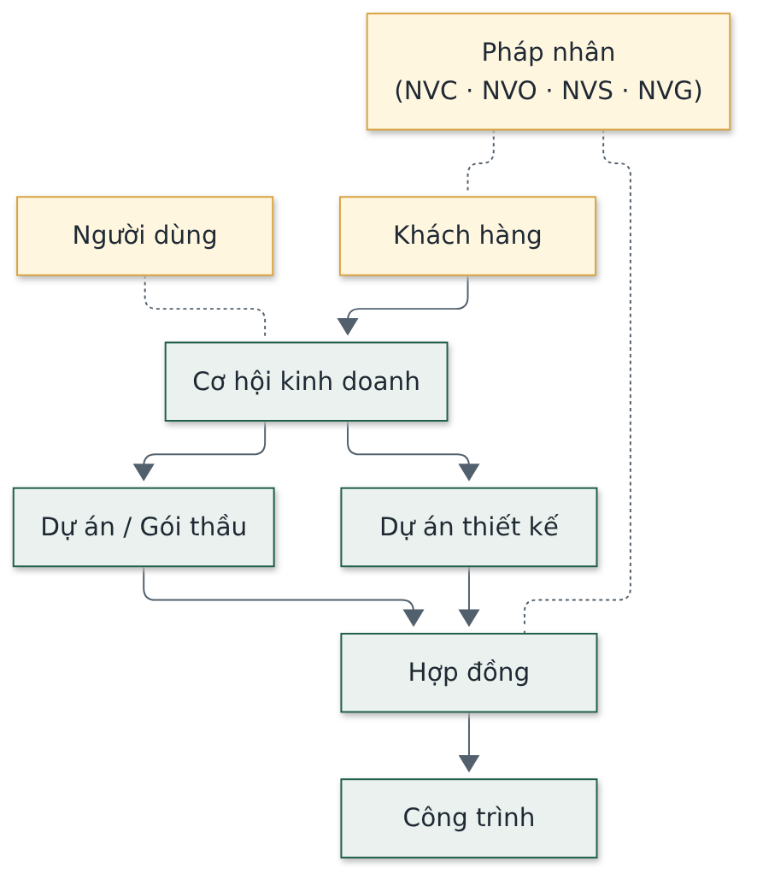

# Đặc tả Yêu cầu Phần mềm (Software Requirements Specification)

Hệ thống Phần mềm Quản trị Nhà Việt Group

| | |
| --- | --- |
| **Phiên bản** | 1.0 |
| **Ngày soạn** | 27/09/2026 |
| **Trạng thái** | Bản nháp — chờ Haan duyệt |
| **Người soạn** | Đội triển khai — vai trò Chủ sản phẩm và Kiến trúc sư phần mềm |
| **Phạm vi** | Bản demo hoàn chỉnh khoảng 95%, 12 phân hệ và tính năng AI Design |

> Tài liệu này là **cầu nối từ nghiệp vụ sang kỹ thuật**: chốt phạm vi chính thức của bản demo, biến
> yêu cầu ở tài liệu Yêu cầu sản phẩm thành đặc tả kiểm được, và ghi ràng buộc kỹ thuật. Yêu cầu
> nghiệp vụ đầy đủ (mã NEN-01, TC-10…) nằm ở tài liệu Yêu cầu sản phẩm; ở đây không lặp lại mà tham
> chiếu bằng mã. Đối tượng đọc: đội kỹ thuật và người phụ trách dự án — tài liệu được phép nêu tên
> công nghệ. Chỗ chưa quyết ghi **Chưa xác định**; chỗ suy luận chưa xác nhận ghi **Giả định**.

---

## 0. Viết tắt và thuật ngữ

| Viết tắt / thuật ngữ | Nghĩa |
| --- | --- |
| NVG · NVC · NVO · NVS | Tập đoàn và ba pháp nhân: xây dựng công nghiệp (NVC), nhà ở dân dụng (NVO), giàn giáo (NVS) |
| Back Office | Khối dùng chung: Kế toán, Tài chính, Nhân sự, Cung ứng |
| Phân hệ | Một nhóm chức năng của phần mềm, có mã (Mục 3) |
| Yêu cầu chức năng | Việc phần mềm phải làm, đã mô tả ở tài liệu Yêu cầu sản phẩm |
| Yêu cầu phi chức năng | Yêu cầu về chất lượng: hiệu năng, bảo mật, khả dụng… (Mục 7) |
| Tiêu chí nghiệm thu | Điều kiện kiểm được để xác nhận một yêu cầu đã đạt |
| Ứng dụng một trang (SPA) | Web tải một lần rồi chạy trong trình duyệt, không dựng lại trang ở máy chủ |
| Cơ sở dữ liệu | Nơi lưu toàn bộ dữ liệu; ở đây dùng PostgreSQL trên nền Supabase |
| Phân quyền trong cơ sở dữ liệu (RLS) | Quy tắc «ai thấy dòng nào» đặt ngay trong cơ sở dữ liệu, không đặt ở giao diện (Row Level Security) |
| Cloudflare Workers | Nền tảng thực thi mã xử lý nghiệp vụ tùy chỉnh gần người dùng, không cần máy chủ thường trực (điện toán biên) |
| Mô hình dữ liệu | Cách tổ chức bảng và quan hệ giữa các bảng |
| Thực thể | Một loại đối tượng dữ liệu (khách hàng, hợp đồng, công trình…) |
| Migration | Tệp mô tả thay đổi cấu trúc cơ sở dữ liệu, lưu trong mã nguồn |
| Ngoại tuyến | Dùng được khi mất mạng, tự đồng bộ khi có mạng |
| PWA | Ứng dụng web cài được lên điện thoại, chạy khi mạng yếu (Progressive Web App) |
| AI | Trí tuệ nhân tạo (Artificial Intelligence) |
| AI Design | Tính năng thiết kế sơ bộ nhà ở bằng AI |
| DXF | Định dạng tệp bản vẽ mà AutoCAD mở trực tiếp |

---

## 1. Giới thiệu

### 1.1 Mục đích

Chốt **phần mềm phải đáp ứng thế nào và đo bằng gì** cho bản demo, làm căn cứ để triển khai và
nghiệm thu. Tài liệu không thay tài liệu Yêu cầu sản phẩm (nói làm gì) hay tài liệu Kiến trúc phần
mềm (nói dựng chi tiết thế nào).

### 1.2 Phạm vi phiên bản

Bản demo hoàn chỉnh khoảng 95%: 12 phân hệ liên kết thông suốt và tính năng AI Design, chạy được
kịch bản demo đầu–cuối cho NVC, NVO, NVS và Back Office trên dữ liệu giả lập hoặc ẩn danh. Nghiệm
thu đo bằng người thật dùng, dữ liệu đúng, báo cáo đối soát được — không bằng số tính năng.

### 1.3 Quy ước mã và tài liệu liên quan

- Mã yêu cầu chức năng dùng lại của tài liệu Yêu cầu sản phẩm (ví dụ NEN-01, SX-17). Mã yêu cầu phi chức năng đặt trong tài liệu này (NFR-01…).
- Tài liệu liên quan: **Tầm nhìn sản phẩm** (vì sao làm, tám mục tiêu M1–M8) · **Yêu cầu sản phẩm** (danh mục yêu cầu chức năng và ranh giới) · **Kiến trúc phần mềm** (thiết kế chi tiết).

---

## 2. Mô tả tổng quát

### 2.1 Ngữ cảnh hệ thống

**Hình 1.** Ai dùng hệ thống và hệ thống nối ra đâu.

Bốn nhóm người dùng (văn phòng, công trường, xưởng, Ban Giám đốc) dùng chung một hệ thống. Hệ thống
dựa trên nền tảng dữ liệu Supabase; gọi mô hình AI cho AI Design và nghiệp vụ đọc hồ sơ; liên kết một chiều với
phần mềm kế toán chính thức và dịch vụ thư điện tử (cả hai còn chờ NVG chốt).

### 2.2 Ràng buộc thiết kế

Các quyết định công nghệ đã chốt, không mở lại trừ khi điều kiện đổi.

| Lớp | Công nghệ | Ghi chú |
| --- | --- | --- |
| Giao diện | React 18, TypeScript, Vite — ứng dụng một trang | Không dựng trang ở máy chủ (không dùng Next.js) |
| Kiểu hiển thị | Tailwind, thư viện thành phần shadcn/ui | Theo hệ thống thiết kế riêng của dự án |
| Cơ sở dữ liệu | PostgreSQL trên nền tảng Supabase; giao diện truy cập trực tiếp qua REST API tự sinh (PostgREST) | Nghiệp vụ thông thường không cần viết API riêng |
| Xử lý nghiệp vụ tùy chỉnh | Cloudflare Workers | Chỉ cho AI Design và một số nghiệp vụ nhiều bước |
| Phân quyền dữ liệu | Thực thi trong cơ sở dữ liệu bằng Row Level Security, không ở giao diện hay tầng API | Quyết định quan trọng nhất về bảo mật |
| Xác thực và tệp | Supabase Auth và Supabase Storage | Không dùng dịch vụ ngoài |
| Nền tảng chạy | Cloudflare Workers và Static Assets; tác vụ nền theo lịch | Không có máy chủ ứng dụng thường trực |
| Di động | Cài được lên điện thoại (PWA); chạy khi mạng yếu | Không làm ứng dụng gốc riêng cho điện thoại |
| AI | Đang thử nghiệm nhiều mô hình (Google Gemini, OpenAI GPT, Anthropic Claude) cho AI Design và đọc hồ sơ; chưa chốt mô hình cuối cùng | Gián đoạn AI không được chặn luồng nghiệp vụ chính |
| Trao đổi dữ liệu | Chuẩn REST (JSON) | Không dùng GraphQL |

### 2.3 Giả định và phụ thuộc

- Danh mục nền (mã vật tư, mã công trình, nhà cung cấp) do NVG tạo trước khi dùng từng giai đoạn.
- Số dư đầu kho và tài sản giàn giáo được kiểm kê và chốt trước khi dùng phân hệ Kho và Sản xuất.
- Phần mềm kế toán chính thức và dịch vụ thư điện tử: **Chưa xác định** — cần NVG chốt.
- **Ràng buộc môi trường (Giả định đang xử lý):** hiện phát triển và bản chạy thử dùng chung một cơ sở dữ liệu; **phải tách môi trường trước khi nhập dòng dữ liệu thật đầu tiên**.

---

## 3. Phạm vi phiên bản

### 3.1 Phân hệ trong phạm vi

Toàn bộ 12 phân hệ (NEN, CRM, DA, TK, HD, TC, MH, KHO, KT, NS, BC, SX) và tính năng AI Design đều
trong phạm vi bản demo. Danh mục yêu cầu chi tiết của từng phân hệ nằm ở tài liệu Yêu cầu sản phẩm.

### 3.2 Ngoài phạm vi phiên bản

Không làm trong bản demo, chỉ liên kết: thay thế phần mềm kế toán và kê khai thuế; hoá đơn điện tử,
chữ ký số, ngân hàng điện tử, bảo hiểm xã hội điện tử; phần mềm thiết kế, kết cấu, dự toán; thiết bị
đo đạc và chấm công phần cứng.

### 3.3 Ưu tiên phạm vi

Nếu phải thu hẹp phạm vi để kịp bản demo, thứ tự ưu tiên đã thống nhất:

- **Giữ bằng mọi giá** — ưu tiên số một của hai bộ phận hiện trường: vòng đời tài sản cho thuê (SX-15→SX-21) và luồng công trường – văn phòng (TC-05, TC-09, TC-10, TC-13).
- **Làm sau khi NVG có dữ liệu thật** (các phần phụ thuộc số liệu chưa có): định mức, năng suất, giá thành sản xuất (SX-07, SX-10, SX-22).
- **Phần nâng cao, không bắt buộc cho demo**: hỗ trợ AI đọc bản vẽ (DA-11); thư viện thiết kế (TK-09); trình chỉnh sửa mặt bằng kéo–thả của AI Design.

---

## 4. Đặc tả chức năng theo phân hệ

Danh mục yêu cầu đầy đủ ở tài liệu Yêu cầu sản phẩm. Ở đây đặc tả **cách hiện thực**: nghiệp vụ nào
truy cập trực tiếp cơ sở dữ liệu, nghiệp vụ nào cần xử lý nghiệp vụ tùy chỉnh, và áp mẫu phân quyền nào.

### 4.1 Nguyên tắc hiện thực

- Nghiệp vụ đọc, ghi thông thường (danh sách, chi tiết, lọc, thêm, sửa) mà quyền diễn đạt được bằng phân quyền cơ sở dữ liệu: **truy cập trực tiếp Supabase**, không viết API riêng.
- Viết endpoint riêng trên Cloudflare Workers chỉ khi: (a) gọi dịch vụ ngoài; (b) ghi nhiều bảng phải toàn vẹn cùng lúc; (c) quy tắc phức tạp hơn phân quyền cơ sở dữ liệu. Bắt buộc dùng cho toàn bộ AI Design.

### 4.2 Cách hiện thực và phân quyền theo phân hệ

| Phân hệ | Cách hiện thực | Mẫu phân quyền chính |
| --- | --- | --- |
| NEN | Supabase trực tiếp; nhật ký nhạy cảm và tác vụ nền qua Cloudflare Workers | Theo pháp nhân; hạn chế cột nhạy cảm cho nhật ký |
| CRM | Supabase trực tiếp | Theo người chịu trách nhiệm; giá đặc biệt theo hạn mức |
| DA | Supabase trực tiếp; phê duyệt giá nhiều bước qua Cloudflare Workers | Theo người chịu trách nhiệm; giá vốn hạn chế cột |
| TK | Supabase trực tiếp; AI Design qua Cloudflare Workers | Theo người chịu trách nhiệm; AI Design chia theo bộ môn |
| HD | Supabase trực tiếp | Theo người chịu trách nhiệm; phê duyệt theo hạn mức |
| TC | Supabase trực tiếp; đồng bộ ngoại tuyến qua Cloudflare Workers | Theo phạm vi hiện trường; giá vốn hạn chế cột |
| MH | Supabase trực tiếp | Theo pháp nhân; phê duyệt theo hạn mức |
| KHO | Supabase trực tiếp; đồng bộ ngoại tuyến qua Cloudflare Workers | Theo pháp nhân và phạm vi hiện trường |
| KT | Supabase trực tiếp; luồng thanh toán nhiều bước qua Cloudflare Workers | Theo hạn mức; lương và giá vốn hạn chế cột |
| NS | Supabase trực tiếp | Hạn chế cột nhạy cảm (lương); theo người chịu trách nhiệm |
| BC | Supabase trực tiếp qua các khung nhìn báo cáo | Theo pháp nhân; lợi nhuận hạn chế cột |
| SX | Supabase trực tiếp; tính tiền thuê và cân sổ tài sản qua Cloudflare Workers | Theo pháp nhân và phạm vi hiện trường; giá thành hạn chế cột |
| AI Design | Toàn bộ qua Cloudflare Workers; kết quả lưu dạng dữ liệu bất biến | Chia theo bộ môn thiết kế |

### 4.3 Ràng buộc chức năng bắt buộc (kiểm được)

- Sáu trạng thái chuẩn cho mọi hồ sơ: Nháp · Chờ duyệt · Đang xử lý · Hoàn thành · Quá hạn · Tranh chấp.
- Mọi kết quả AI ở trạng thái nháp tới khi người có thẩm quyền duyệt; AI không tự phát hành.
- Đổi tham số không hồi tố: chứng từ đã phát hành giữ giá trị đã áp dụng.
- Chứng từ đã ký hai bên hoặc kỳ đã khoá chỉ sửa bằng chứng từ điều chỉnh có người duyệt; cưỡng chế trong cơ sở dữ liệu, không ở giao diện.
- Chỉ số chưa có dữ liệu thật hiện «Chưa đủ dữ liệu», không hiện 0, không điền mặc định.

---

## 5. Yêu cầu dữ liệu

### 5.1 Thực thể trung tâm

**Hình 2.** Các thực thể tham chiếu xuyên phân hệ — liên kết, không sao chép.

Thực thể dùng chung (khách hàng, người dùng, pháp nhân) không gắn một pháp nhân cụ thể; thực thể
giao dịch (hợp đồng, công trình, cơ hội) gắn pháp nhân. Mỗi module khác liên kết tới các thực thể
này, không tạo bản sao.

### 5.2 Quy ước dữ liệu bắt buộc

| Quy ước | Nội dung |
| --- | --- |
| Đặt tên | Tên bảng và cột bằng tiếng Anh, chữ thường nối gạch dưới; tên bảng số nhiều |
| Khoá | Khoá chính là mã định danh duy nhất; khoá ngoại theo tên bảng số ít |
| Pháp nhân | Mọi bảng giao dịch có cột pháp nhân; bảng dùng chung thì không |
| Vết kiểm | Mỗi bảng có ngày tạo, ngày sửa, người tạo, người sửa |
| Xoá và phiên bản | Bảng quan trọng xoá mềm (đánh dấu, không xoá cứng); có phiên bản và bản đang hiệu lực |
| Tiền và số lượng | Tiền lưu bằng số nguyên đồng, không thập phân; số lượng vật lý lưu số thực, đơn vị ở bảng danh mục |
| Bản ghi hiện trường | Có mốc nghiệp vụ do máy khách đặt, mốc đồng bộ do máy chủ đặt, và mã khử trùng khi đồng bộ lại |
| Lịch sử | Thay đổi trạng thái hoặc giá trị quan trọng ghi vào bảng lịch sử riêng, không ghi đè |

---

## 6. Yêu cầu giao diện

### 6.1 Bố cục

- Mọi màn hình thuộc một trong chín mẫu bố cục chuẩn: Bảng điều khiển (Dashboard) · Danh sách · Chi tiết hồ sơ · Biểu mẫu · Bảng Kanban · Hộp thư Phê duyệt · Trình theo dõi đề nghị · Màn hình di động hiện trường · Sổ tài sản.
- Một hành động chính mỗi màn hình; phân cấp bằng độ đậm và kích thước, không bằng màu.
- Ẩn menu, nút, liên kết khi không có quyền — không hiện rồi báo lỗi.

### 6.2 Ngôn ngữ và di động

- Giao diện tiếng Việt 100%, **gồm cả chữ do trình duyệt tự sinh** (ràng buộc biểu mẫu, ô ngày, ô số, hộp thoại xác nhận) — kiểm bằng trình duyệt đặt tiếng Anh.
- Ba nhóm hiện trường (Kho, Xưởng, Công trường) thiết kế cho điện thoại là chính: nút chụp ảnh không ẩn sau menu; ưu tiên chọn từ gợi ý thay gõ tay; hiện trạng thái đồng bộ.

### 6.3 Giao diện ngoài

- Nền tảng Supabase (cơ sở dữ liệu, xác thực, lưu trữ tệp): bắt buộc.
- Mô hình AI (đang thử nghiệm Google Gemini, OpenAI GPT và Anthropic Claude, chưa chốt mô hình cuối cùng): chỉ dùng cho AI Design và đọc hồ sơ; gián đoạn không chặn luồng nghiệp vụ chính.
- Phần mềm kế toán và thư điện tử: liên kết một chiều, **Chưa xác định** công cụ.

---

## 7. Yêu cầu phi chức năng

| Mã | Yêu cầu | Mức | Cách kiểm |
| --- | --- | --- | --- |
| NFR-01 | Hiệu quả nhập liệu hiện trường | Cập nhật hằng ngày của chỉ huy trưởng, phụ trách xưởng ≤ 10–20 phút, mục tiêu 5–10 phút | Đo thời gian thao tác thực trên điện thoại theo kịch bản một ngày |
| NFR-02 | Thời gian phản hồi | Thao tác danh sách, chi tiết, lưu ở quy mô NVG phản hồi nhanh, không có màn hình chờ toàn trang; đang tải hiện khung xương | Đo trên bản chạy thử với dữ liệu mẫu |
| NFR-03 | Quy mô người dùng | ~40 nhân sự văn phòng, ~18 xưởng, ~11 công trường, cộng thời vụ; nhiều người thao tác đồng thời | Thử nhiều phiên đồng thời |
| NFR-04 | Phân quyền | Mọi bảng có phân quyền trong cơ sở dữ liệu; cột nhạy cảm (giá vốn, lợi nhuận, lương) chỉ hiện cho vai trò được phép | Bộ kiểm phân quyền tự động, nhất là giá vốn, lương, lợi nhuận |
| NFR-05 | Nhật ký nhạy cảm | Mọi lượt xem, sửa dữ liệu nhạy cảm có vết; chỉ vai trò cao đọc được nhật ký | Kiểm bản ghi nhật ký sau thao tác thử |
| NFR-06 | Bảo mật đường truyền và lưu trữ | Mã hoá khi truyền; khoá dịch vụ chỉ nằm ở máy chủ, giao diện chỉ dùng khoá ẩn danh | Rà cấu hình; không có khoá bí mật trong mã giao diện |
| NFR-07 | Ngoại tuyến | Kho, Xưởng, Công trường thao tác được khi mất mạng, tự đồng bộ; một thao tác ngoại tuyến không tạo hai bản ghi | Thử ngắt mạng rồi đồng bộ, kiểm trùng |
| NFR-08 | Sao lưu và khôi phục | Sao lưu định kỳ, có phương án khôi phục | Thử khôi phục từ bản sao lưu |
| NFR-09 | Khả năng cấu hình | Hạn mức, tham số biến động, danh mục, quy trình cấu hình được; thêm pháp nhân mới không thiết kế lại | Đổi tham số qua màn hình quản trị, không sửa mã |
| NFR-10 | Ngôn ngữ | Tiếng Việt 100% gồm chữ trình duyệt tự sinh | Kiểm bằng trình duyệt đặt tiếng Anh; bộ kiểm giao diện canh |
| NFR-11 | Khả dụng của AI | Hết hạn mức hoặc lỗi mô hình AI không chặn luồng nghiệp vụ chính | Thử tắt AI, xác nhận luồng chính vẫn chạy |

---

## 8. Điều kiện nghiệm thu

### 8.1 Bốn luồng đầu–cuối (bản demo phải chạy được cả bốn)

1. **Công trình:** Hợp đồng → Ngân sách → Mua hàng, Kho → Nghiệm thu → Đề nghị thanh toán → Thu tiền → Lãi/lỗ.
2. **Cho thuê giàn giáo:** Báo giá kiểm tồn → Xuất kho → Giao, giao thêm, trả bớt → Thu hồi, phân loại → Tính tiền thuê và bồi thường → Đối soát, tất toán.
3. **Lệnh sản xuất:** Lệnh có phiên bản → Cấp nguyên liệu theo định mức → Công đoạn → Chất lượng → Nhập kho → Giá thành thực tế.
4. **Công trường hằng ngày:** Nhật ký → Đề nghị vật tư có hạn xử lý → Nghiệm thu theo danh mục kiểm.

### 8.2 Kịch bản demo

Chạy đầu–cuối cho NVC, NVO, NVS và Back Office trên dữ liệu giả lập hoặc ẩn danh: một cơ hội chạy từ
CRM tới hợp đồng và truy vết được phê duyệt; một công trình và một đơn thuê giàn giáo chạy trọn vòng
đời; Ban Giám đốc xem Dashboard với số thật.

### 8.3 Bằng chứng kiểm thử tự động

Nghiệm thu kèm bộ kiểm tự động hiện có: kiểm giao diện và logic nghiệp vụ (Vitest, Playwright); **bộ kiểm phân
quyền bắt buộc** (giá vốn, lương, lợi nhuận); bộ tự cài lỗi để chứng minh bộ kiểm có tác dụng; kiểm
tự động chạy trên mỗi thay đổi.

---

## 9. Ma trận truy vết

Mục tiêu (tài liệu Tầm nhìn) → yêu cầu chính → nghiệm thu.

| Mục tiêu | Yêu cầu chính | Nghiệm thu |
| --- | --- | --- |
| M1 — Tách bạch pháp nhân | NEN-01, BC-07 | Báo cáo từng pháp nhân và hợp nhất khớp, đã loại giao dịch nội bộ |
| M2 — Một nguồn dữ liệu | NEN-06, nguyên tắc nhập một lần | Bốn luồng chạy hết trên hệ thống, không cần Excel/Zalo |
| M3 — Việc có trách nhiệm | NEN-03, TC-10 | Mọi hồ sơ có người chịu trách nhiệm, hạn, lịch sử |
| M4 — Thấy gần thời gian thực và cảnh báo | BC-01, BC-05 | Dashboard số thật; cảnh báo quá hạn, vượt ngân sách |
| M5 — Phân quyền theo hạn mức | NEN-02, NEN-12 | Cấp quản lý duyệt trong hạn mức; đổi hạn mức không sửa mã |
| M6 — Biết từng mã giàn giáo | SX-15, KHO-06 | Sổ tài sản cân dòng tổng; xem lại tại ngày quá khứ |
| M7 — Hai chiều có thời hạn | TC-10, MH-02 | Đề nghị quá hạn tự cảnh báo lên cấp trên |
| M8 — Thiết kế sơ bộ bằng AI | TK-10, TK-12→TK-17 | Kiến trúc sư có phương án đạt ngưỡng để sửa; xuất được tệp bản vẽ |

---

## 10. Phụ lục — Vấn đề còn mở

Đồng bộ với tài liệu Yêu cầu sản phẩm: phần mềm kế toán chính thức; hạn mức phê duyệt; thời hạn phản
hồi từng phòng ban; giá thuê nội bộ, bảng giá bồi thường, ngưỡng tỷ lệ lỗi; cách tính lương công
nhân xưởng; bộ định mức nguyên vật liệu; các số liệu NVS chưa có (sản lượng, thất thoát). Ngoài ra:
tách môi trường phát triển và bản chạy thử trước khi nhập dữ liệu thật.
