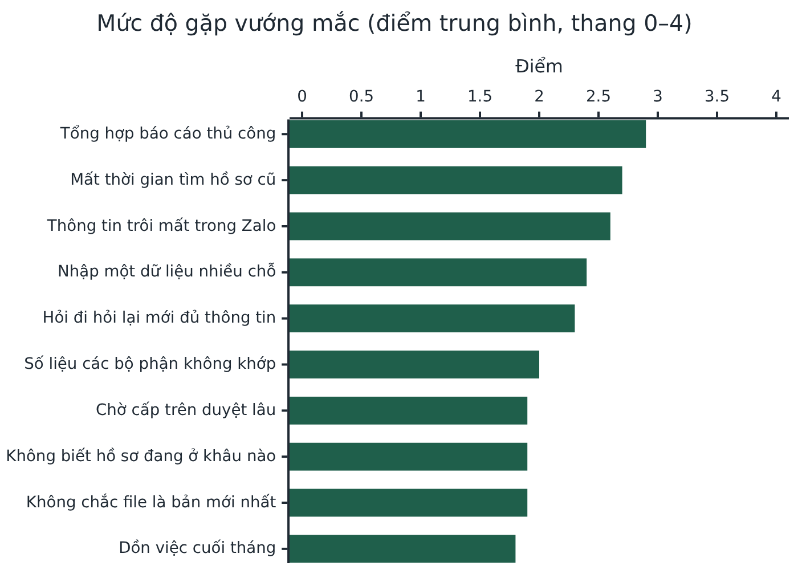
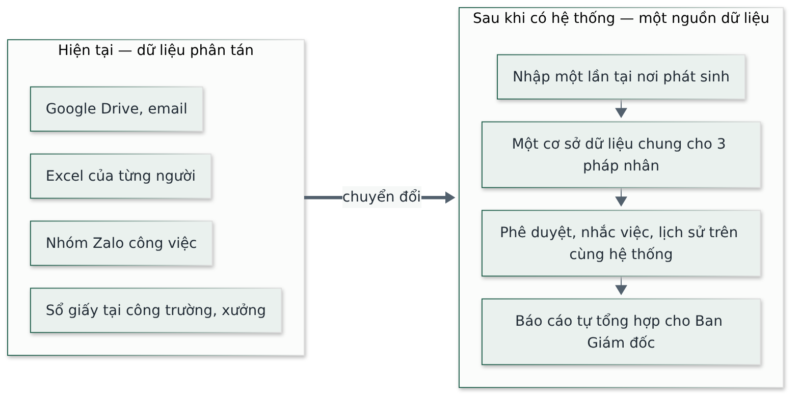
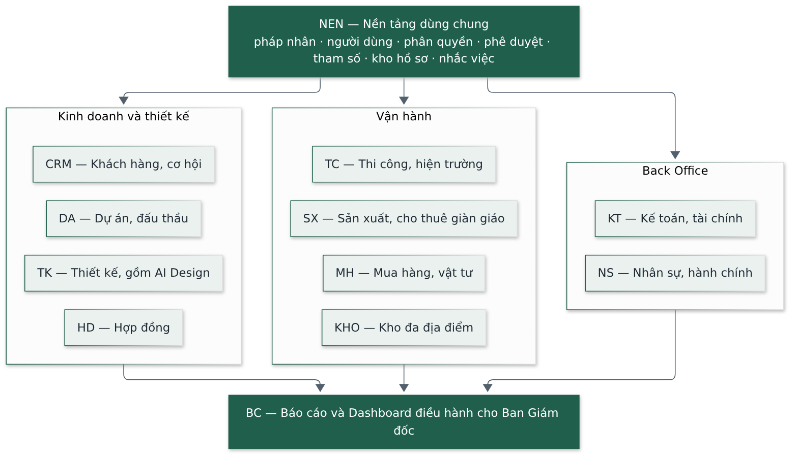
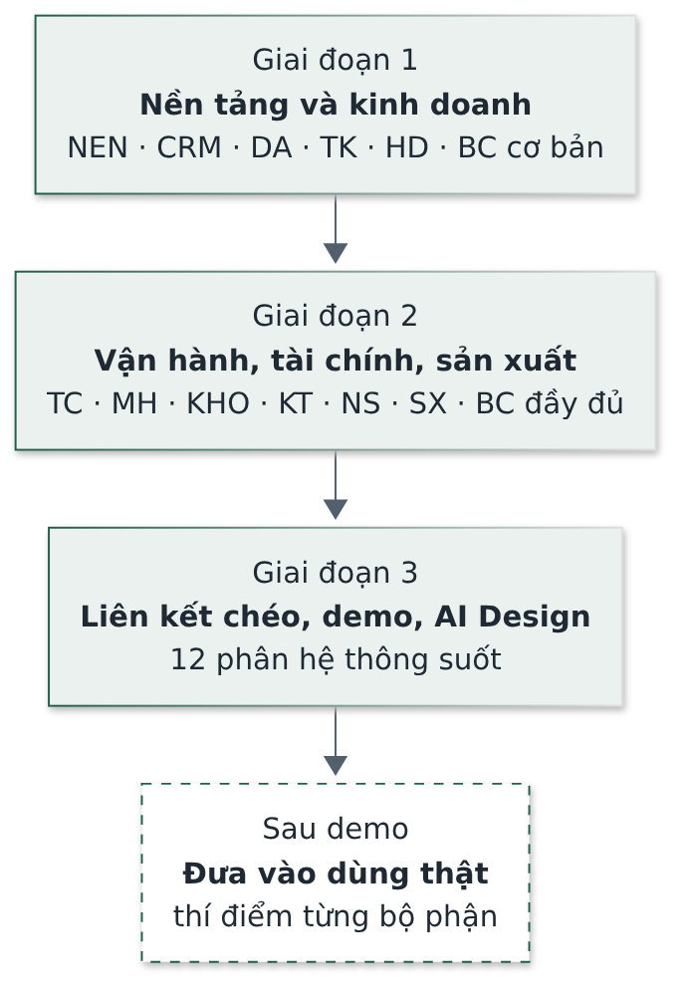

# Tầm nhìn sản phẩm và Luận chứng kinh doanh (Vision & Business Case)

Hệ thống Phần mềm Quản trị Nhà Việt Group

| | |
| --- | --- |
| **Phiên bản** | 1.0 |
| **Ngày soạn** | 25/09/2026 |
| **Trạng thái** | Bản nháp — chờ Haan duyệt, sau đó trình Ban Giám đốc |
| **Người soạn** | Đội triển khai — vai trò Chủ sản phẩm (Product Owner) |
| **Người duyệt** | Haan (đầu mối dự án) · Tổng Giám đốc NVG |

> Tài liệu này trả lời câu hỏi **vì sao làm** và **làm tới đâu thì gọi là thành công**. Chỗ chưa có
> số ghi **Chưa xác định**; điều chưa ai xác nhận ghi **Giả định**. Tài liệu không cam kết mốc thời
> gian — chỉ cam kết thứ tự và tiêu chí hoàn thành.

---

## 0. Viết tắt và thuật ngữ dùng trong tài liệu

| Viết tắt / thuật ngữ | Nghĩa |
| --- | --- |
| NVG | Nhà Việt Group — tập đoàn gồm ba pháp nhân dưới đây |
| NVC | Nhà Việt Cons — nhà xưởng công nghiệp, tổng thầu |
| NVO | Nhà Việt One — thiết kế và thi công trọn gói nhà ở dân dụng |
| NVS | Nhà Việt Steel — sản xuất, thương mại, cho thuê giàn giáo và kết cấu thép |
| Back Office | Khối dùng chung: Hành chính–Nhân sự, Cung ứng–Vật tư, Kế toán, Tài chính |
| Pháp nhân | Một công ty thành viên có tư cách pháp lý riêng |
| Phân hệ | Một nhóm chức năng của phần mềm, có mã hai–ba chữ (bảng ở Mục 6) |
| AI Design | Tính năng thiết kế sơ bộ nhà ở bằng trí tuệ nhân tạo, nằm trong phân hệ Thiết kế |
| AI | Trí tuệ nhân tạo (Artificial Intelligence) |
| USD | Đô la Mỹ |

---

## 1. Tóm tắt

| | |
| --- | --- |
| **Vấn đề** | Ba pháp nhân và Back Office vận hành trên Excel, Zalo, Google Drive và giấy. Không có nguồn dữ liệu chung. Bốn vướng mắc nặng nhất đều là vấn đề dữ liệu phân tán: tổng hợp báo cáo thủ công, mất thời gian tìm hồ sơ cũ, thông tin trôi mất trong Zalo, nhập một dữ liệu ở nhiều chỗ. |
| **Giải pháp** | Một hệ thống quản trị nội bộ trên web, **một cơ sở dữ liệu cho cả ba pháp nhân**, 12 phân hệ từ khách hàng tới báo cáo. Dữ liệu nhập một lần tại nơi phát sinh; phê duyệt, nhắc việc, lịch sử nằm trên cùng hệ thống. |
| **Giá trị** | Ban Giám đốc xem doanh thu, dòng tiền, công nợ, ngân sách công trình, tài sản giàn giáo **không cần chờ tổng hợp Excel**. Công trường và xưởng có đường đề nghị–phê duyệt có hạn xử lý. NVS biết từng mã giàn giáo đang ở đâu. NVO có bản thiết kế sơ bộ bằng AI để rút ngắn khâu tư vấn khách. |
| **Chi phí** | Hạ tầng thuê theo mức dùng, không có máy chủ riêng. Ở quy mô NVG có thể chạy trên các gói miễn phí; nếu vượt, chi phí hạ tầng tối đa khoảng 25 USD/tháng, cộng chi phí gọi AI theo lượt. |
| **Cần Ban Giám đốc quyết** | (1) Duyệt tầm nhìn và tiêu chí thành công ở tài liệu này. (2) Cử đầu mối mỗi bộ phận để thí điểm. (3) Cung cấp các tham số còn trống (Mục 9.3). (4) Duyệt ngân sách vận hành khi đưa vào dùng thật. |

---

## 2. Bối cảnh Nhà Việt Group

| Pháp nhân | Mảng kinh doanh | Quy mô | Định hướng |
| --- | --- | --- | --- |
| **NVC** | Nhà xưởng công nghiệp, tổng thầu | ~30 dự án/năm, 20 nhân sự | Tổng thầu công nghiệp, cải tạo nhà máy, nhà cao tầng |
| **NVO** | Thiết kế + thi công trọn gói nhà ở | ~70 dự án/năm, 8 nhân sự | Tăng tỷ lệ chuyển từ thiết kế sang thi công trọn gói |
| **NVS** | Sản xuất, bán, cho thuê giàn giáo | ~700 đơn hàng/năm, 12 nhân sự văn phòng; xưởng 18 người | Mở rộng sản xuất, thương mại, sản phẩm mới |
| **Back Office** | Kế toán, Tài chính, Nhân sự, Cung ứng | dùng chung cho ba pháp nhân | — |

Tổng cộng khoảng 40 nhân sự văn phòng và ban công trường, cộng 50–200 lao động thời vụ theo mùa vụ.

---

## 3. Vấn đề hiện tại

Khảo sát 11 phiếu từ 10 bộ phận. Mỗi bộ phận chấm mức độ gặp 10 tình huống, thang 0–4.

**Hình 1.** Mức độ gặp vướng mắc toàn công ty (10 bộ phận, thang 0–4).

| Vướng mắc | Bằng chứng từ khảo sát |
| --- | --- |
| Tổng hợp báo cáo thủ công | 90% bộ phận gặp thường xuyên — cao nhất trong 10 tình huống |
| Mất thời gian tìm hồ sơ cũ | Hồ sơ lưu đúng chỗ: 5–15 phút. Hồ sơ nằm trong Zalo, máy cá nhân: **30 phút tới vài giờ**, có lúc không xác định được bản cuối cùng |
| Dùng nhầm bản cũ | Công trường đã phải tháo dỡ làm lại vì thi công theo bản vẽ cũ trong khi thiết kế đã điều chỉnh |
| Đề nghị từ hiện trường không ai theo dõi | Điểm nghẽn lớn nhất của công trường là luồng đề nghị–phê duyệt với văn phòng, không phải ghi chép |
| Tài sản giàn giáo cho thuê | Mảng dữ liệu phân tán nặng nhất toàn hệ thống; chưa có số liệu tổng hợp thất thoát, hư hỏng |

---

## 4. Tầm nhìn sản phẩm

> **Một nguồn dữ liệu cho toàn Nhà Việt Group: mỗi việc có người chịu trách nhiệm, thời hạn và lịch
> sử; mỗi con số trên báo cáo truy ngược được về chứng từ gốc.**

**Hình 2.** Từ dữ liệu phân tán sang một nguồn dữ liệu.

### 4.1 Mục tiêu kinh doanh

| # | Mục tiêu | Đo bằng gì |
| --- | --- | --- |
| M1 | Một hệ thống chung, nhưng **tách bạch** doanh thu, chi phí, công nợ, lợi nhuận của từng pháp nhân | Báo cáo từng pháp nhân và báo cáo hợp nhất đối soát được, đã loại giao dịch nội bộ |
| M2 | Gom dữ liệu phân tán về **một nguồn** | Các luồng demo chạy hết trên hệ thống, không cần Excel/Zalo song song |
| M3 | Mỗi việc có **người chịu trách nhiệm, thời hạn, trạng thái, lịch sử** | Mọi hồ sơ có tab Lịch sử; mọi đề nghị có người đang giữ và thời gian chờ |
| M4 | Ban Giám đốc thấy tình hình **gần thời gian thực** và được **cảnh báo sớm** | Dashboard hiện số thật; cảnh báo quá hạn, vượt ngân sách, công nợ đến hạn |
| M5 | **Phân quyền theo chức danh và hạn mức** để giảm phụ thuộc Tổng Giám đốc và Giám đốc Tài chính | Hạn mức phê duyệt cấu hình được; cấp quản lý duyệt trong hạn mức của mình |
| M6 | NVS biết **từng mã giàn giáo đang ở đâu, bao nhiêu, tình trạng gì** | Sổ tài sản cân dòng tổng, xem lại được tại ngày quá khứ |
| M7 | Luồng **hai chiều có thời hạn** giữa công trường và văn phòng | Đề nghị từ công trường có hạn xử lý, cảnh báo khi văn phòng quá hạn |
| M8 | Rút ngắn khâu **thiết kế sơ bộ nhà ở** của NVO bằng AI | Kiến trúc sư có phương án mặt bằng đạt ngưỡng chất lượng để sửa tiếp, thay vì vẽ từ đầu |

M8 (thiết kế sơ bộ bằng AI) là tính năng bổ sung, được xác định là yếu tố quyết định thành công của
phân hệ Thiết kế.

### 4.2 Nguyên tắc sản phẩm

1. **Nhập một lần** tại nơi phát sinh; phân hệ khác liên kết, không chép.
2. **Con người quyết định.** Phần mềm và AI chỉ tổng hợp, tính toán, cảnh báo, gợi ý. Mọi kết quả AI là bản nháp tới khi người có thẩm quyền duyệt.
3. **Không hiển thị số ước lượng.** Chưa có dữ liệu thật thì hiện «Chưa đủ dữ liệu».
4. **Thiết kế cho hiện trường**: dùng trên điện thoại, chụp ảnh trực tiếp; cập nhật hằng ngày của chỉ huy trưởng không quá 10–20 phút, mục tiêu 5–10 phút.
5. **Tham số hoá**: đơn giá, hạn mức, tỷ lệ lỗi, giá bồi thường là dữ liệu cấu hình; đổi tham số không làm thay đổi chứng từ đã phát hành.
6. **Trách nhiệm hai chiều**: văn phòng cũng có hạn xử lý trên cùng hệ thống.

---

## 5. Người dùng và giá trị nhận được

| Nhóm người dùng | Hôm nay | Sau khi có hệ thống |
| --- | --- | --- |
| **Ban Giám đốc** | Hỏi qua Zalo, chờ tổng hợp Excel | Dashboard mỗi sáng; cảnh báo sớm; phê duyệt trong một hộp thư |
| **Kinh doanh** (3 pháp nhân) | Danh sách khách trên Excel riêng | Khách hàng và cơ hội tập trung, nhắc việc, báo cáo chuyển đổi |
| **Dự án – Đấu thầu** (NVC) | Dự toán nhiều bản, khó biết bản nào được duyệt | Phiên bản dự toán, phê duyệt giá truy vết được, bàn giao ngân sách cho thi công |
| **Thiết kế** (NVO) | Đầu bài rải rác, phiên bản bản vẽ lẫn lộn | Đầu bài có cấu trúc, bản vẽ đang hiệu lực, phương án sơ bộ bằng AI Design |
| **Thi công / Công trường** | Nhật ký giấy, đề nghị qua Zalo không ai theo dõi | Nhật ký trên điện thoại, đề nghị có trạng thái và hạn, nghiệm thu bằng danh mục kiểm + ảnh |
| **Mua hàng, Kho** | Tồn kho biết khi kiểm đếm | Đề nghị mua theo luồng, tồn kho theo thời gian thực nhiều địa điểm |
| **Xưởng NVS** | Vòng đời giàn giáo cho thuê theo dõi thủ công | Lệnh sản xuất, sổ tài sản cho thuê, tính tiền thuê, bồi thường thiếu–hỏng |
| **Kế toán – Tài chính** | Nhận chứng từ từ nhiều nguồn | Đề nghị thanh toán, tạm ứng, công nợ, dòng tiền trên cùng dữ liệu; vẫn giữ phần mềm kế toán chính thức |
| **Hành chính – Nhân sự** | Hồ sơ nhân sự phân tán | Hồ sơ điện tử tập trung, chấm công ba khối, nhắc hạn hợp đồng |

---

## 6. Phạm vi tổng quát

**Hình 3.** 12 phân hệ trên một nền tảng dùng chung.

| Mã | Phân hệ | Mã | Phân hệ |
| --- | --- | --- | --- |
| NEN | Nền tảng dùng chung | TC | Thi công, ngân sách, hiện trường |
| CRM | Khách hàng và cơ hội kinh doanh | MH | Mua hàng và vật tư |
| DA | Dự án và đấu thầu (NVC) | KHO | Kho đa địa điểm |
| TK | Thiết kế (NVO), gồm AI Design | KT | Kế toán và tài chính |
| HD | Hợp đồng | NS | Nhân sự và hành chính |
| BC | Báo cáo và Dashboard điều hành | SX | Sản xuất và cho thuê giàn giáo (NVS) |

### 6.1 Chưa làm — chỉ liên kết

| Không thay thế | Ví dụ |
| --- | --- |
| Phần mềm kế toán chính thức — **không tạo hai bộ số liệu** | MISA, Fast Accounting (NVG chưa chốt công cụ nào) |
| Hoá đơn điện tử, chữ ký số, kê khai thuế, ngân hàng điện tử, bảo hiểm xã hội điện tử | — |
| Phần mềm chuyên môn thiết kế, kết cấu | AutoCAD, Revit, SketchUp, ETABS |
| Phần mềm dự toán chuyên dụng | GXD, Delta, F1, Escon |
| Thiết bị hiện trường, máy chấm công | Máy toàn đạc, flycam, camera, máy chấm công |

### 6.2 Ranh giới trách nhiệm

Phần mềm và AI **không tự quyết**: nội dung chuyên môn, pháp lý, kỹ thuật, nhân sự; giá bán cuối,
tỷ lệ lợi nhuận, mức dự phòng; giải pháp kết cấu, điện nước, phòng cháy; chọn nhà cung cấp; phê
duyệt thanh toán; đánh giá chất lượng, hư hỏng, bồi thường giàn giáo.

---

## 7. Luận chứng kinh doanh

### 7.1 Lợi ích

| Lợi ích | Loại | Căn cứ |
| --- | --- | --- |
| Bỏ việc tổng hợp báo cáo thủ công | Tiết kiệm thời gian | Vướng mắc số 1, 90% bộ phận gặp thường xuyên |
| Tìm hồ sơ bằng tìm kiếm toàn hệ thống thay vì mất 30 phút tới vài giờ | Tiết kiệm thời gian | Khảo sát 10 bộ phận |
| Không thi công theo bản vẽ cũ | Giảm chi phí làm lại | Sự cố tháo dỡ làm lại đã xảy ra |
| Biết số giàn giáo thất thoát, hư hỏng; tính đúng tiền thuê và bồi thường | Giảm thất thoát tài sản | Hiện chưa có số tổng hợp |
| Cảnh báo sớm vượt ngân sách, công nợ quá hạn | Giảm rủi ro tài chính | Yêu cầu cảnh báo sớm của Ban Giám đốc |
| Giảm phụ thuộc hai người duyệt cao nhất | Tăng tốc ra quyết định | Hạn mức phê duyệt theo cấp |
| Rút ngắn khâu thiết kế sơ bộ nhà ở | Tăng tỷ lệ chuyển đổi của NVO | Định hướng của NVO |
| Nền tảng mở rộng cho pháp nhân mới; phân hệ AI Design sẵn cấu trúc để bán lại cho công ty khác | Giá trị dài hạn | **Giả định** — cần Ban Giám đốc xác nhận định hướng bán lại |

### 7.2 Chi phí

| Hạng mục | Hiện tại | Khi đưa vào dùng thật |
| --- | --- | --- |
| Cơ sở dữ liệu và lưu trữ tệp (Supabase) | Gói miễn phí (kiểm tra 25/09/2026) | Vẫn dùng gói miễn phí; chỉ nâng lên gói Pro (~25 USD/tháng) nếu vượt hạn mức gói miễn phí |
| Máy chủ giao diện và API (Cloudflare Workers) | Gói miễn phí | Gói miễn phí — ở quy mô NVG chắc chắn không vượt hạn mức 100.000 lượt gọi/ngày |
| Email giao dịch | Gói miễn phí | Vài USD/tháng nếu vượt |
| Gọi AI nghiệp vụ (đọc hồ sơ, gợi ý) | Đang thử nghiệm nhiều mô hình | **Chưa xác định** — chưa chốt mô hình cuối; một số gói miễn phí có thể dùng dữ liệu để huấn luyện, cần bản trả phí khi dùng dữ liệu thật |
| Gọi AI cho AI Design | Trả theo lượt | 0,08–0,23 USD mỗi lượt dựng chương trình không gian; tổng tháng **Chưa xác định** (phụ thuộc số dự án NVO dùng) |
| Tên miền riêng | Chưa có | ~10–15 USD/năm (không bắt buộc) |

### 7.3 Hiệu quả đầu tư

Chưa tính được tỷ suất hoàn vốn vì thiếu các số sau. Đây là danh sách số NVG cần cung cấp:

| Số cần có | Ai cung cấp | Dùng để tính |
| --- | --- | --- |
| Số giờ mỗi tháng mỗi bộ phận dành cho tổng hợp báo cáo và tìm hồ sơ | Trưởng các bộ phận | Giá trị thời gian tiết kiệm |
| Giá trị giàn giáo thất thoát, hư hỏng 12 tháng gần nhất | NVS, Kế toán | Giá trị giảm thất thoát |
| Chi phí làm lại do dùng nhầm bản vẽ (số vụ, giá trị) | Phòng Thi công | Giá trị giảm làm lại |
| Tỷ lệ chuyển từ thiết kế sang thi công của NVO hiện nay | NVO | Giá trị của AI Design |
| Ngân sách vận hành chấp nhận được | Ban Giám đốc | Chọn gói hạ tầng và AI |

---

## 8. Tiêu chí thành công

Nghiệm thu bằng **người thật dùng, dữ liệu đúng, báo cáo đối soát được** — không bằng số tính năng
(yêu cầu của Tổng Giám đốc).

| Mốc | Tiêu chí hoàn thành |
| --- | --- |
| Hết giai đoạn 1 | Một cơ hội chạy từ Khách hàng → Dự án/Thiết kế → Hợp đồng; truy vết được phiên bản dự toán và người phê duyệt |
| Hết giai đoạn 2 | Bốn luồng cùng chạy được: (1) Hợp đồng → Ngân sách → Mua hàng, Kho → Nghiệm thu → Thanh toán → Thu tiền → Lãi/lỗ; (2) Đơn thuê giàn giáo từ báo giá tới tất toán; (3) Lệnh sản xuất từ định mức tới giá thành; (4) Công trường hằng ngày: nhật ký, đề nghị vật tư, nghiệm thu |
| Hết giai đoạn 3 (demo) | 12 phân hệ liên kết thông suốt; kịch bản demo đầu–cuối cho NVC, NVO, NVS và Back Office; AI Design đạt mức hoàn thiện đã thống nhất |
| Luôn áp dụng | Cập nhật hằng ngày của chỉ huy trưởng, phụ trách xưởng **không quá 10–20 phút, mục tiêu 5–10 phút** — vượt là người dùng quay lại Excel, Zalo |
| Sau khi dùng thật | Tỷ lệ bộ phận bỏ hẳn Excel/Zalo song song — chỉ đo được sau thí điểm |

---

## 9. Rủi ro và giả định

### 9.1 Rủi ro chính

| Rủi ro | Mức | Cách giảm |
| --- | --- | --- |
| Nhân sự ngại đổi, nhập đối phó, tiếp tục làm song song trên Zalo, Excel | Cao | Thí điểm từng bộ phận; giới hạn thời gian nhập liệu; cấp quản lý duyệt trên hệ thống |
| Chỉ công trường cập nhật, văn phòng không xử lý trên hệ thống | Cao | Hạn xử lý hai chiều, cảnh báo văn phòng quá hạn |
| Dữ liệu nền chưa chuẩn (mã sản phẩm, số dư đầu, tên kho) | Cao | Kiểm kê và chốt số dư đầu trước khi dùng Kho, Sản xuất |
| Làm quá nhiều tính năng cùng lúc | Trung bình | Nếu phải cắt: giữ vòng đời tài sản cho thuê và luồng công trường–văn phòng; hoãn định mức, giá thành |
| Gửi dữ liệu nhạy cảm lên AI công cộng | Trung bình | Chỉ gửi phần cần thiết, không gửi danh tính; gói trả phí khi dùng dữ liệu thật |

### 9.2 Giả định

- NVG cử **một đầu mối mỗi bộ phận** chịu trách nhiệm chuẩn hoá dữ liệu, thử nghiệm, hướng dẫn.
- Các phòng ban văn phòng **cam kết thời hạn phản hồi** cho đề nghị từ công trường, xưởng.
- NVG tự tạo bộ mã vật tư, công trình, nhà cung cấp trước khi dùng từng giai đoạn.
- Các tham số hiện dùng (hạn mức, giá bồi thường, tỷ lệ lỗi) là tạm, Ban Giám đốc điều chỉnh khi ban hành quy chế.

### 9.3 Quyết định và số liệu còn chờ NVG

| Nội dung | Ảnh hưởng tới |
| --- | --- |
| Phần mềm kế toán chính thức sẽ liên kết | Phân hệ Kế toán |
| Hạn mức phê duyệt chính thức theo cấp | Mọi luồng phê duyệt |
| Thời hạn phản hồi của từng phòng ban | Cảnh báo quá hạn công trường–văn phòng |
| Giá thuê nội bộ giàn giáo; bảng giá bồi thường thiếu–hỏng; ngưỡng tỷ lệ lỗi | Phân hệ Sản xuất – Cho thuê |
| Cách tính lương công nhân xưởng; cách ghi nhận công tại công trường | Phân hệ Nhân sự |
| Bộ định mức nguyên vật liệu hiện hành | Lệnh sản xuất, giá thành |

---

## 10. Lộ trình

**Hình 4.** Ba giai đoạn xây dựng, sau đó đưa vào dùng thật từng bước.

- Lộ trình trên là thứ tự **xây dựng**. Đưa vào **dùng thật** làm thận trọng, từng bước: thí điểm
  tại Phòng Dự án – Đấu thầu NVC, một nhóm sản phẩm giàn giáo NVS, và một công trường có bộ máy
  tương đối đầy đủ.
- Hiện trạng (đo ngày 20/09/2026): 12 phân hệ đã có trên một cơ sở dữ liệu với 108 bảng, 14 vai
  trò, khoảng 110 màn hình; giai đoạn 1 đạt tiêu chí; giai đoạn 2 đã có phần lõi, phạm vi mở rộng
  của Thi công và Sản xuất còn đang làm.

---

## 11. Tài liệu liên quan

| Tài liệu | Trả lời câu hỏi |
| --- | --- |
| Tầm nhìn và Luận chứng kinh doanh (tài liệu này) | Vì sao làm, thành công là gì |
| Yêu cầu sản phẩm | Làm gì, ranh giới không làm |
| Đặc tả yêu cầu phần mềm | Phạm vi chính thức của phiên bản, yêu cầu đo được |
| Kiến trúc phần mềm | Hệ thống dựng thế nào |
| Hồ sơ khảo sát vận hành | Dữ liệu gốc từ 10 bộ phận |
